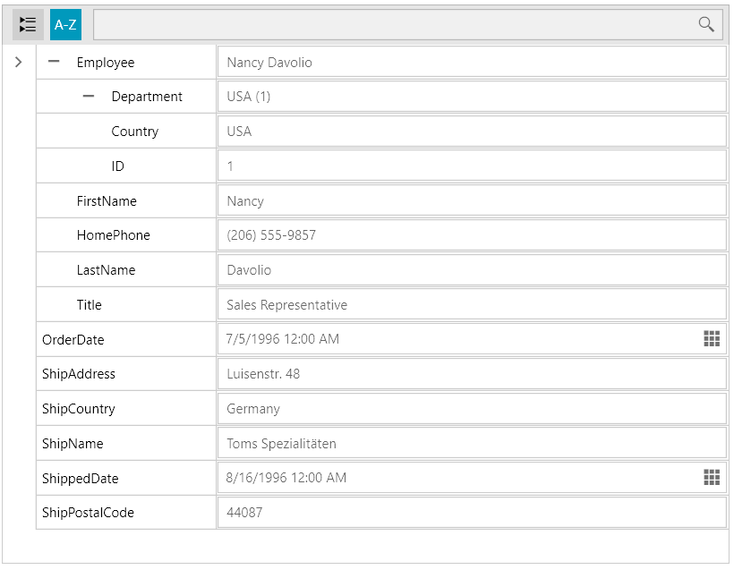

# Nested Properties

`RadPropertyGrid` can show nested PropertyDefinitions. In order to enable the nested properties support you need to set the `NestedPropertiesVisibility` property to `Visible`. That way, you will be able to modify any editable child properties of reference types.

The following example will show a simple scenario with visible nested properties:

__Preparing sample data__  
```C#
	DataContext = new Order()
	{
	    OrderDate = new DateTime(1996, 7, 5),
	    ShippedDate = new DateTime(1996, 8, 16),
	    ShipAddress = "Luisenstr. 48",
	    ShipCountry = "Germany",
	    ShipName = "Toms Spezialitaten",
	    ShipPostalCode = "44087",
	    Employee = new Employee()
	    {
	        FirstName = "Nancy",
	        LastName = "Davolio",
	        Title = "Sales Representative",
	        HomePhone = "(206) 555-9857",
	        Department = new Department()
	        {
	            Country = "USA",
	            ID = 1
	        }
	    },
	};
```
```VB.NET
	DataContext = New Order() With {
	    .OrderDate = New DateTime(1996, 7, 5),
	    .ShippedDate = New DateTime(1996, 8, 16),
	    .ShipAddress = "Luisenstr. 48",
	    .ShipCountry = "Germany",
	    .ShipName = "Toms Spezialitaten",
	    .ShipPostalCode = "44087",
	    .Employee = New Employee() With {
	        .FirstName = "Nancy",
	        .LastName = "Davolio",
	        .Title = "Sales Representative",
	        .HomePhone = "(206) 555-9857",
	        .Department = New Department() With {
	            .Country = "USA",
	            .ID = 1
	        }
	    }
	}
```

__Showing the PropertyDefinitions for the nested properties__  
```XAML
	<telerik:RadPropertyGrid Item="{Binding}" NestedPropertiesVisibility="Visible" />
```

__RadPropertyGrid with visible nested properties__



You can find a runnable example for this feature in our [Demos application](https://demos.telerik.com/silverlight/#PropertyGrid/NestedPropertyDefinitions)[Demos application](https://demos.telerik.com/wpf/#PropertyGrid/NestedPropertyDefinitions).

## Manually Defining PropertyDefinitions for Nested Properties

You can manually define property definitions for nested properties. To do so, add new `PropertyDefinition` instances to the `NestedProperties` collection of the parent `PropertyDefinition`.

The next example shows how to define a property definition for one of the nested properties:

__Defining a PropertyDefinition for a nested property__  
```XAML
	<telerik:RadPropertyGrid Item="{Binding}" NestedPropertiesVisibility="Visible" AutoGeneratePropertyDefinitions="False">
	    <telerik:RadPropertyGrid.PropertyDefinitions>
	        <telerik:PropertyDefinition Binding="{Binding Employee}">
	            <telerik:PropertyDefinition.NestedProperties>
	                <telerik:PropertyDefinition DisplayName="First name" Binding="{Binding FirstName}"/>
	            </telerik:PropertyDefinition.NestedProperties>
	        </telerik:PropertyDefinition>
	    </telerik:RadPropertyGrid.PropertyDefinitions>
	</telerik:RadPropertyGrid>
```

## Searching in Nested Properties

RadPropertyGrid exposes the option to search in nested properties. To enable this functionality, set the `SearchInNestedProperties` property to `True`.

__Setting the SearchInNestedProperties property__  
```XAML
	<telerik:RadPropertyGrid NestedPropertiesVisibility="Visible" SearchInNestedProperties="True"/>
```

## Specifying the PropertyDefinition Auto-Generating Mode

RadPropertyGrid allows you to specify if property definitions for the nested properties will be auto-generated when the control initially loads. This behavior is controlled by the `AutoGeneratePropertyDefinitionsMode` property, which accepts one of two following options:

* `FirstLevel`&mdash;When this option is set, the property definitions will be auto-generated only for the top-level properties. This is the default value of the AutoGeneratePropertyDefinitionsMode property.
* `AllLevels`&mdash;RadPropertyGrid will recursively generate property definitions for all nested properties when this mode is selected.

__Setting the AutoGeneratePropertyDefinitionsMode property__  
```XAML
	<telerik:RadPropertyGrid NestedPropertiesVisibility="Visible" AutoGeneratePropertyDefinitionsMode="AllLevels"/>
```

>tip The `AllLevels` mode will also allow you to search in nested properties if the `SearchInNestedProperties` property is set to `True`, without having to expand them beforehand.

## See Also
 * [Getting Started with RadPropertyGrid]()
 * [Edit Modes]()
 * [Scrolling into View]()
