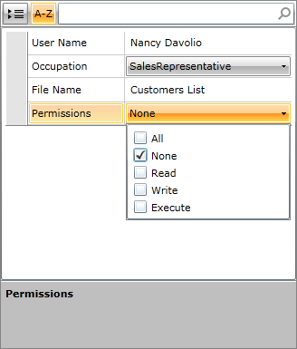
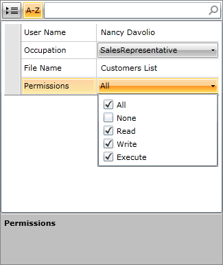
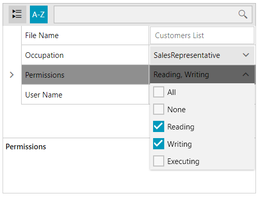

# FlagEnumEditor

RadPropertyGrid now supports editing bit flag enum by exposing a new editor – __FlagEnumEditor__. It enables the user to store any combination of the values that are defined in the enumerator list:


You can define flag enum by setting __FlagsAttribute__ as follows:

__Defining flag enum__

```C#
	[Flags]
	public enum Permissions
	{
	    Read = 1,
	    Write = 2,
	    Execute = 4
	}
```
```VB.NET
	<Flags()>
	Public Enum Permissions
	    Read = 1
	    Write = 2
	    Execute = 4
	End Enum
```

Each element should contain name and a value (which should be degree of 2 – 1, 2, 4, 8, 16, etc.).

>You can find more information about enum and flag enum in [this article](http://msdn.microsoft.com/en-us/library/cc138362.aspx).

Once you define your flag enum, you can edit it in RadPropertyGrid as follows:    


Furthermore, if you define zero and -1 values in your flag enum (meaning no flags are set and all flags are set correspondingly), you can benefit from the built-in functionality for selecting and unselecting the elements of the enum:

__Defining the flag enum__

```C#
	[Flags]
	public enum PermissionsAllNone
	{
	    All = -1,
	    None = 0,
	    Read = 1,
	    Write = 2,
	    Execute = 4
	}
```
```VB.NET
	<Flags()>
	Public Enum PermissionsAllNone
	    All = -1
	    None = 0
	    Read = 1
	    Write = 2
	    Execute = 4
	End Enum
```

>Do not define values with 0 and -1 values if you do not mean to use them as select no flag and select all flags.

You can manually define your __FlagEnumEditor__ in __XAML__, like so:

__Defining the FlagEnumEditor__

```XAML
	<telerik:PropertyDefinition Binding="{Binding Permission}">
	    <telerik:PropertyDefinition.EditorTemplate>
	        <DataTemplate>
	            <telerik:FlagEnumEditor Value="{Binding Permission}" EnumType="my:Permissions"/>
	        </DataTemplate>
	    </telerik:PropertyDefinition.EditorTemplate>
	</telerik:PropertyDefinition>
```

Thus the __FlagEnumEditor__ will look like this:





## Display and Description Attributes

As of **R2 2022 SP1**, the `FlagEnumEditor` control supports the `Display` and `Description` attributes which let you specify user-friendly and/or localizable strings for the enum values used in the user interface.

__Using the Display and Description attributes__

```C#
    [Flags]
    public enum Permissions
    {
        All = -1,
        None = 0,
        [Display(Name = "Reading")]
        Read = 1,
        [Description("Writing")]
        Write = 2,
        [Display(Name = "Executing")]
        [Description("Exe")]
        Execute = 4
    }
```
```VB.NET
	<Flags>
	Public Enum Permissions
		All = -1
		None = 0
		<Display(Name := "Reading")>
		Read = 1
		<Description("Writing")>
		Write = 2
		<Display(Name := "Executing")><Description("Exe")>
		Execute = 4
	End Enum
```



>The `Display` attribute takes precedence over the `Description` attribute.

## See Also

* [Data Annotations]()
* [Collection Editors]()