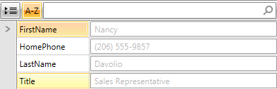
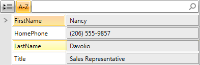

# ReadOnlyEditorState

RadPropertyGrid provides the __ReadOnlyEditorState__ property, which controls the read-only behavior of the control. 

The property supports three options:

* __Default__: This is the current behavior of RadPropertyGrid when __IsReadOnly="True"__ is set.  When this is the chosen option the __IsReadOnly__ property of the __TextBox and CollectionEditorPicker__ is respected. For all other controls the __IsEnabled__ property is set.

* __Disabled__: Provides a consistent view and behavior, by binding the __IsEnabled__ property of the corresponding editors ( __TexBox__, __CollectionEditor__, __DateTimePicker__). This option does not allow any interaction with the property values.

* __ReadOnly__: When this is the selected option, the __IsReadOnly__ property will be set. If the corresponding control does __not have IsReadOnly__ property, then the __IsEnabled__ property will be set as a fallback. This option provides limited interaction with the property values.

>important This behavior can be used only when IsReadOnly = “True”.

The following examples show how RadPropertyGrid will look like when the ReadOnlyEditorState property is used:

__Example 1: Setting ReadOnlyEditorState property to Disabled__

```XAML
	<telerik:RadPropertyGrid 
	    Item="{Binding Employee}"
	    IsReadOnly="True"
	    ReadOnlyEditorState="Disabled"/>
```

#### __Figure 1: RadPropertyGrid with ReadOnlyEditorState set to Disabled__



__Example 2: Setting ReadOnlyEditorState to ReadOnly__

```XAML
	<telerik:RadPropertyGrid
	    Item="{Binding Employee}"
	    IsReadOnly="True"
	    ReadOnlyEditorState="ReadOnly"/>
```

#### __Figure 2: RadPropertyGrid with ReadOnlyEditorState set to ReadOnly__



## See Also

 * [Read Only PropertyDefinition]()

 * [Getting Started with RadPropertyGrid]()
