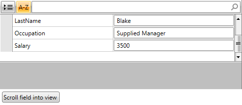
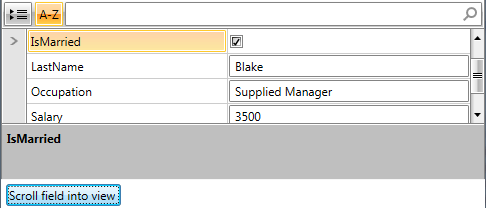
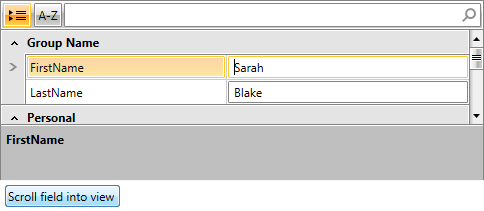
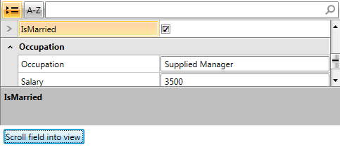

# Scrolling into View

Since __RadPropertyGrid__ utilizes UI virtualization, it only initializes those PropertyGridField that should be currently displayed in the view port. Thus, if one aims to bring some PropertyDefinition's PropertyGridField into view, a standard visual tree traversal will not do the work. 

## The ScrollIntoViewAsync method

__ScrollIntoViewAsync(PropertyDefinition propertyDefinition, Action<PropertyGridField> finishedCallback)__ handles the mentioned scenario. Invoking it for a certain __PropertyDefinition__ forces RadPropertyGrid to calculate the needed scroll offset to display its PropertyGridField and then scrolls to it. 
        

>tipAfter the scrolling operation is accomplished, the __finishedCallback__ is executed, passing the __newly realized PropertyGridField as a parameter__.
          

>importantScrollIntoViewAsync is supported only when __RenderMode is set to Flat__. For more information on the different rendering modes, please check the [Layout Rendering Modes]() article.
        

Below you can find a basic scenario illustrating how to scroll to a particular field and then select it.

You can define __RadPropertyGrid__ similar to:

__Example 1:__ RadPropertyGrid with manually defined PropertyDefinitions

#### __XAML__

{{region radpropertygrid-scrolling_0}}
	<Grid>
	  <Grid.RowDefinitions>
	    <RowDefinition Height="*"/>
	    <RowDefinition Height="Auto" />
	  </Grid.RowDefinitions>
	  <telerik:RadPropertyGrid Height="200" x:Name="PropertyGrid1" RenderMode="Flat" AutoGeneratePropertyDefinitions="False">
	    <telerik:RadPropertyGrid.PropertyDefinitions>
	      <telerik:PropertyDefinition Binding="{Binding FirstName}" GroupName="Group Name" DisplayName="FirstName"/>
	      <telerik:PropertyDefinition Binding="{Binding LastName}" GroupName="Group Name" DisplayName="LastName"/>
	      <telerik:PropertyDefinition Binding="{Binding Ocupation}" GroupName="Occupation" DisplayName="Occupation"/>
	      <telerik:PropertyDefinition Binding="{Binding Salary}" GroupName="Occupation" DisplayName="Salary"/>
	      <telerik:PropertyDefinition Binding="{Binding IsMarried}" GroupName="Personal" DisplayName="IsMarried"/>
	    </telerik:RadPropertyGrid.PropertyDefinitions>
	  </telerik:RadPropertyGrid>
	  <Button Name="Button1"
	      Grid.Row="1"
	      Content="Scroll field into view "
	      Click="Button1_Click"
	      Margin="5"
	      HorizontalAlignment="Left"/>
	</Grid>
	{{endregion}}

As to assigning the __Item of RadPropertyGrid__, please check the __Binding RadPropertyGrid to an item__ section in 
          [Getting Started with RadPropertyGrid](07F77841-3BC1-4AEA-A46A-DECB93D1C724#Binding_RadPropertyGrid) help article.
        

You can see the result after starting the program on __Figure 1__:
        

Figure 1: RadPropertyGrid in sorted mode with some fields not currently visible

Then, click on __Scroll field into view__ button and execute the following code:

__Example 2:__ Scrolling to a particular PropertyDefinition and selecting it

#### __C#__

{{region radpropertygrid-scrolling_1}}
	private void Button1_Click(object sender, RoutedEventArgs e)
	{
	    var propertyDefinition = this.PropertyGrid1.PropertyDefinitions.Where(x=>x.DisplayName == "IsMarried").FirstOrDefault();
	    if (propertyDefinition != null)
	    {
	        PropertyGrid1.ScrollIntoViewAsync(propertyDefinition, new Action<PropertyGridField>(f => f.IsSelected = true));
	    }
	}
	{{endregion}}

#### __VB__

{{region radpropertygrid-scrolling_1}}
	    Private Sub Button1_Click(sender As Object, e As RoutedEventArgs)
	        Dim propertyDefinition = Me.PropertyGrid1.PropertyDefinitions.Where(Function(x) x.DisplayName = "IsMarried").FirstOrDefault()
	        If propertyDefinition IsNot Nothing Then
	            PropertyGrid1.ScrollIntoViewAsync(propertyDefinition, New Action(Of PropertyGridField)(Function(f) InlineAssignHelper(f.IsSelected, True)))
	        End If
	    End Sub
	{{endregion}}

You can observe the result on __Figure 2__.

Figure 2: RadPropertyGrid after scrolling to a particular PropertyDefinition and selecting it

## ScrollIntoViewAsync with grouping

ScrollIntoViewAsync can also be used in __grouped scenarios__, to bring given PropertyDefinition’s PropertyGridField in the view port. 
          

>tipInvoking it will scroll to the group, expanding it if needed.

However, this functionality is supported only for groups that have valid Key (PropertyDefinition.GroupName). You can find more information on how to define groups in the article on [Grouping Support]().
        

Figure 3: RadPropertyGrid in grouped mode with some fields not currently visible

Then, click on __Scroll field into view__ button and execute the following code:
        

__Example 3:__ Scrolling to a particular PropertyDefinition and selecting it

#### __C#__

{{region radpropertygrid-scrolling_1}}
	private void Button1_Click(object sender, RoutedEventArgs e)
	{
	    var propertyDefinition = this.PropertyGrid1.PropertyDefinitions.Where(x=>x.DisplayName == "IsMarried").FirstOrDefault();
	    if (propertyDefinition != null)
	    {
	        PropertyGrid1.ScrollIntoViewAsync(propertyDefinition, new Action<PropertyGridField>(f => f.IsSelected = true));
	    }
	}
	{{endregion}}

#### __VB__

{{region radpropertygrid-scrolling_1}}
	    Private Sub Button1_Click(sender As Object, e As RoutedEventArgs)
	        Dim propertyDefinition = Me.PropertyGrid1.PropertyDefinitions.Where(Function(x) x.DisplayName = "IsMarried").FirstOrDefault()
	        If propertyDefinition IsNot Nothing Then
	            PropertyGrid1.ScrollIntoViewAsync(propertyDefinition, New Action(Of PropertyGridField)(Function(f) InlineAssignHelper(f.IsSelected, True)))
	        End If
	    End Sub
	{{endregion}}

You can observe the result on __Figure 4__.
        

Figure 4: RadPropertyGrid after scrolling to a particular PropertyDefinition and selecting it

## ScrollIntoViewAsync with nested properties

When ScrollIntoView is __invoked for a__. You can find more information on how to define nested PropertyDefinitions in the article on [Nested Properties]().
        

To guarantee that such operations will be successfully executed, both root and nested PropertyDefinitions should have a valid Binding set.
        

>tipIt works with multiple levels of hierarchy.
          

For sample code on how to perform the scroll please refer to the [ScrollIntoViewAsync section](#the-scrollintoviewasync-method) above.

# See Also

 * [Getting Started]()

 * [Layout Rendering Modes]()

 * [Grouping Support]()

 * [Nested Properties]()

 * [Autogenerated Property Definitions]()
