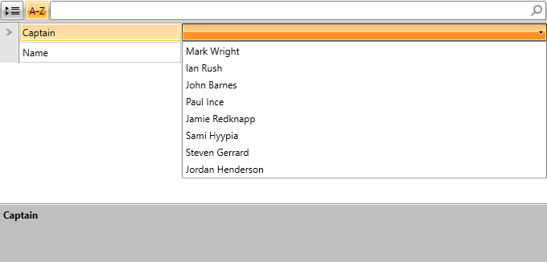
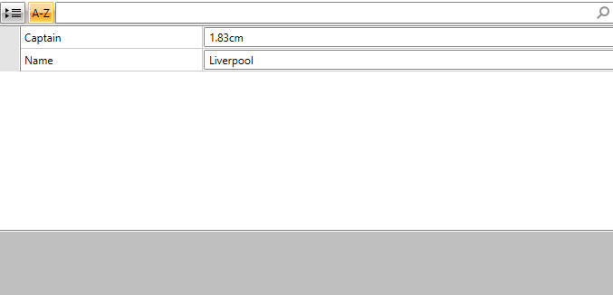

# TypeConverter Support

In certain cases, __RadPropertyGrid__ is used for displaying and editing properties of custom data type. By default, in such scenarios the control will display the custom type as a string. RadPropertyGrid provides __TypeConverter__ support, meaning that this behavior can be modified by defining a custom __TypeConverter__. The main methods that are usually utilized when implementing a custom __TypeConverter__ are listed below.

* Override the __CanConvertFrom__ method that specifies which type the converter can convert from.

* Override the __ConvertFrom__ method that implements the conversion.

* Override the __CanConvertTo__ method that specifies which type the converter can convert to.

* Override the __ConvertTo__ method that implements the conversion.

> More information on implementing a **TypeConverter** can be found in MSDN: [How to: Implement a Type Converter](https://msdn.microsoft.com/en-us/library/ayybcxe5.aspx).

* [Defining the Business Object](#defining-the-business-object)

 
* [Display a Predefined List of Values for a Property with TypeConverter](#display-a-predefined-list-of-values-for-a-property-with-typeconverter)


* [Culture-aware TypeConverter](#culture-aware-typeconverter)

## Defining the Business Object 

Demonstrating the __TypeConverter__ mechanism in the scope of RadPropertyGrid will require an object which has a property of custom data type. This section will cover the process of defining them.

The example will use a __Club__ object which has a __Captain__ property of type __Player__.

__Example 1: Defining the business object__

<snippet id='radpropertygrid-features-typeconverter-support-block_1-cs' />
<snippet id='radpropertygrid-features-typeconverter-support-block_1-vb' />

 
## Display a Predefined List of Values for a Property with TypeConverter

As of __R1 2017__, the TypeConverter mechanism of RadPropertyGrid provides support for a standard set of values that can be picked from a predefined list. This can be done through overriding the __GetStandardValuesSupported__ method.

__Example 2: Defining a TypeConverter providing a default set of values__
<snippet id='radpropertygrid-features-typeconverter-support-block_2-cs' />
<snippet id='radpropertygrid-features-typeconverter-support-block_2-vb' />

> If __EditorAttribute__ is set to a specific property with a set __TypeConverter__ the __EditorAttribute__ is with lower priority - a default set of values will be visualized if the __GetStandardValuesSupported__ is overridden instead of an editor.

#### __Figure 1: TypeConverter providing a default set of values__



## Culture-aware TypeConverter

In this section, the definition of a culture aware TypeConverter will be demonstrated. The support for it is added as of __R1 2017__. For this purpose, the __Height__ property of the __Player__ object  will be used.

__Example 3: Defining a culture aware TypeConverter__

<snippet id='radpropertygrid-features-typeconverter-support-block_3-cs' />
<snippet id='radpropertygrid-features-typeconverter-support-block_3-vb' />

#### __Figure 2: Culture-aware TypeConverter__

 

## See also

* [Data Annotations]()

* [Editor Attribute]()
