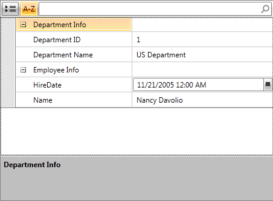
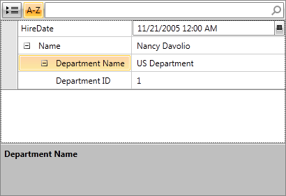

# Unbound Mode

With this feature RadPropertyGrid enables its users to create their own nested property hierarchies, without the need to respect any of the actual parent/child or siblings relations. 

## AutogenerateBindingPaths

When non-auto-generated PropertyDefinitions are used, RadPropertyGrid relies on an internal “binding path generation” mechanism, as it is described in this article. This behavior can be modified by setting the __AutogenerateBindingPaths__ property to __"False"__. In this mode, it is mandatory to write the whole binding path, from the root (Item) level, to the respective nested property. 

The following examples illustrate two possible hierarchies based on the following class definitions:

__Example 1: Prepare sample objects__

	```C#
	public class Employee
	{
	    public string Name { get; set; }
	    public DateTime HireDate { get; set; }
	    public Department Department { get; set; }
	}
	public class Department
	{
	    public string Name { get; set; }
	    public int ID { get; set; }
	}
```
```VB.NET
	Public Class Employee
	    Public Property Name() As String
	    Public Property HireDate() As Date
	    Public Property Department() As Department
	End Class
	Public Class Department
	    Public Property Name() As String
	    Public Property ID() As Integer
	End Class
```

And the sample data:

__Example 2: Prepare sample data__

	```C#
	InitializeComponent();
	this.rpg.Item = new Employee()
	{
	    Name = "Nancy Davolio",
	    HireDate = DateTime.Now,
	    Department = new Department()
	    {
	        ID = 1,
	        Name = "US Department"
	    }
	};
```
```VB.NET
	Public Sub New()
	    InitializeComponent()
	    Me.rpg.Item = New Employee() With {
	        .Name = "Nancy Davolio",
	        .HireDate = Date.Now,
	        .Department = New Department() With {
	            .ID = 1,
	            .Name = "US Department"
	        }
	    }
	End Sub
```

__Example 3: RadPropertyGrid UnboundMode first example__

	```XAML
	<telerik:RadPropertyGrid x:Name="rpg" 
	                         AutoGenerateBindingPaths="False" 
	                         AutoGeneratePropertyDefinitions="False" 
	                         NestedPropertiesVisibility="Visible">
	    <telerik:RadPropertyGrid.PropertyDefinitions>
	        <telerik:PropertyDefinition DisplayName="Employee Info">
	            <telerik:PropertyDefinition.NestedProperties>
	                <telerik:PropertyDefinition DisplayName="Name" Binding="{Binding Name}" />
	                <telerik:PropertyDefinition DisplayName="HireDate" Binding="{Binding HireDate}" />
	            </telerik:PropertyDefinition.NestedProperties>
	        </telerik:PropertyDefinition>
	        <telerik:PropertyDefinition DisplayName="Department Info">
	            <telerik:PropertyDefinition.NestedProperties>
	                <telerik:PropertyDefinition DisplayName="Department Name" Binding="{Binding Department.Name}" />
	                <telerik:PropertyDefinition DisplayName="Department ID" Binding="{Binding Department.ID}" />
	            </telerik:PropertyDefinition.NestedProperties>
	        </telerik:PropertyDefinition>
	    </telerik:RadPropertyGrid.PropertyDefinitions>
	</telerik:RadPropertyGrid>
```



__Example 4: RadPropertyGrid UnboundMode second example__

	```XAML
	<telerik:RadPropertyGrid x:Name="rpg1" 
	                         AutoGenerateBindingPaths="False" 
	                         AutoGeneratePropertyDefinitions="False" 
	                         NestedPropertiesVisibility="Visible">
	    <telerik:RadPropertyGrid.PropertyDefinitions>
	        <telerik:PropertyDefinition DisplayName="Name" Binding="{Binding Name}" >
	            <telerik:PropertyDefinition.NestedProperties>
	                <telerik:PropertyDefinition DisplayName="Department Name" Binding="{Binding Department.Name}">
	                    <telerik:PropertyDefinition.NestedProperties>
	                        <telerik:PropertyDefinition DisplayName="Department ID" Binding="{Binding Department.ID}" />
	                    </telerik:PropertyDefinition.NestedProperties>
	                </telerik:PropertyDefinition>
	            </telerik:PropertyDefinition.NestedProperties>
	        </telerik:PropertyDefinition>
	        <telerik:PropertyDefinition DisplayName="HireDate" Binding="{Binding HireDate}" />
	    </telerik:RadPropertyGrid.PropertyDefinitions>
	</telerik:RadPropertyGrid>
```


