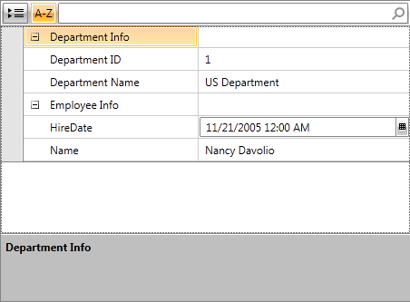
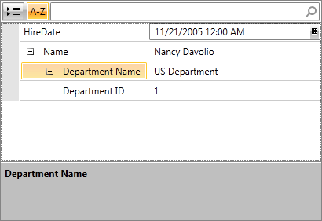

# Unbound Mode

With this feature RadPropertyGrid enables its users to create their own nested property hierarchies, without the need to respect any of the actual parent/child or siblings relations. 

## AutogenerateBindingPaths

When non-auto-generated PropertyDefinitions are used, RadPropertyGrid relies on an internal “binding path generation” mechanism, as it is described in this article. This behavior can be modified by setting the __AutogenerateBindingPaths__ property to __"False"__. In this mode, it is mandatory to write the whole binding path, from the root (Item) level, to the respective nested property. 

The following examples illustrate two possible hierarchies based on the following class definitions:

__Example 1: Prepare sample objects__

<snippet id='radpropertygrid-features-unbound-mode-block_1-cs' />
<snippet id='radpropertygrid-features-unbound-mode-block_1-vb' />

And the sample data:

__Example 2: Prepare sample data__

<snippet id='radpropertygrid-features-unbound-mode-block_2-cs' />
<snippet id='radpropertygrid-features-unbound-mode-block_2-vb' />

__Example 3: RadPropertyGrid UnboundMode first example__

<snippet id='radpropertygrid-features-unbound-mode-block_3-xaml' />

__Example 4: RadPropertyGrid UnboundMode second example__

<snippet id='radpropertygrid-features-unbound-mode-block_4-xaml' />

