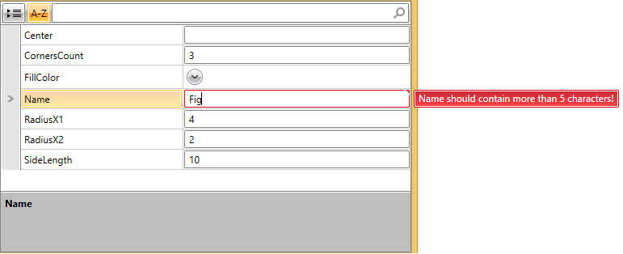

# Validation Support

RadPropertyGrid supports validation through [IDataErrorInfo](#validating-through-idataerrorinfo), [INotifyDataErrorInfo](#validating-through-inotifydataerrorinfo) and through [DataAnnotations](#validating-through-dataannotations) as well as validating [PropertySets](#validating-property-sets).

>Complete examples of the implementation of the validation mechanisms in the RadPropertyGrid control can be found in our GitHub repository:
* [IDataErrorInfo and Data Annotations Validation](https://github.com/telerik/xaml-sdk/tree/master/PropertyGrid/Validation)
* [INotifyDataErrorInfo Validation](https://github.com/telerik/xaml-sdk/tree/master/PropertyGrid/ValidationINotifyDataErrorInfo)

>You can run these examples through the [SDK Samples Browser]().

## Validating through IDataErrorInfo

In order to have the validation rules defined through the [IDataErrorInfo](https://docs.microsoft.com/en-us/dotnet/api/system.componentmodel.idataerrorinfo) interface, you will have to implement additional code which sets the __ValidatesOnDataErrors__ and __NotifyOnValidationError__ properties of the Binding to __"true"__. Please note, that the default binding generated for auto-generated PropertyDefinition have those properties set to __"false"__. 

__Example 1: Setting ValidatesOnDataErrors and NotifyOnValidationError of the Binding__

```C#
	private void rpg_AutoGeneratingPropertyDefinition(object sender, Telerik.Windows.Controls.Data.PropertyGrid.AutoGeneratingPropertyDefinitionEventArgs e)
	{
	    (e.PropertyDefinition.Binding as Binding).ValidatesOnDataErrors = true;
	    (e.PropertyDefinition.Binding as Binding).NotifyOnValidationError = true;
	}
```
```VB.NET
	Private Sub rpg_AutoGeneratingPropertyDefinition(ByVal sender As Object, ByVal e As Telerik.Windows.Controls.Data.PropertyGrid.AutoGeneratingPropertyDefinitionEventArgs)
	    TryCast(e.PropertyDefinition.Binding, Binding).ValidatesOnDataErrors = True
	    TryCast(e.PropertyDefinition.Binding, Binding).NotifyOnValidationError = True
	End Sub
```

You can define the validation rules like so:

__Example 2: Defining validation rules__

```C#
	public string this[string columnName]
	{
	    get
	    {
	        if (columnName == "IntProp")
	        {
	            return this.IntProp < 100 && this.IntProp > 0 ? string.Empty : "Value should be in the range of (0, 100)";
	        }
	        if (columnName == "StringProp")
	        {
	            return this.StringProp != null && Regex.IsMatch(this.StringProp, @"^[0-9]+[\p{L}]*") ? string.Empty : @"Value should math the regex: ^[0-9]+[\p{L}]*";
	        }
	        if (columnName == "DateTimeProp")
	        {
	            return this.DateTimeProp.Year > 1900 ? string.Empty : "Date should be after 1/1/1900";
	        }
	        return string.Empty;
	    }
	}
```
```VB.NET
	Default Public ReadOnly Property Item(ByVal columnName As String) As String
	    Get
	        If columnName = "IntProp" Then
	            Return If(Me.IntProp < 100 AndAlso Me.IntProp > 0, String.Empty, "Value should be in the range of (0, 100)")
	        End If
	        If columnName = "StringProp" Then
	            Return If(Me.StringProp IsNot Nothing AndAlso Regex.IsMatch(Me.StringProp, "^[0-9]+[\p{L}]*"), String.Empty, "Value should math the regex: ^[0-9]+[\p{L}]*")
	        End If
	        If columnName = "DateTimeProp" Then
	            Return If(Me.DateTimeProp.Year > 1900, String.Empty, "Date should be after 1/1/1900")
	        End If
	        Return String.Empty
	    End Get
	End Property
```

## Validating through INotifyDataErrorInfo

Provided your business objects correctly implement the [INotifyDataErrorInfo](https://docs.microsoft.com/en-us/dotnet/api/system.componentmodel.inotifydataerrorinfo) interface, such validation is supported out of the box. **Example 3** and **Example 4** demonstrate a sample implementation.

__Example 3: Defining the validation method__

```C#
	private void ValidateName()
	{
		var error = "Name must be at least 5 characters!";

		if (this.Name == null || this.Name.Length < 5)
		{
			this.AddError("Name", error);
		}
		else
		{
			this.RemoveError("Name", error);
		}
	}
```
```VB.NET
	Private Sub ValidateName()
		Dim [error] = "Name must be at least 5 characters!"

		If Me.Name Is Nothing OrElse Me.Name.Length < 5 Then
			Me.AddError("Name", [error])
		Else
			Me.RemoveError("Name", [error])
		End If
	End Sub
```

__Example 4: Calling the ValidateName method__

```C#
	public string Name
	{
		get { return this.name; }
		set
		{
			if (value != this.name || value == null)
			{
				this.name = value;
				this.OnPropertyChanged("Name");
				this.ValidateName();
			}
		}
	}
```
```VB.NET
	Public Property Name() As String
		Get
			Return Me._name
		End Get
		Set(ByVal value As String)
			If value <> Me._name OrElse value Is Nothing Then
				Me._name = value
				Me.OnPropertyChanged("Name")
				Me.ValidateName()
			End If
		End Set
	End Property
```

## Validating through DataAnnotations

In order to have the validation rules defined through [DataAnnotations](https://docs.microsoft.com/en-us/dotnet/api/system.componentmodel.dataannotations) respected, you will have to set the ValidatesOnExceptions property of the Binding to true. Please note, that the default binding generated for auto-generated PropertyDefinition does not have this property set to true. 

__Example 5: Setting ValidatesOnExceptions of Binding__

```C#
	private void rpg1_AutoGeneratingPropertyDefinition(object sender, Telerik.Windows.Controls.Data.PropertyGrid.AutoGeneratingPropertyDefinitionEventArgs e)
	{
	    (e.PropertyDefinition.Binding as Binding).ValidatesOnExceptions = true;
	}
```
```VB.NET
	Private Sub rpg1_AutoGeneratingPropertyDefinition(ByVal sender As Object, ByVal e As Telerik.Windows.Controls.Data.PropertyGrid.AutoGeneratingPropertyDefinitionEventArgs)
	    TryCast(e.PropertyDefinition.Binding, Binding).ValidatesOnExceptions = True
	End Sub
```

For example you can define the Required DataAnnotations attribute like so:

__Example 6: Defining DataAnnotations Attribute__

```C#
	private string requiredField;
	[Required(ErrorMessage = "This field is Required.")]
	public string RequiredField
	{
	    get { return requiredField; }
	    set
	    {
	        requiredField = value;
	        ValidateProperty("RequiredField", value);
	        this.OnPropertyChanged("RequiredField");
	    }
	}
```
```VB.NET
	Private _requiredField As String
	<Required(ErrorMessage:="This field is Required.")>
	Public Property RequiredField() As String
	    Get
	        Return _requiredField
	    End Get
	    Set(ByVal value As String)
	        _requiredField = value
	        ValidateProperty("RequiredField", value)
	        Me.OnPropertyChanged("RequiredField")
	    End Set
	End Property
```

You may notice that there is a call to a ValidateProperty method. You will have to define such method like this:

__Example 7: Defining ValidateProperty method__

```C#
	public void ValidateProperty(string propName, object value)
	{
	    var result = new List<System.ComponentModel.DataAnnotations.ValidationResult>();
	    Validator.TryValidateProperty(value, new ValidationContext(this, null, null) { MemberName = propName }, result);
	    if (result.Count > 0)
	    {
	        throw new ValidationException(result[0].ErrorMessage);
	    }
	}
```
```VB.NET
	Public Sub ValidateProperty(ByVal propName As String, ByVal value As Object)
	    Dim result = New List(Of ValidationResult)()
	    Validator.TryValidateProperty(value, New ValidationContext(Me, Nothing, Nothing) With {.MemberName = propName}, result)
	    If result.Count > 0 Then
	        Throw New ValidationException(result(0).ErrorMessage)
	    End If
	End Sub
```

## Validating Property Sets

> Before proceeding with this section you might find it useful to get familiar with  RadPropertyGrid`s [Property Sets]() functionality.

In order to enable validation for the fields that represent property sets, you need to set the __PropertySetsValidationFunction__ of RadPropertyGrid. The function takes two arguments: __string__ - the property that is being changed and __object__ - the value that is about to be applied. The function returns a string that represents the error message. 

__Example 8: Setting the PropertySetsValidationFunction__

```C#
	this.rpg.PropertySetsValidationFunction = new Func<string, object, string>((s, t) => 
	{
	    if (s == "Name" && t != null && t.ToString().Length < 5)
	    {
	        return "Name should contain more than 5 characters!";
	    }
	    else
	    {
	        return null;
	    }
	});
```
```VB.NET
	Me.rpg.PropertySetsValidationFunction = New Func(Of String, Object, String)(Function(s, t)
	                                                                                If s = "Name" AndAlso t IsNot Nothing AndAlso t.ToString().Length < 5 Then
	                                                                                    Return "Name should contain more than 5 characters!"
	                                                                                Else
	                                                                                    Return Nothing
	                                                                                End If
	                                                                            End Function)
```

__Figure 1__ shows the appearance of RadPropertyGrid after validation is applied.

#### __Figure 1: Appearance of RadPropertyGrid after PropertySetsValidationFunction is set:__


>important Both the __ValidatesOnDataErrors__ and __NotifyOnValidationError__ properties of the PropertyDefinition`s Binding should be set to __True__ for the error message to appear.

## See Also

- [Property Sets]()

- [Edit Modes]()

