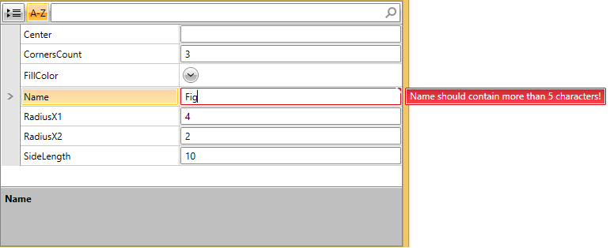

# Validation Support

RadPropertyGrid supports validation through [IDataErrorInfo](#validating-through-idataerrorinfo), [INotifyDataErrorInfo](#validating-through-inotifydataerrorinfo) and through [DataAnnotations](#validating-through-dataannotations) as well as validating [PropertySets](#validating-property-sets).

>Complete examples of the implementation of the validation mechanisms in the RadPropertyGrid control can be found in our GitHub repository:
* [IDataErrorInfo and Data Annotations Validation](https://github.com/telerik/xaml-sdk/tree/master/PropertyGrid/Validation)
* [INotifyDataErrorInfo Validation](https://github.com/telerik/xaml-sdk/tree/master/PropertyGrid/ValidationINotifyDataErrorInfo)

>You can run these examples through the [SDK Samples Browser]().

## Validating through IDataErrorInfo

In order to have the validation rules defined through the [IDataErrorInfo](https://docs.microsoft.com/en-us/dotnet/api/system.componentmodel.idataerrorinfo) interface, you will have to implement additional code which sets the __ValidatesOnDataErrors__ and __NotifyOnValidationError__ properties of the Binding to __"true"__. Please note, that the default binding generated for auto-generated PropertyDefinition have those properties set to __"false"__. 

__Example 1: Setting ValidatesOnDataErrors and NotifyOnValidationError of the Binding__

<snippet id='radpropertygrid-features-validation-block_1-cs' />
<snippet id='radpropertygrid-features-validation-block_1-vb' />

You can define the validation rules like so:

__Example 2: Defining validation rules__

<snippet id='radpropertygrid-features-validation-block_2-cs' />
<snippet id='radpropertygrid-features-validation-block_2-vb' />

## Validating through INotifyDataErrorInfo

Provided your business objects correctly implement the [INotifyDataErrorInfo](https://docs.microsoft.com/en-us/dotnet/api/system.componentmodel.inotifydataerrorinfo) interface, such validation is supported out of the box. **Example 3** and **Example 4** demonstrate a sample implementation.

__Example 3: Defining the validation method__

<snippet id='radpropertygrid-features-validation-block_3-cs' />
<snippet id='radpropertygrid-features-validation-block_3-vb' />

__Example 4: Calling the ValidateName method__

<snippet id='radpropertygrid-features-validation-block_4-cs' />
<snippet id='radpropertygrid-features-validation-block_4-vb' />

## Validating through DataAnnotations

In order to have the validation rules defined through [DataAnnotations](https://docs.microsoft.com/en-us/dotnet/api/system.componentmodel.dataannotations) respected, you will have to set the ValidatesOnExceptions property of the Binding to true. Please note, that the default binding generated for auto-generated PropertyDefinition does not have this property set to true. 

__Example 5: Setting ValidatesOnExceptions of Binding__

<snippet id='radpropertygrid-features-validation-block_5-cs' />
<snippet id='radpropertygrid-features-validation-block_5-vb' />

For example you can define the Required DataAnnotations attribute like so:

__Example 6: Defining DataAnnotations Attribute__

<snippet id='radpropertygrid-features-validation-block_6-cs' />
<snippet id='radpropertygrid-features-validation-block_6-vb' />

You may notice that there is a call to a ValidateProperty method. You will have to define such method like this:

__Example 7: Defining ValidateProperty method__

<snippet id='radpropertygrid-features-validation-block_7-cs' />
<snippet id='radpropertygrid-features-validation-block_7-vb' />

## Validating Property Sets

> Before proceeding with this section you might find it useful to get familiar with  RadPropertyGrid`s [Property Sets]() functionality.

In order to enable validation for the fields that represent property sets, you need to set the __PropertySetsValidationFunction__ of RadPropertyGrid. The function takes two arguments: __string__ - the property that is being changed and __object__ - the value that is about to be applied. The function returns a string that represents the error message. 

__Example 8: Setting the PropertySetsValidationFunction__

<snippet id='radpropertygrid-features-validation-block_8-cs' />
<snippet id='radpropertygrid-features-validation-block_8-vb' />

__Figure 1__ shows the appearance of RadPropertyGrid after validation is applied.

#### __Figure 1: Appearance of RadPropertyGrid after PropertySetsValidationFunction is set:__

>important Both the __ValidatesOnDataErrors__ and __NotifyOnValidationError__ properties of the PropertyDefinition`s Binding should be set to __True__ for the error message to appear.

## See Also

- [Property Sets]()

- [Edit Modes]()