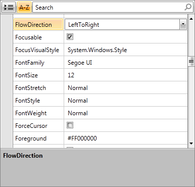
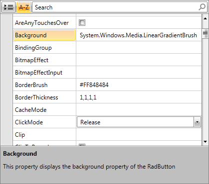

# Autogenerated Property Definitions

By default, RadPropertyGrid creates its property definitions automatically based on the type of the corresponding properties. Thus the proper editor controls are text fields for string properties, CheckBoxes for Boolean, ComboBoxes for enums.

#### __Figure 1: RadPropertyGrid with autogenerated property definitions__



However, you are free to change each of the property definitions displayed. What you need to do is to set the __AutoGeneratePropertyDefinitions__ property of RadPropertyGrid to __"True"__ and handle the __AutoGeneratingPropertyDefinition__ event. As it is cancelable, you may reject the creation of a particular property definition.  

The arguments of the __AutoGeneratingPropertyDefinition__ event are:

* __Cancel__: Gets or set a value that indicates whether the operation should be cancelled.

* __PropertyDefinition__: Gets or sets the property definition for each of the properties. You may edit the following properties of each property definition:

	* __Binding__: Points to the data member to display/edit in the field.
	
	* __Description__: The description of a property.
	
	* __DisplayName__: The displayed name.
	
	* __EditorTemplate__: The DataTemplate for the editor of the property. If left unset, a default editor will be generated.
	
	* __GroupName__: The group name used to organize properties in categories.
	
	* __HasNestedProperties__: Indicates whether this property definition has nested property definitions.
	
	* __NestedProperties__: The collection of nested properties.
	
	* __OrderIndex__: The index of the order.
	
	* __ParentProperty__: The parent property of this property definition.

The AutoGeneratingPropertyDefinition event will be fired for each property of the item, thus enabling you to customize the view on property basis.
So, for example, let us decide on defining a Description for the Background property of RadButton bound to RadPropertyGrid.

__Example 1: AutoGeneratingPropertyDefinition event__

```C#
	private void PropertyGrid1_AutoGeneratingPropertyDefinition(object sender, Telerik.Windows.Controls.Data.PropertyGrid.AutoGeneratingPropertyDefinitionEventArgs e)
	{
	    if (e.PropertyDefinition.DisplayName == "Background")
	    {
	        e.PropertyDefinition.Description = "This property displays the background property of the RadButton";
	    }
	}
```
```VB.NET
	Private Sub PropertyGrid1_AutoGeneratingPropertyDefinition(sender As Object, e As Telerik.Windows.Controls.Data.PropertyGrid.AutoGeneratingPropertyDefinitionEventArgs)
	    If e.PropertyDefinition.DisplayName = "Background" Then
	        e.PropertyDefinition.Description = "This property displays the background property of the RadButton"
	    End If
	End Sub
```

#### __Figure 2: RadPropertyGrid with customized autogenerated property definitions__



## See Also

[Customized Property Definitions]()

[Nested Properties]()