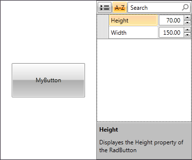
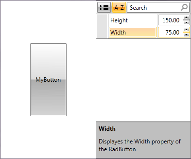

# Customized Property Definitions

RadPropertyGrid auto-generates its property definitions by default based on the properties of the source object. They are stacked vertically in a standard form layout and depend on the type of each property.

#### Figure 1: RadPropertyGrid with automatically generated property definitions when bound to a button


However, sometimes you may decide on customizing or totally changing them. This can be achieved by setting the __AutoGeneratePropertyDefinitions__ to __"False"__ and defining those you require in the **PropertyDefinitions** collection. For example, instead of using a simple TextBox for editing the **Height** and **Width** properties of a **RadButton**, you may use a **RadNumericUpDown**:

__Example 1: Custom Property Definitions__

```XAML
    <Grid>
        <Grid.ColumnDefinitions>
            <ColumnDefinition Width="*" />
            <ColumnDefinition Width="*" />
        </Grid.ColumnDefinitions>
        <telerik:RadButton x:Name="button1" Content="MyButton" Width="150" Height="70" />
        <telerik:RadPropertyGrid Item="{Binding ElementName=button1}" AutoGeneratePropertyDefinitions="False" LabelColumnWidth="100" Grid.Column="1">
            <telerik:RadPropertyGrid.PropertyDefinitions>
                <telerik:PropertyDefinition Binding="{Binding Width}" Description="Displays the Width property of the RadButton" DisplayName="Width">
                    <telerik:PropertyDefinition.EditorTemplate>
                        <DataTemplate>
                            <telerik:RadNumericUpDown Value="{Binding Width, Mode=TwoWay}" />
                        </DataTemplate>
                    </telerik:PropertyDefinition.EditorTemplate>
                </telerik:PropertyDefinition>
                <telerik:PropertyDefinition Binding="{Binding Height}" Description="Displays the Height property of the RadButton" DisplayName="Height">
                    <telerik:PropertyDefinition.EditorTemplate>
                        <DataTemplate>
                            <telerik:RadNumericUpDown Value="{Binding Height, Mode=TwoWay}" />
                        </DataTemplate>
                    </telerik:PropertyDefinition.EditorTemplate>
                </telerik:PropertyDefinition>
            </telerik:RadPropertyGrid.PropertyDefinitions>
        </telerik:RadPropertyGrid>
    </Grid>
```

Then, your RadPropertyGrid will be displayed as shown in **Figure 2**.

#### Figure 2: RadPropertyGrid with custom property definitions



You may also use RadPropertyGrid to edit directly the properties of the object it is bound to. So, once you change the values inside the RadPropertyGrid, the RadButton will be resized.

#### Figure 3: Resized RadButton



## See Also

* [Autogenerated Property Definitions]()
* [Nested Properties]()