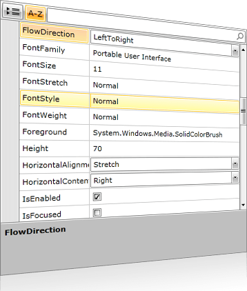

# Overview

## 







Thank you for choosing Telerik RadPropertyGrid !

RadPropertyGrid provides an easy and versatile approach to processing data objects' properties. Utilizing its autogeneration features and the intuitive custom editors capabilities, users would be able either to display data in a way that best fits their needs or modify it with minimal effort.

RadPropertyGrid can be bound to an item with just a single line of code and you may start exploring or editing its properties. The proper editor controls are auto generated - text fields for string properties, CheckBoxes for Boolean, DateTimePickers for dates, ComboBoxes for enums, RadColorPicker for colors. In addition RadPropertyGrid allows flexible manual setting and customization of editors and their layout via the standard Silverlight/WPF styling and templating mechanisms.  It is highly customizable, allowing the user to modify the default look in easy and intuitive manner.

 

