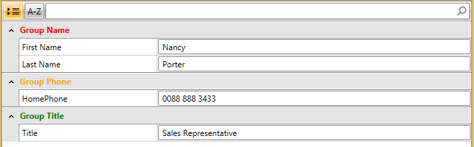

# GroupStyleSelector

This article will show you how to style RadPropertyGrid's group rows conditionally by applying __GroupStyleSelector__.
		
>tipLearn more about [StyleSelectors]().

Assume we have a RadPropertyGrid bound to an Employee object. You can view the initial setup in the [Styling Groups](%slug radpropertygrid-groupstyle%) article. At first the appearance of the control looks like this:

What we would like to achieve is to apply one style to the Group Name row and different style to the other groups. In order to achieve the desired behavior, you need to follow these steps:

1.Create a new class that inherits the __StyleSelector__ class. Override its __SelectStyle__ method. Based on your conditions - you return the proper Style that will be applied to the framework element.

	 class GroupStyleSelector : StyleSelector
    {
        public override Style SelectStyle(object item, DependencyObject container)
        {
            GroupDefinition groupDef = item as GroupDefinition;

            if (groupDef.DisplayName == "Group Name")
            {
                return this.NameGroupStyle;
            }
            else if (groupDef.DisplayName == "Group Phone")
            {
                return this.PhoneGroupStyle;
            }
            else
            {
                return this.TitleGroupStyle;
            }
           
        }
        public Style NameGroupStyle { get; set; }
        public Style PhoneGroupStyle { get; set; }
        public Style TitleGroupStyle { get; set; }
    }

In this specific scenario we have three different styles that could be applied:

- NameGroupStyle

- PhoneGroupStyle

- TitleGroupStyle 

Depending on the underlying data you can select which style to apply.

2.In the XAML file define the style selector as a resource and set the properties for the different styles:

	 <my:GroupStyleSelector x:Key="groupStyleSelector">
            <my:GroupStyleSelector.NameGroupStyle>
                
            </my:GroupStyleSelector.NameGroupStyle>
            <my:GroupStyleSelector.PhoneGroupStyle>
                
            </my:GroupStyleSelector.PhoneGroupStyle>
            <my:GroupStyleSelector.TitleGroupStyle>
                
            </my:GroupStyleSelector.TitleGroupStyle>
        </my:GroupStyleSelector>

>The __"my:"__ prefix before __GroupStyleSelector__ specifies the mapping for the namespace of the project: __xmlns:my="__

If you are using our [Implicit Themes](), you should base the style on the one defined for the corresponding theme:

#### __XAML__

{{region gridview-cell-style-selector_4}}

	
	
{{endregion}}

3.Finally, set the GroupStyleSelector property of the data column which represents the GroupStyleSelector field:

	    <telerik:RadPropertyGrid x:Name="PropertyGrid" 
                                 RenderMode="Flat"   
                                 IsGrouped="True"
                                 GroupStyleSelector="{StaticResource groupStyleSelector}"
                                 AutoGeneratePropertyDefinitions="False">
            <telerik:RadPropertyGrid.PropertyDefinitions>
                <telerik:PropertyDefinition Binding="{Binding FirstName}" GroupName="Group Name" DisplayName="First Name" />
                <telerik:PropertyDefinition Binding="{Binding LastName}" GroupName="Group Name" DisplayName="Last Name"/>
                <telerik:PropertyDefinition Binding="{Binding Title}" GroupName="Group Title" DisplayName="Title"/>
                <telerik:PropertyDefinition Binding="{Binding HomePhone}" GroupName="Group Phone" DisplayName="HomePhone"/>
            </telerik:RadPropertyGrid.PropertyDefinitions>
        </telerik:RadPropertyGrid>

The RadPropertyGrid should have the following appearance after the applied changes:

>tipIf you are using [Implicit Themes](), you should base the style on the one defined for the corresponding theme.

## See Also 
		
- [Group Style]()

- [Templates Structure]()

- [Property Grid Styles And Templates]()

        

 

