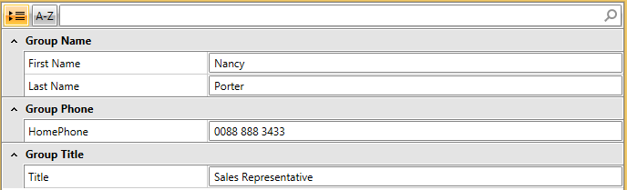
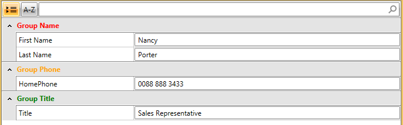

# GroupStyleSelector

This article will show you how to style RadPropertyGrid's group rows conditionally by applying __GroupStyleSelector__.

Assume we have a RadPropertyGrid bound to an Employee object. You can view the initial setup in the [Styling Groups]() article. At first the appearance of the control looks like this:

What we would like to achieve is to apply one style to the Group Name row and different style to the other groups. In order to achieve the desired behavior, you need to follow these steps:

1. Create a new class that inherits the __StyleSelector__ class. Override its __SelectStyle__ method. Based on your conditions - you return the proper Style that will be applied to the framework element.

__Example 1: The GroupStyleSelector class__

<snippet id='radpropertygrid-styles-and-templates-group-style-selectors-block_1-cs' />
<snippet id='radpropertygrid-styles-and-templates-group-style-selectors-block_1-vb' />

In this specific scenario we have three different styles that could be applied:

- NameGroupStyle

- PhoneGroupStyle

- TitleGroupStyle 

Depending on the underlying data you can select which style to apply.

2. In the XAML file define the style selector as a resource and set the properties for the different styles:

__Example 2: Defining the different style for the GroupStyleSelector__

<snippet id='radpropertygrid-styles-and-templates-group-style-selectors-block_2-xaml' />

>The __"my:"__ prefix before __GroupStyleSelector__ specifies the mapping for the namespace of the project: __xmlns:my="__

If you are using our [Implicit Themes](), you should base the style on the one defined for the corresponding theme:

__Example 3: Basing the style on the default for the control__

<snippet id='radpropertygrid-styles-and-templates-group-style-selectors-block_3-xaml' />

3. Finally, set the GroupStyleSelector property of the data column which represents the GroupStyleSelector field:

__Example 4: Setting RadPropertyGrid's GroupStyleSelector property__

<snippet id='radpropertygrid-styles-and-templates-group-style-selectors-block_4-xaml' />

The RadPropertyGrid should have the following appearance after the applied changes:

>tip If you are using [Implicit Themes](), you should base the style on the one defined for the corresponding theme.

## See Also 
		
- [Group Style]()

- [Templates Structure]()

- [Property Grid Styles And Templates]()

        

 

