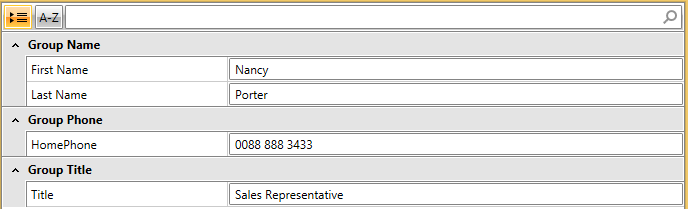
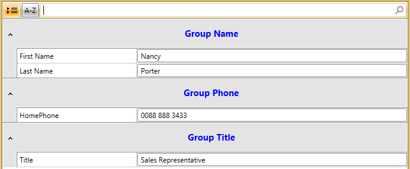

# Styling Groups

This article will show you how to assign a common style for all the groups of the __RadPropertyGrid__. You can achieve this by creating a style and assigning it to the __GroupStyle__ property of the RadPropertyGrid. 

>important This feature is only available with __RenderMode__ set to __"Flat"__

>tip The feature was introduced with Q1 2016

__1.__ First we declare an Employee class, an instance of which we will set as the RadPropertyGrid`s item: 

#### [C#] Example 1: Create the Employee class
	
	```C#
	public class Employee
	{
	    public string FirstName { get; set; }
	    public string LastName { get; set; }
	    public string Title { get; set; }
	    public string HomePhone { get; set; }
	}
```

#### [VB.NET] Example 1: Create the Employee class
	
	```VB.NET
	Public Class Employee
	    Public Property FirstName() As String
	    Public Property LastName() As String
	    Public Property Title() As String
	    Public Property HomePhone() As String
	End Class
```

__2.__ Declare the RadPropertyGrid in XAML:

#### [XAML] Example 2: Create the RadPropertyGrid

	```XAML
	<telerik:RadPropertyGrid x:Name="PropertyGrid" 
	                 RenderMode="Flat"   
	                 IsGrouped="True"
	                 AutoGeneratePropertyDefinitions="False">
	    <telerik:RadPropertyGrid.PropertyDefinitions>
	        <telerik:PropertyDefinition Binding="{Binding FirstName}" GroupName="Group Name" DisplayName="First Name" />
	        <telerik:PropertyDefinition Binding="{Binding LastName}" GroupName="Group Name" DisplayName="Last Name"/>
	        <telerik:PropertyDefinition Binding="{Binding Title}" GroupName="Group Title" DisplayName="Title"/>
	        <telerik:PropertyDefinition Binding="{Binding HomePhone}" GroupName="Group Phone" DisplayName="HomePhone"/>
	    </telerik:RadPropertyGrid.PropertyDefinitions>
	</telerik:RadPropertyGrid>
```        

__3.__ Instantiate the Employee object and set it as the item of the PropertyGrid control:

#### [C#] Example 3: Instantiate Employee object

	```C#
	Employee employee = new Employee()
	{
	    FirstName = "Nancy",
	    LastName = "Porter",
	    Title = "Sales Representative",
	    HomePhone = "0088 888 3433"
	};
	PropertyGrid.Item = employee;
```

#### [VB.NET] Example 3: Instantiate Employee object

	```VB.NET
	Dim employee As New Employee() With {
	    .FirstName = "Nancy",
	    .LastName = "Porter",
	    .Title = "Sales Representative",
	    .HomePhone = "0088 888 3433"
	}
	PropertyGrid.Item = employee
```  

At this point we have the following appearance:



You then need to proceed with creating the specific style and assign it to the control.

__4.__ Create the common style as a static resource:

#### [XAML] Example 4: Create the style
	
	```XAML
	<Style x:Key="commonGroupStyle" TargetType="telerik:RadToggleButton">
	    <Setter Property="Foreground" Value="Blue" />
	    <Setter Property="HorizontalContentAlignment" Value="Center"/>
	    <Setter Property="FontSize" Value="15"/>
	    <Setter Property="Height"  Value="50" />
	</Style>
```

__5.__ Set the __Group Style__ property of the RadPropertyGrid:

#### [XAML] Example 5: Set the GroupStyle property

	```XAML
	<telerik:RadPropertyGrid RenderMode="Flat"   
	                 IsGrouped="True"
	                 AutoGeneratePropertyDefinitions="False"
	                 GroupStyle="{StaticResource commonGroupStyle}" />
```  

The effect on the appearance of the control will be the following:



## See Also 

- [Group Style Selectors]()

- [Templates Structure]()

- [Property Grid Styles And Templates]()


        

 


