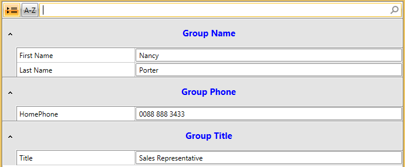

# Styling Groups

This article will show you how to assign a common style for all the groups of the __RadPropertyGrid__. You can achieve this by creating a style and assigning it to the __GroupStyle__ property of the RadPropertyGrid. 

>important This feature is only available with __RenderMode__ set to __"Flat"__

>tip The feature was introduced with Q1 2016

__1.__ First we declare an Employee class, an instance of which we will set as the RadPropertyGrid`s item: 

<snippet id='radpropertygrid-styles-and-templates-styling-groups-block_1-cs' />
<snippet id='radpropertygrid-styles-and-templates-styling-groups-block_1-vb' />

__2.__ Declare the RadPropertyGrid in XAML:

<snippet id='radpropertygrid-styles-and-templates-styling-groups-block_2-xaml' />

__3.__ Instantiate the Employee object and set it as the item of the PropertyGrid control:

<snippet id='radpropertygrid-styles-and-templates-styling-groups-block_3-cs' />
<snippet id='radpropertygrid-styles-and-templates-styling-groups-block_3-vb' />

At this point we have the following appearance:

You then need to proceed with creating the specific style and assign it to the control.

__4.__ Create the common style as a static resource:
	
<snippet id='radpropertygrid-styles-and-templates-styling-groups-block_4-xaml' />

__5.__ Set the __Group Style__ property of the RadPropertyGrid:

<snippet id='radpropertygrid-styles-and-templates-styling-groups-block_5-xaml' />

The effect on the appearance of the control will be the following:

## See Also 

- [Group Style Selectors]()

- [Templates Structure]()

- [Property Grid Styles And Templates]()

        

 

