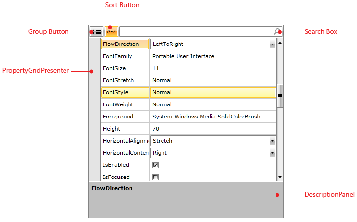

# VisualStructure

## 

RadPropertyGrid provides an easy and versatile approach to processing data objects' properties. Utilizing its autogeneration features and the intuitive custom editors capabilities, users would be able either to display data in a way that best fits their needs or modify it with minimal effort.

This section defines the terms and concepts used in the scope of the RadPropertyGrid that you have to get familiar with prior to continue reading this help. They can also be helpful when contacting with the support service in order to better describe your issue. Below you can see snapshot and explanations of the main states and visual elements of the standard RadPropertyGrid control.

         
      

* __Group Button__ - allows you to organize the RadPropertyGrid according to the predefined group names;

* __Sort Button (or Flat Button)__ - displays all the properties in a flat/ ungrouped structure;

* __Search Box__ - enables searching a specific property based on its name;

* __PropertyGridPresenter__- displays the properties of the object tha property grid is bound to;

* __DescriptionPanel__ - displays the description of the selected property.
