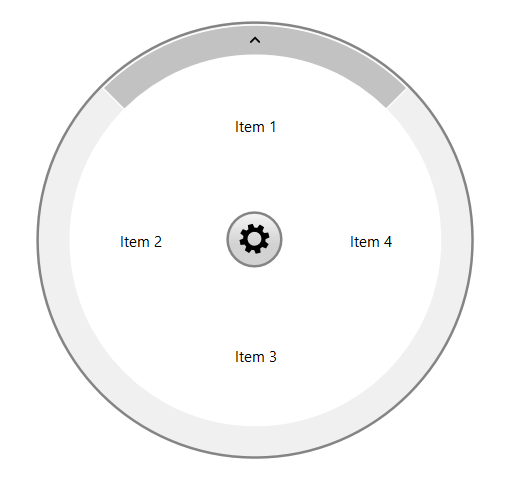
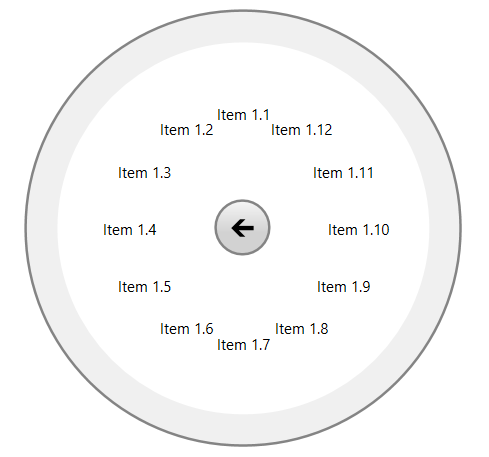
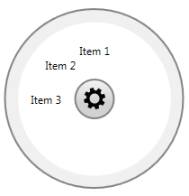
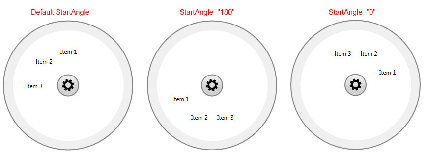
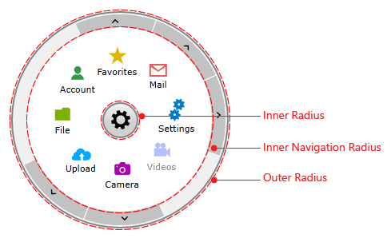

# Configuration

This help topic describes the basic properties used to configure the way __RadRadialMenu__ looks & behaves.

## Open the RadialMenu

Initially __RadRadialMenu__ is closed, you should click on the __RadialMenuButton__ in order to open it and show its items. __IsOpen__ boolean property of the __RadialMenu__ allows you to make it open by default. __Example 1__ shows how __IsOpen__ can be set.          

__Example 1: Setting IsOpen property__

```XAML
	<telerik:RadRadialMenu IsOpen="True">
	    <!--...-->
	</telerik:RadRadialMenu>
```

## Automatically Size the MenuItems

Since the __R1 2021__ release, the RadRadialMenu can auto-size its items. This enables the option of defining more or less than 8 items per level. In order to turn on this feature, set the __AutoSizeMenuItems__ property of the RadRadialMenu to __True__.

> When the items are auto-sized, the start angle of the first item is automatically calculated. If you want the __StartAngle__ property to be respected in that case, you can set the __AutoCalculateStartAngle__ property to __False__.

__Example 2: Setting the AutoSizeMenuItems property__

```XAML
	<telerik:RadRadialMenu IsOpen="True" AutoSizeMenuItems="True">
		<telerik:RadRadialMenuItem Header="Item 1">
			<telerik:RadRadialMenuItem Header="Item 1.1" />
			<telerik:RadRadialMenuItem Header="Item 1.2" />
			<telerik:RadRadialMenuItem Header="Item 1.3" />
			<telerik:RadRadialMenuItem Header="Item 1.4" />
			<telerik:RadRadialMenuItem Header="Item 1.5" />
			<telerik:RadRadialMenuItem Header="Item 1.6" />
			<telerik:RadRadialMenuItem Header="Item 1.7" />
			<telerik:RadRadialMenuItem Header="Item 1.8" />
			<telerik:RadRadialMenuItem Header="Item 1.9" />
			<telerik:RadRadialMenuItem Header="Item 1.10" />
			<telerik:RadRadialMenuItem Header="Item 1.11" />
			<telerik:RadRadialMenuItem Header="Item 1.12" />
		</telerik:RadRadialMenuItem>
		<telerik:RadRadialMenuItem Header="Item 2" />
		<telerik:RadRadialMenuItem Header="Item 3" />
		<telerik:RadRadialMenuItem Header="Item 4" />
	</telerik:RadRadialMenu>
```

> When the __AutoSizeMenuItems__ property is __True__, menu items on all levels will be auto-sized. If you want to dynamically control this, you can handle the [Navigating](#navigating) event and set the __AutoSizeMenuItems__ property of the event arguments.

#### __Figure 1: RadRadialMenu with less than 8 Autosized Items__


<!-- -->

#### __Figure 2: RadRadialMenu with more than 8 Autosized Items__


## Change the size of the RadialMenu

The size of __RadRadialMenu__ is set through __MinWidth__ and __MinHeight__ properties. Both should be set to the same value which refers to the diameter of the circle representing the menu.

__Example 3: Setting MinWidth and MinHeight properties__

```XAML
	<telerik:RadRadialMenu IsOpen="True" MinWidth="200" MinHeight="200">
	    <telerik:RadRadialMenuItem Header="Item 1" />
	    <telerik:RadRadialMenuItem Header="Item 2" />
	    <telerik:RadRadialMenuItem Header="Item 3" />
	</telerik:RadRadialMenu>
```

__Figure 3__ shows how the __RadialMenu__ looks in smaller size.     

#### __Figure 3: Setting MinWidth and MinHeight properties__
       

## Change the StartAngle property

__StartAngle__ property is used to set the angle at which the first __RadRadialMenuItem__ will be positioned.            

__Example 4: Setting StartAngle property__

```XAML
	<telerik:RadRadialMenu IsOpen="True" StartAngle="180" >
	    <telerik:RadRadialMenuItem Header="Item 1" />
	    <telerik:RadRadialMenuItem Header="Item 2" />
	    <telerik:RadRadialMenuItem Header="Item 3" />
	</telerik:RadRadialMenu>
```

__Figure 4__ shows how the __RadialMenu__ looks with different settings of the StartAngle property.            

#### __Figure 4: Setting StartAngle property__


## Change the Radius properties

__RadRadialMenu__ provides the following Radius properties:

* __InnerRadiusFactor__ - defines the inner radius of the panel holding all __RadRadialMenuItems__ as a fraction of the size of __RadRadialMenu__ control. The value should be between 0 and 1. If the passed value lies outside this range, it is automatically set to the nearest boundary value.                

* __InnerNavigationRadiusFactor__ - defines the inner radius of the panel holding the __NavigationItemButton__ items as a fraction of the size of __RadRadialMenu__ control. The value should be between 0 and 1. If the passed value lies outside this range, it is automatically set to the nearest boundary value.                

* __OuterRadiusFactor__ - defines the outer radius of the panel holding the __NavigationItemButton__ items as a fraction of the size of __RadRadialMenu__ control. The value should be between 0 and 1. If the passed value lies outside this range, it is automatically set to the nearest boundary value.               

#### __Figure 5: Radius Properties__


## Change the AnimationSpeedFactor property

__RadRadialMenu__ provides a static *double* property that will help you to adjust the speed of the animations as required. The default value of the __AnimationSpeedFactor__ property is *1.5d**1.6d* and the minimum possible value is *0.1d*. The property can be set as shown below:
 
__Example 5: Setting AnimationSpeedFactor property__
```C#
	RadRadialMenu.AnimationSpeedFactor = 1.2d;
```

## See Also

 * [Visual Structure]()
