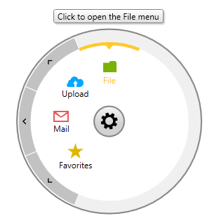
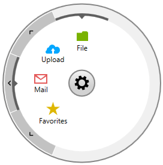
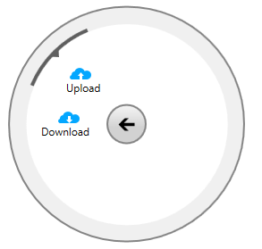

# RadialMenuItems

__RadRadialMenuItem__ is the item type in __RadRadialMenu__. It is used for the top-level menu and each __RadialMenuItem__ can have other RadialMenuItems as children in order to create sub-menus.

In this topic we will go through the following section:

* [Basic RadialMenuItem properties](#basic-radialmenuitem-properties)

* [Selected Items](#selected-items)

* [Grouped Items](#grouped-items)

## Basic RadialMenuItem properties

__RadRadialMenuItem__ provides the following properties:        

* __Header__ - specifies the Title of the menu item;            

* __IconContent__ - defines the icon associated with the menu item;            

* __ToolTipContent__ -  defines the content that will be visualized in the tooltip for the current __RadRadialMenuItem__. If this value is not set, the tooltip will display the Header content.            

__Example 1__ shows how they can be set.        

__Example 1: Setting RadRadialMenuItem properties__

```XAML
	<telerik:RadRadialMenu>
	    <telerik:RadRadialMenuItem Header="File" ToolTipContent="Click to open the File menu" >
	        <telerik:RadRadialMenuItem.IconContent>
	            <Path Data="F1M13,16L23,16L23,15C23,14 24,13 25,13L32,13C33,13 35,14.8 35,16L35,32L13,32L13,16z" 
	        Fill="#FF79B200" 
	        Height="16" 
	        Width="19" 
	        Stretch="Fill" 
	        Margin="0 0 0 4"/>
	        </telerik:RadRadialMenuItem.IconContent>
	    </telerik:RadRadialMenuItem>
	    <!--...-->
	</telerik:RadRadialMenu>
```

Figure 1: Setting RadialMenuItems properties


## Selected Items

__RadRadialMenu__ provides selection of its items. It is implelemented through the following properties of the __RadialMenuItem__:        

* __IsSelected__ - boolean property that indicates whether the menu item is selected.          

* __CanUserSelect__ - indicates whether the menu item can be selected. Its default value is __true__.          

__Figure 2__ shows how the selected RadialMenuItems look.       

Figure 2: RadialMenu with "File" and "Mail" items selected


## Grouped Items

__RadialMenuItems__ can be grouped, so that they behave as radio buttons when selected. This is implemented through the __GroupName__ property of the __RadialMenuItem__ which specifies the group it belongs to.         

__Example 2: Grouping RadialMenuItems__

```XAML
	<telerik:RadRadialMenuItem Header="Upload">
	    <telerik:RadRadialMenuItem Header="Upload" GroupName="UploadGroup" />
	    <telerik:RadRadialMenuItem Header="Download" GroupName="UploadGroup" />
	</telerik:RadRadialMenuItem>
```

As a result, selecting one of the items deselects the other one (if selected).

Figure 3: Grouped RadialMenuItems


## See Also

 * [Populating with Data]()

 * [RadialMenuItem Commands]()
