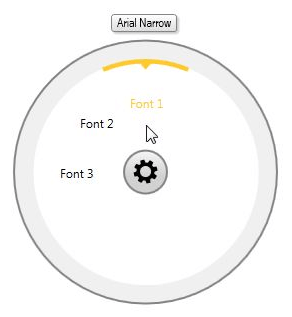
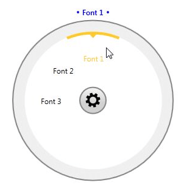
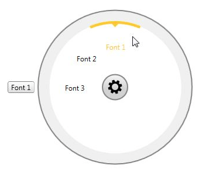

# Customize the ToolTip

This topic describes how to customize the ToolTip shown while hovering a __RadialMenuItem__. By default the ToolTip will display the Header of the item.      

We will go through the following sections:

* [Disable the ToolTip](#disable-the-tooltip)

* [Customize the ToolTipContent](#customize-the-tooltipcontent)

* [Customize the MenuToolTipStyle](#customize-the-menutooltipstyle)

* [Change the ToolTip position](#change-the-tooltip-position)

## Disable the ToolTip

You can completely disable showing the ToolTip for the whole __RadRadialMenu__ by setting the __ShowToolTip__ property as shown in __Example 1__.        

__Example 1: Disabling the ToolTip__

```XAML
	<telerik:RadRadialMenu ShowToolTip="False">
	    <!--...-->
	</telerik:RadRadialMenu>
```

## Customize the ToolTipContent

__ToolTipContent__ property of the __RadialMenuItem__ allows you to customize the content shown inside the tooltip.        

__Example 2: Custom ToolTipContent__

```XAML
	<telerik:RadRadialMenu>
	    <telerik:RadRadialMenuItem Header="Font 1">
	        <telerik:RadRadialMenuItem.ToolTipContent>
	            <TextBlock Text="Arial Narrow"
	        FontFamily="Arial Narrow" />
	        </telerik:RadRadialMenuItem.ToolTipContent>
	    </telerik:RadRadialMenuItem>
	    <!--...-->
	</telerik:RadRadialMenu>
```

Figure 1: Custom ToolTipContent


## Customize the MenuToolTipStyle

You could customize the Style and Template of the ToolTip of the __RadRadialMenu__ by creating a Style based on the default __MenuToolToolTipStyle__ with a TargetType set to __MenuToolTip__.        

>tip The default __MenuToolTipStyle__ could be extracted the UI for SilverlightWPF installation folder. Go into the __Themes.Implicit__ folder and select the theme that you have chosen to use. Drill down to find the Telerik.Windows.Controls.Navigation.xaml file in the directory that corresponds to your theme. From this resource dictionary extract the __MenuToolToolTipStyle__ and copy it into your project.          

__Example 3__ shows a quick sample of a custom MenuToolTipStyle.        

__Example 3: Custom MenuToolTipStyle__

```XAML
	<Style TargetType="telerik:MenuToolTip" BasedOn="{StaticResource MenuToolTipStyle}">
	    <Setter Property="Template">
	        <Setter.Value>
	            <ControlTemplate TargetType="telerik:MenuToolTip">
	                <StackPanel Orientation="Horizontal" Background="White">
	                    <Ellipse Width="4"
	                Height="4"
	                Fill="Blue"
	                Margin="1" />
	                    <TextBlock Text="{TemplateBinding Content}"
	                VerticalAlignment="Center"
	                HorizontalAlignment="Center"
	                FontFamily="Segoe UI Semibold"
	                Foreground="Blue"
	                Margin="4,0,4,0" />
	                    <Ellipse Width="4"
	                Height="4"
	                Fill="Blue"
	                Margin="1" />
	                </StackPanel>
	            </ControlTemplate>
	        </Setter.Value>
	    </Setter>
	</Style>
```

Figure 2: Custom MenuToolTipStyle


## Change the ToolTip position

You could change the default position of the __RadialMenu__ ToolTip through the __MenuToolTipEventArgs__ received inside the __PreviewToolTipOpen__ event handler. The following example demonstrates the approach.        

__Example 4: Subscribe to PreviewToolTipOpen event__

```XAML
	<telerik:RadRadialMenu PreviewToolTipOpen="RadRadialMenu_PreviewToolTipOpen">
	    <!--...-->
	</telerik:RadRadialMenu>
```

__Example 5: Set the position inside the event handler__

```C#
	private void RadRadialMenu_PreviewToolTipOpen(object sender, MenuToolTipEventArgs e)
	{
	    e.Placement = System.Windows.Controls.Primitives.PlacementMode.Left;
	}
```

Figure 3: ToolTip with Left position set


## See Also

 * [Events]()
