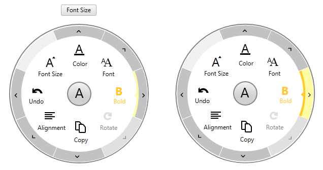

# Overview







Thank you for choosing Telerik __RadRadialMenu__!

__RadRadialMenu__ is a circular menu that comes with support for selection, commands, events and many customization options. Using __RadRadialMenu__ the end-user can drill-down into different levels of items that provide variety of options to choose from.

## Key Features

__RadRadialMenu__ key features list:        

* __Nested Items__

* __Selection__

* __Commands__

* __Events__

* __Can be used as a ContextMenu__

* __Positioning relative to the target element__

* __API for showing on different events__

* __Fully Customizable Appearance__

You can check __RadRadialMenu__ demos at: [RadRadialMenu FirstLook](http://demos.telerik.com/silverlight/#RadialMenu/FirstLook)[http://demos.telerik.com/wpf](http://demos.telerik.com/wpf). 

## See Also

 * [Getting Started]()

 * [Visual Structure]()
