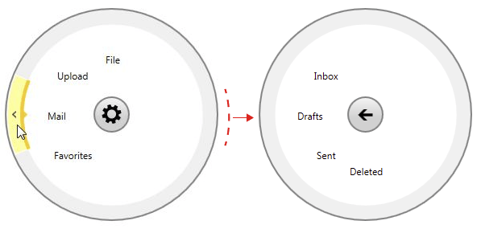

# Binding to Object

With the __Q1 2015__ release version of UI for WPFSilverlight, __RadRadialMenu__ provides a new way to easily populate its items in a MVVM manner. The control now supports data binding to a collection of business objects through the new __ItemsSource__ property. 

The following example will demonstrate how to bind __RadRadialMenu__ with a collection of custom objects from the ViewModel.

## Implementing a Custom Object

In order to be able to successfully use the binding feature of the control, the used custom objects need to implement the __IRadialMenuItem__ interface. The interface provides all the required properties for __RadRadialMenuItem__:

<snippet id='radradialmenu-populating-with-data-binding-to-object-block_1-cs' />
<snippet id='radradialmenu-populating-with-data-binding-to-object-block_1-vb' />

>Note that if you need to change any of those properties at run time you would need implement also the [INotifyPropertyChanged](https://msdn.microsoft.com/en-us/library/system.componentmodel.inotifypropertychanged%28v=vs.110%29.aspx), interface or inherit from the built in [ViewModelBase](https://docs.telerik.com/devtools/wpf/api/telerik.windows.controls.viewmodelbase) class in order to raise PropertyChanged of required properties.

## Implementing a ViewModel

The next thing is to simply define the needed source collection of CustomMenuItems in the ViewModel. Once this is done we will be able to bind it to the __ItemsSource__ property. 

<snippet id='radradialmenu-populating-with-data-binding-to-object-block_2-cs' />
<snippet id='radradialmenu-populating-with-data-binding-to-object-block_2-vb' />

## Binding the Collection in XAML

The final step would be to set the ViewModel as DataContext and bind the already created collection to the __ItemsSource__ property of __RadRadialMenu__ as shown below:

<snippet id='radradialmenu-populating-with-data-binding-to-object-block_3-xaml' />

You can see the final result on __Figure 1__.

__Figure 1__: __RadRadialMenu__ populated from the bound collection of CustomMenuItem objects

>tip Find a runnable project of the previous example in the [WPF Samples GitHub repository](https://github.com/telerik/xaml-sdk/tree/master/RadialMenu/BindingItemsSource).      

## See Also  
 * [Populating With Data]() 
 * [RadialMenuItems]()