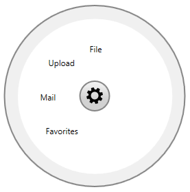
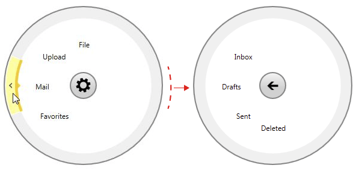

# Overview

This tutorial will walk you through the common task of populating __RadRadialMenu__ with __RadRadialMenuItems__

In order to add items you need to use the __RadialMenu's Items__ property. The __Items__ property is an __ItemCollection__ which contains your __RadRadialMenuItems__. __Example 1__ shows how to add the top-level items of the radial menu.        

__Example 1: Adding parent items__

```XAML
	<telerik:RadRadialMenu>
	    <telerik:RadRadialMenuItem Header="File" />
	    <telerik:RadRadialMenuItem Header="Upload" />
	    <telerik:RadRadialMenuItem Header="Mail" />
	    <telerik:RadRadialMenuItem Header="Favorites" />
	</telerik:RadRadialMenu>
```

Figure 1: Adding parent items


Each of the __RadRadialMenuItems__ can have child items that are defined in the same way. __Example 2__ demonstrates how to add submenu items to one of the top-level items.        

__Example 2: Adding child items__

```XAML
	<telerik:RadRadialMenu Margin="50">
	    <telerik:RadRadialMenuItem Header="File" />
	    <telerik:RadRadialMenuItem Header="Upload" />
	    <telerik:RadRadialMenuItem Header="Mail">
	        <telerik:RadRadialMenuItem Header="Inbox" />
	        <telerik:RadRadialMenuItem Header="Drafts" />
	        <telerik:RadRadialMenuItem Header="Sent" />
	        <telerik:RadRadialMenuItem Header="Deleted" />
	    </telerik:RadRadialMenuItem>
	    <telerik:RadRadialMenuItem Header="Favorites" />
	</telerik:RadRadialMenu>
```

Clicking on the navigate button of the parent item will navigate to its child items:

Figure 2: Navigating to the child items


The submenu items can also have children on their own.

## See Also

 * [RadialMenuItems]()
