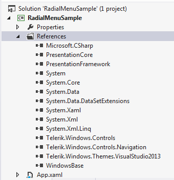
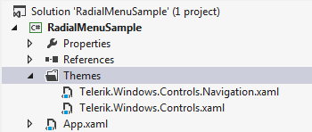
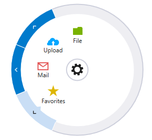

# Setting a Theme

The purpose of this article is to show you how to set a built-in theme to __RadRadialMenu__.

>tipDetailed information about the use of implicit styles can be found [here]().

So, in order to set a theme to the RadialMenu, you should merge the following xaml files in App.xaml file:        

* Telerik.Windows.Controls.xaml

* Telerik.Windows.Controls.Navigation.xaml

There are two ways to reference the needed xaml files:

* Directly from the theme assembly: 
	
	Let's, for example, apply VisualStudio2013 theme to the control. This means that we should add a reference to Telerik.Windows.Themes.VisualStudio2013.dll as well:
	
	Figure 1: Adding the needed references	
	
	
	Then merge the xaml files in the App.xaml as shown in __Example 1__:

	__Example 1: Merging the .xaml files__

	```XAML
		<Application.Resources>
		    <ResourceDictionary>
		        <ResourceDictionary.MergedDictionaries>
		            <ResourceDictionary Source="/Telerik.Windows.Themes.VisualStudio2013;component/Themes/Telerik.Windows.Controls.xaml" />
		            <ResourceDictionary Source="/Telerik.Windows.Themes.VisualStudio2013;component/Themes/Telerik.Windows.Controls.Navigation.xaml" />
		        </ResourceDictionary.MergedDictionaries>
		    </ResourceDictionary>
		</Application.Resources>
	```

* Copy the xaml files to a folder in the project: Create a Theme folder and copy the required files from Themes.Implicit/../VisualStudio2013/../Themes/ folder located in the installation folder of UI for SilverlightWPF:

	Figure 2: Copying the .xaml files
	

	__Example 2__ shows how to merge the copied .xaml files.            

	__Example 2: Merging the .xaml files__

	```XAML
		<Application.Resources>
		    <ResourceDictionary>
		        <ResourceDictionary.MergedDictionaries>
		            <ResourceDictionary Source="Themes/Telerik.Windows.Controls.xaml" />
		            <ResourceDictionary Source="Themes/Telerik.Windows.Controls.Navigation.xaml" />
		        </ResourceDictionary.MergedDictionaries>
		    </ResourceDictionary>
		</Application.Resources>
	```

Either way you choose, the end result will be the following:

Figure 3: RadialMenu with VisualStudio2013 theme applied

