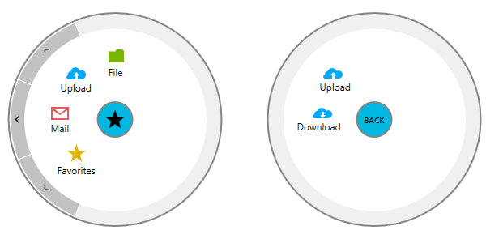

# Styling the RadialMenuButton

This topic explains how you could customize the look & feel of the __RadialMenuButton__ used for opening and closing the __RadialMenu__ as well as for navigating to the parent items.

>Before proceeding, please check [Setting a Theme]() topic.     

In order to change the look of the __RadialMenuButton__ you will need to customize the default Style with TargetType set to it from the used __RadialMenu__ theme.      

We will go through the following sections:

* [How to extract the default RadialMenuButtonStyle](#how-to-extract-the-default-radialmenubuttonstyle)

* [How to customize the RadialMenuButton ContentTemplate](#how-to-customize-the-radialmenubutton-contenttemplate)

## How to extract the default RadialMenuButtonStyle

The default Style could be extracted from the UI for SilverlightWPF installation folder. Go into the __Themes.Implicit__ folder and select the theme that you have chosen to use. Drill down to find the Telerik.Windows.Controls.Navigation.xaml file in the directory that corresponds to your theme. From this resource dictionary extract the __RadialMenuButtonStyle__ and copy it into your project. __Example 1__ shows the expected result:        

__Example 1: Extracting the default Style__

```XAML
	<UserControl.Resources>
	    <Style x:Key="RadialMenuButtonStyle" TargetType="telerik:RadialMenuButton">
	        <Setter Property="BorderThickness" Value="2"/>
	        <Setter Property="BorderBrush" Value="{StaticResource RadialMenuButtonBorderBrush}"/>
	        <Setter Property="Background" Value="{StaticResource RadialMenuButtonBackgroundBrush}"/>
	        <Setter Property="Foreground" Value="{StaticResource RadialMenuButtonForegroundBrush}"/>
	        <Setter Property="MinWidth" Value="0"/>
	        <Setter Property="Width" Value="45"/>
	        <Setter Property="Height" Value="45"/>
	        <Setter Property="VerticalAlignment" Value="Top"/>
	        <Setter Property="HorizontalAlignment" Value="Left"/>
	        <Setter Property="FontWeight" Value="Normal"/>
	        <Setter Property="FontSize" Value="12"/>
	        <Setter Property="FocusVisualStyle" Value="{x:Null}"/>
	        <Setter Property="ContentTemplate">
	            <Setter.Value>
	                <DataTemplate>
	                    <!--...-->
	                </DataTemplate>
	            </Setter.Value>
	        </Setter>
	        <Setter Property="BackContentTemplate">
	            <Setter.Value>
	                <DataTemplate>
	                    <!--...-->
	                </DataTemplate>
	            </Setter.Value>
	        </Setter>
	        <Setter Property="Template">
	            <Setter.Value>
	                <ControlTemplate TargetType="telerikRadialMenu:RadialMenuButton">
	                    <!--...-->
	                </ControlTemplate>
	            </Setter.Value>
	        </Setter>
	    </Style>
	</UserControl.Resources>
```

Note the __ContentTemplate__ and __BackContentTemplate__ properties inside the __RadialMenuButtonStyle__ - they are used depending on the state of the __RadialMenuButton__ - in its normal state the __ContentTemplate__ is used, while in the cases when the __RadialMenuButton__ is used to navigate to parent items, __BackContentTemplate__ is applied.      

## How to customize the RadialMenuButton ContentTemplate

In this section we will change the __ContentTemplate__ as well as __BackContentTemplate__ of the __RadialMenuButton.__

We will need to create a new Style based on the default __RadialMenuButtonStyle__ only with the changed properties. __Example 2__ demonstrates the approach.      

__Example 2: Custom ContentTemplate and BackContentTemplate__

```XAML
	<Style TargetType="telerik:RadialMenuButton" BasedOn="{StaticResource RadialMenuButtonStyle}">
	    <Setter Property="Background" Value="#FF00B7E0" />
	    <Setter Property="ContentTemplate">
	        <Setter.Value>
	            <DataTemplate>
	                <Image Source="28-star.png" Height="24" Width="24" />
	            </DataTemplate>
	        </Setter.Value>
	    </Setter>
	    <Setter Property="BackContentTemplate">
	        <Setter.Value>
	            <DataTemplate>
	                <TextBlock Text="BACK" Margin="0 4 0 0" FontFamily="Segoe UI Semibold" FontSize="10"/>
	            </DataTemplate>
	        </Setter.Value>
	    </Setter>
	</Style>
```

__Figure 1__ shows the final result.      

Figure 1: Customized RadialMenuButton

