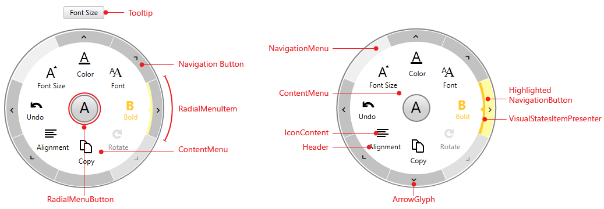

# Visual Structure

This article describes all the visual elements and terms used in __RadRadialMenu__ control. 

* __ContentMenu__ - represents the container of the menu items.          

* __NavigationMenu__ - represents the container of the navigation buttons.          

* __RadialMenuItem__ - defines a menu item that has __Header__ and __Icon__.          

* __IconContent__ - represents the icon associated with this __RadialMenuItemControl__.          

* __Header__ - represents the header associated with this __RadialMenuItemControl__.          

* __Navigation Button__ - navigates to the children items of this __RadialMenuItem__.          

* __ArrowGlyph__ - represents the glyph displayed in the __NavigationItemButton__.          

* __RadialMenuButton__ - navigates to the parent __RadialMenuItem__ or opens/closes the __RadRadialMenu__ control.          

* __VisualStatesItemPresenter__ - used to mark the selected and highlighted __RadRadialMenuItems__.          

* __ToolTip__ - the tooltip for the current __RadRadialMenuItem__.          

# See Also

 * [Configuration]()
