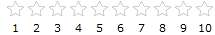

# Declaratively

This tutorial will walk you through the common task of populating __RadRating__ with __RadRatingItems__ declaratively.

Example 1 demonstrates a regular __RadRating__ declaration, where __telerik__ points to: __&lt;xmlns:telerik="http://schemas.telerik.com/2008/xaml/presentation" /&gt;__

__Example 1: Declare a RadRating__
```XAML
	<telerik:RadRating x:Name="radRating" />
```

#### __Figure 1: Result from Example 1__


In order to add rating items you need to use the __RadRating's__ __Items__ property. The __Items__ property is an __ItemCollection__ which contains your __RadRatingItems__. Example 2 shows how to add RadRatingItems to your RadRating.

__Example 2: Adding RadRatingItems__
```XAML
	<telerik:RadRating x:Name="radRating">
	    <telerik:RadRatingItem Content="1" />
	    <telerik:RadRatingItem Content="2" />
	    <telerik:RadRatingItem Content="3" />
	    <telerik:RadRatingItem Content="4" />
	    <telerik:RadRatingItem Content="5" />
	    <telerik:RadRatingItem Content="6" />
	    <telerik:RadRatingItem Content="7" />
	    <telerik:RadRatingItem Content="8" />
	    <telerik:RadRatingItem Content="9" />
	    <telerik:RadRatingItem Content="10" />
	</telerik:RadRating>
```

#### __Figure 2: Result from Example 2__


>tip Consider declaring rating items in XAML instead of adding them by code whenever it's possible. This includes situations when you know what items you need at design time.
