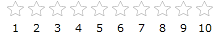

# Declaratively

This tutorial will walk you through the common task of populating __RadRating__ with __RadRatingItems__ declaratively.

Example 1 demonstrates a regular __RadRating__ declaration, where __telerik__ points to: __&lt;xmlns:telerik="http://schemas.telerik.com/2008/xaml/presentation" /&gt;__

__Example 1: Declare a RadRating__
<snippet id='radrating-populating-with-data-populating-declaratively-block_1-xaml' />

#### __Figure 1: Result from Example 1__

In order to add rating items you need to use the __RadRating's__ __Items__ property. The __Items__ property is an __ItemCollection__ which contains your __RadRatingItems__. Example 2 shows how to add RadRatingItems to your RadRating.

__Example 2: Adding RadRatingItems__
<snippet id='radrating-populating-with-data-populating-declaratively-block_2-xaml' />

#### __Figure 2: Result from Example 2__

>tip Consider declaring rating items in XAML instead of adding them by code whenever it's possible. This includes situations when you know what items you need at design time.