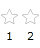

# In Code-Behind

This tutorial will walk you through the common tasks of [adding](#Adding_RadRatingItems) and [removing](#Removing_RadRatingItems) __RadRatingItems__ programmatically.			

Example 1 demonstrates a regular __RadRating__ declaration:

#### __[XAML] Example 1: Declare a RadRating__
{{region xaml-populating-in-code-behind_0}}
	<telerik:RadRating x:Name="radRating"/>
{{endregion}}

#### __Figure 1: Result from Example 1__

## Adding RadRatingItems

In order to add new rating items to a __RadRating__ control, you have to perform several simple steps:				

* Create an instance of the __RadRatingItem__ class					

* Set its properties such as __Content__ if you need so					

* Add it to the __RadRating__'s __Items__ collection					

	#### __[C#] Example 2: Adding RadRatingItems__
	{{region cs-populating-in-code-behind_1}}
		RadRatingItem ratingItem = new RadRatingItem();
		this.radRating.Items.Add(ratingItem);
	{{endregion}}

	#### __[VB.NET] Example 2: Adding RadRatingItems__
	{{region vb-populating-in-code-behind_2}}
		Dim ratingItem As New RadRatingItem()
		Me.radRating.Items.Add(ratingItem)
	{{endregion}}

#### __Figure 2: Result from Example 2__

In order to clear the default rating items and add new you have to add one additional step to the previous:

* Clear the __Items__ collection of the __RadRating__ control					

* Create an instance of the __RadRatingItem__ class					

* Set its properties such as __Content__ if you need so					

* Add it to the __RadRating__'s __Items__ collection					

#### __[C#] Example 3: Clearing the Items collection__
{{region cs-populating-in-code-behind_3}}
	this.radRating.Items.Clear(); 
	RadRatingItem ratingItem = new RadRatingItem();
	ratingItem.Content = "1";
	this.radRating.Items.Add(ratingItem);
	ratingItem = new RadRatingItem();
	ratingItem.Content = "2";
	this.radRating.Items.Add(ratingItem);
{{endregion}}

#### __[VB.NET] Example 3: Clearing the Items collection__
{{region vb-populating-in-code-behind_4}}
	Me.radRating.Items.Clear() 
	Dim ratingItem As New RadRatingItem()
	ratingItem.Content = "1"
	Me.radRating.Items.Add(ratingItem)
	ratingItem As New RadRatingItem()
	ratingItem.Content = "2"
	Me.radRating.Items.Add(ratingItem)
{{endregion}}

#### __Figure 3: Result from Example 3__

>tip Consider declaring rating items in XAML instead of adding them by code whenever it's possible. This includes situations when you know what items you need at design time.

## Removing RadRatingItems

In order to remove a specific __RadRatingItem__, you should remove it from the __RadRating__'s __Items__ collection.				

#### __[C#] Example 4: Removing RadRatingItems__
{{region cs-populating-in-code-behind_5}}
	private void RemoveRatingItem( RadRatingItem itemToRemove )
	{
	   this.radRating.Items.Remove( itemToRemove );
	}
{{endregion}}

#### __[VB.NET] Example 4: Removing RadRatingItems__
{{region vb-populating-in-code-behind_6}}
	Private Sub RemoveRatingItem(ByVal itemToRemove As RadRatingItem)
	    Me.radRating.Items.Remove(itemToRemove)
	End Sub
{{endregion}}