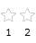

# In Code-Behind

This tutorial will walk you through the common tasks of [adding](#Adding-RadRatingItems) and [removing](#Removing-RadRatingItems) __RadRatingItems__ programmatically.			

<snippet id='radrating-populating-with-data-populating-in-code-behind-block_1-xaml' />

#### __Figure 1: Result from Example 1__

## Adding RadRatingItems

In order to add new rating items to a __RadRating__ control, you have to perform several simple steps:				

* Create an instance of the __RadRatingItem__ class					

* Set its properties such as __Content__ if you need so					

* Add it to the __RadRating__'s __Items__ collection					

	<snippet id='radrating-populating-with-data-populating-in-code-behind-block_2-cs' />
	<snippet id='radrating-populating-with-data-populating-in-code-behind-block_3-vb' />

#### __Figure 2: Result from Example 2__

In order to clear the default rating items and add new you have to add one additional step to the previous:

* Clear the __Items__ collection of the __RadRating__ control					

* Create an instance of the __RadRatingItem__ class					

* Set its properties such as __Content__ if you need so					

* Add it to the __RadRating__'s __Items__ collection					

<snippet id='radrating-populating-with-data-populating-in-code-behind-block_4-cs' />
<snippet id='radrating-populating-with-data-populating-in-code-behind-block_5-vb' />

#### __Figure 3: Result from Example 3__

>tip Consider declaring rating items in XAML instead of adding them by code whenever it's possible. This includes situations when you know what items you need at design time.

## Removing RadRatingItems

In order to remove a specific __RadRatingItem__, you should remove it from the __RadRating__'s __Items__ collection.				

<snippet id='radrating-populating-with-data-populating-in-code-behind-block_6-cs' />
<snippet id='radrating-populating-with-data-populating-in-code-behind-block_7-vb' />