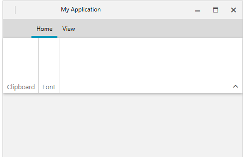

# Collapsing

__RadRibbonView__ supports collapsing, which means that the control will automatically set the __Visibility__ of its main panel to __Collapsed__ to save space. This happens when the window in which the control is hosted is resized to a size smaller than the __CollapseThresholdSize__.

#### __Figure 1: RadRibbonView collapsing functionality__


## Properties

The following properties are related to the collapse functionality:

* __IsCollapsed__: A property of type __bool__, which gives information about the current state of the __RadRibbonView__ control. This property is __read-only__.  

* __CollapseThresholdSize__: A property of type [Size](https://docs.microsoft.com/en-us/dotnet/api/system.windows.size?view=netframework-4.8), which allows you to control the threshold for collapsing. The default value is __300, 250__.  

	__Example 1: Setting the CollapseThresholdSize__
	```XAML
		<telerik:RadRibbonView x:Name="radRibbonView" CollapseThresholdSize="100,100">
			...
		</telerik:RadRibbonView>
	```

## Events

You can use the __CollapsedChanged__ event to be notified when collapsed state of the ribbon is changed.				

__Example 2: Adding a handler to the CollapsedChanged event__
```XAML
	<telerik:RadRibbonView x:Name="radRibbonView" CollapseThresholdSize="100,100" CollapsedChanged="radRibbonView_CollapsedChanged">
	 ...
	</telerik:RadRibbonView>
```

__Example 3: Handling the CollapsedChanged event__
```C#
	private void radRibbonView_CollapsedChanged(object sender, Telerik.Windows.RadRoutedEventArgs e)
	{
		RadRibbonView ribbonView = sender as RadRibbonView;
		bool isCollapsed = ribbonView.IsCollapsed;
	}
```
```VB.NET
	Private Sub radRibbonView_CollapsedChanged(sender As Object, e As Telerik.Windows.RadRoutedEventArgs)
		Dim ribbonView As RadRibbonView = TryCast(sender, RadRibbonView)
		Dim isCollapsed As Boolean = ribbonView.IsCollapsed	
	End Sub
```

> For more information about the events exposed by the __RadRibbonView__, check out the [Events - Overview]() topic.