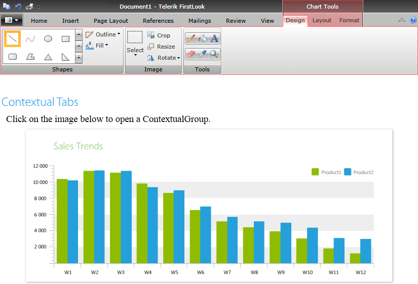
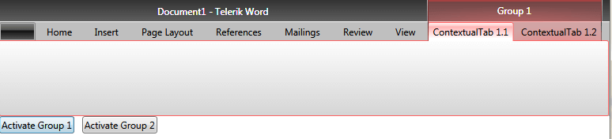
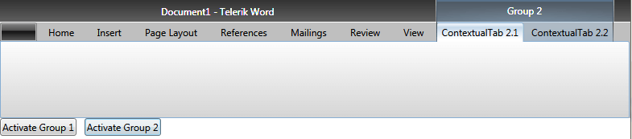

# Contextual Tabs

A contextual tab allows you to provide the users with a certain UI when they are in a specific context or they have selected a specific element. The contextual tabs are organized in groups, so that the user can see multiple tabs available for a specific context.

The contextual groups are used to display tabs with a context-specific functionality. They get displayed only when this functionality is needed. This way the common UI in the __RadRibbonView__ becomes lighter while the specific functionality becomes easier to find as it is grouped and displayed on demand.	  

To define contextual tabs in the __RadRibbonView__ control you have to first define their groups. You can do that declaratively, programmatically or by using data-binding through the following properties:	  

* __ContextualGroups__: Gets or sets a collection of __RadRibbonContextualGroups__ used to generate the contextual groups. This collection can be populated declaratively in XAML or programmatically in code-behind.		  

	__Example 1: Set the ContextualGroups property__

	<snippet id='radribbonview-features-contextual-tabs-block_1-xaml' />
	
* __ContextualGroupsItemsSource__: Gets or sets an __IEnumerable__ collection of **business items** used to generate the contextual groups. You can bind this property to a collection of data items in XAML or populate it in code-behind.

	__Example 2: Set the ContextualGroups property__

	<snippet id='radribbonview-features-contextual-tabs-block_2-xaml' />

## Adding Contextual RadRibbonTabs Declaratively

In order to add contextual tabs, you need to define __RadRibbonTabs__ associated with contextual groups. The __RadRibbonTab__ control exposes a __ContextualGroupName__ property that allows you to associate it with a __ContextualGroup__.

__Example 3: Define RadRibbonTabs__

<snippet id='radribbonview-features-contextual-tabs-block_3-xaml' />

This is why it is important to set the __x:Name__ property of all __RadRibbonContextualGroups__ in the __RadRibbonView ContextualGroups__ collection, otherwise you won't be able to associate any __RibbonTabs__ with them.

## Data-Binding Contextual Groups and Tabs

In order to data-bind the __RadRibbonView__ to a collection of business items, you need to set its __ItemsSource__ property. This property is used to dynamically generate __RadRibbonTabs__. As the contextual tabs are __RadRibbonTabs__ associated with contextual groups, they are also generated through the data items in that collection. However, in order to make a dynamically generated __RadRibbonTab__ contextual, you need to define a style that sets the value of the __ContextualGroupName__ property.

You can bind the __RadRibbonTab ContextualGroupName__ to a business property using a style setter. The __Style__ should target the __RadRibbonTab__ type.		  

__Example 4: Style the contextual tabs__

<snippet id='radribbonview-features-contextual-tabs-block_4-xaml' />

Once you have the __ItemsSource__ collection properly data-bound, you will need to also bind the __ContextualGroupsItemsSource__.		

>Please note that the __Name__ property of the __RadRibbonContextualGroups__ cannot be data-bound in a style setter. This is why we exposed an attached property - __RadRibbonContextualGroup.GroupName__, which internally sets the __Name__ so that a tab can be associated to a contextual group.		  

In order to data-bind the __ContextualGroups__ properties you can also use style bindings.		

__Example 5: Bind the group names in a style__

<snippet id='radribbonview-features-contextual-tabs-block_5-xaml' />

>tip Find a runnable project of the previous example in the [WPF Samples GitHub repository](https://github.com/telerik/xaml-sdk/tree/master/RibbonView/ContextualGroups-DataBinding).		  

__RadRibbonView__ exposes two methods that allow you to work with the __ContextualGroups ContainerGenerator__:		

* __ContainerFromContextualGroupItem()__: Returns the __RadRibbonContextualGroup__ corresponding to the given item.			

* __ItemFromContextualGroupContainer()__: Returns the item that corresponds to the specified, generated __RadRibbonContextualGroup__.			

## RibbonContextualGroup Properties

The __RadRibbonContextualGroup__ exposes a __Color__ property, which allows you to specify a color for the group. 

To make the __RadRibbonContextualGroup__ visible you have to set its __IsActive__ property to __True__. This should be done when a certain requirement is met by the user. This requirement should specify whether the specific functionality in the contextual tab is needed. For example if you have a contextual tab that should manipulate images, you'd want to show this tab only when the user has selected an image.		

You can set these properties in the definition of declaratively defined __RadRibbonContextualGroups:__

__Example 6: Set group properties declaratively__

<snippet id='radribbonview-features-contextual-tabs-block_6-xaml' />

or in an implicit style targeting the contextual groups:

__Example 7: Set group properties via a style__

<snippet id='radribbonview-features-contextual-tabs-block_7-xaml' />

You can easily control the active groups from code-behind. For instance, the __IsActive__ property of the declaratively defined contextual groups demonstrated above can be easily changed when clicking a button:

__Example 8: Activate the groups on a button click__

<snippet id='radribbonview-features-contextual-tabs-block_8-xaml' />

__Example 9: Change the groups' IsActive property__

<snippet id='radribbonview-features-contextual-tabs-block_9-cs' />
<snippet id='radribbonview-features-contextual-tabs-block_10-vb' />

## Mouse Wheel Scrolling of Tabs

By default, scrolling the **mouse wheel** while the mouse is over the control will change the currently selected tab. You can disable this behavior by setting the **IsMouseWheelTabScrollingEnabled** property of the RadRibbonView control to **False**.

__Example 10: Disable mouse wheel scrolling in XAML__

<snippet id='radribbonview-features-contextual-tabs-block_11-xaml' />

__Example 10: Disable mouse wheel scrolling in code-behind__

<snippet id='radribbonview-features-contextual-tabs-block_12-cs' />
<snippet id='radribbonview-features-contextual-tabs-block_13-vb' />

## Prevent the Selection of a Contextual Tab When It Is Activated

By default, when a contextual tab is activated, the first tab element inside will be selected. To disable this behavior you can set the __SelectFirstTabOnActivation__ property of the __RadRibbonContextualGroup__ to __false__.

__Example 11: Disable selection of the first tab inside contextual tab__
<snippet id='radribbonview-features-contextual-tabs-block_14-xaml' />
  

## See Also
 * [Ribbon Tab]()
 * [Controlling Appearance]()