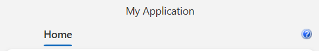
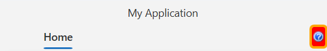

# Help Button

The `RadRibbonView` control allows you to display a help button, which is positioned on the right side of the component. To do so, set the `HelpButtonVisibility` property to `Visible`.

#### __[XAML] Displaying the help button__
{{region radribbonview-help-button-0}}
    <telerik:RadRibbonView HelpButtonVisibility="Visible"/>
{{endregion}}

__RadRibbonView with displayed help button__

## Change the Help Button Image

To set a different icon from the default one, you can use the `HelpButtonImageSource` property.

#### __[XAML] Changing the help button image__
{{region radribbonview-help-button-1}}
    <telerik:RadRibbonView HelpButtonImageSource="myHelpButton.png"/> 
{{endregion}}

## Set a Custom Style for the Help Button

The RadRibbonView control exposes the `HelpButtonStyle` property that allows you to customize the help button. To do so, set a new Style that targets the `RadRibbonButton` element.

#### __[XAML] Setting a custom Style for the help button__
{{region radribbonview-help-button-2}}
    <telerik:RadRibbonView.HelpButtonStyle>
        <!--If NoXaml is used: BasedOn="{StaticResource HelpButtonStyle}"-->
        
    </telerik:RadRibbonView.HelpButtonStyle>
{{endregion}}

__RadRibbonView with custom style set to the help button__

## Set a Command on the Help Button

The RadRibbonView control allows you to set a command for the help button via the `HelpCommand` property. It will accept every object that implements the [ICommand](https://learn.microsoft.com/en-us/dotnet/api/system.windows.input.icommand?view=net-9.0&redirectedfrom=MSDN) interface.

The following example showcases how to use the HelpCommand property:

#### __[XAML] Defining the RadRibbonView__
{{region radribbonview-help-button-3}}
    <telerik:RadRibbonView HelpButtonVisibility="Visible">
        <telerik:RadRibbonTab Header="Home"/>
    </telerik:RadRibbonView>
{{endregion}}

#### __[C#] Defining the DelegateCommand__
{{region radribbonview-help-button-4}}
    public partial class MainWindow : Window
    {
        public MainWindow()
        {
            InitializeComponent();

            OpenHelpPageCommand = new DelegateCommand(ExecuteCommandHandler, CanExecuteCommandHandler);
            this.DataContext = OpenHelpPageCommand;
        }

        public DelegateCommand OpenHelpPageCommand { get; set; }

        private bool CanExecuteCommandHandler(object obj)
        {
            // Implement logic that checks if the button command can be executed 
            return true;
        }

        private void ExecuteCommandHandler(object obj)
        {
            // Implement the logic that should be executed when the button is clicked 
            MessageBox.Show("Help Command Executed");
        }
    }
{{endregion}}

#### __[XAML] Setting the HelpCommand property__
{{region radribbonview-help-button-5}}
    <telerik:RadRibbonView HelpButtonVisibility="Visible" HelpCommand="{Binding}">
        <telerik:RadRibbonTab Header="Home"/>
    </telerik:RadRibbonView>
{{endregion}}

>tip In addition you can use the `HelpCommandParameter` and the `HelpCommandTarget` properties of the RadRibbonView in order to pass additional data to the command.
>tip Find a runnable project of the previous example in the [WPF Samples GitHub repository](https://github.com/telerik/xaml-sdk/tree/master/RibbonView/HelpFunctionality).