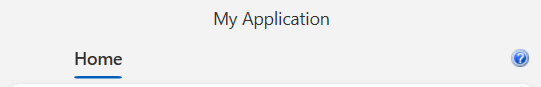
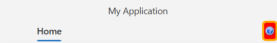

# Help Button

The `RadRibbonView` control allows you to display a help button, which is positioned on the right side of the component. To do so, set the `HelpButtonVisibility` property to `Visible`.

__Displaying the help button__
<snippet id='radribbonview-features-help-button-block_1-xaml' />

__RadRibbonView with displayed help button__

## Change the Help Button Image

To set a different icon from the default one, you can use the `HelpButtonImageSource` property.

__Changing the help button image__
<snippet id='radribbonview-features-help-button-block_2-xaml' />

## Set a Custom Style for the Help Button

The RadRibbonView control exposes the `HelpButtonStyle` property that allows you to customize the help button. To do so, set a new Style that targets the `RadRibbonButton` element.

__Setting a custom Style for the help button__
<snippet id='radribbonview-features-help-button-block_3-xaml' />

__RadRibbonView with custom style set to the help button__

## Set a Command on the Help Button

The RadRibbonView control allows you to set a command for the help button via the `HelpCommand` property. It will accept every object that implements the [ICommand](https://learn.microsoft.com/en-us/dotnet/api/system.windows.input.icommand?view=net-9.0&redirectedfrom=MSDN) interface.

The following example showcases how to use the HelpCommand property:

__Defining the RadRibbonView__
<snippet id='radribbonview-features-help-button-block_4-xaml' />

__Defining the DelegateCommand__
<snippet id='radribbonview-features-help-button-block_5-cs' />

__Setting the HelpCommand property__
<snippet id='radribbonview-features-help-button-block_6-xaml' />

>tip In addition you can use the `HelpCommandParameter` and the `HelpCommandTarget` properties of the RadRibbonView in order to pass additional data to the command.
>tip Find a runnable project of the previous example in the [WPF Samples GitHub repository](https://github.com/telerik/xaml-sdk/tree/master/RibbonView/HelpFunctionality).