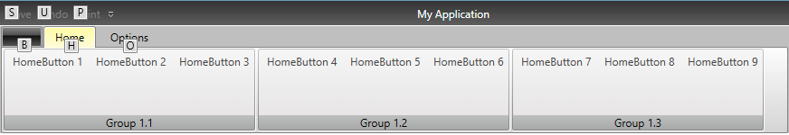

# Keyboard Support

__RadRibbonView__ provides a keyboard navigation mechanisms using key tips and the arrow keys. You can enable this feature by setting the __KeyTipService.IsKeyTipsEnabled__ attached property on the __RadRibbonView__ control to __True__.

__Example 1: Enabling RibbonView Key Tips__
```XAML
    <telerik:RadRibbonView x:Name="radRibbonView" 
                           ApplicationName="RibbonViewApplication"
                           telerik:KeyTipService.IsKeyTipsEnabled="True" />
```

You can attach *key tip* text to every component in the __RadRibbonView__ using the __KeyTipSerive.AccessText__ attached property:	  

__Example 2: Setting access text to a particular control__
```XAML
    <telerik:RadRibbonView x:Name="radRibbonView" 
                           ApplicationName="RibbonViewApplication"
                           telerik:KeyTipService.IsKeyTipsEnabled="True">
        <telerik:RadRibbonView.Backstage>
            <telerik:RadRibbonBackstage telerik:KeyTipService.AccessText="B" />
        </telerik:RadRibbonView.Backstage>
    </telerik:RadRibbonView>
```


Enabling the keytip service also activates the __arrow keys navigation__. Pressing the __left__, __right__, __up__ or __down__ arrow will change the currently highlighted item. Also, the Enter/Space keys activates the current element, which is highlighted by the KeyboardNavigation.
>When you start navigating with the arrows, the key tips will be hidden. Navigating with the arrow keys will handle the appropriate KeyUp/Down/PreviewDown events fired for the RadRibbonView

<!-- -->

>It is recommended that you avoid using the arrow navigation with the ContextMenu because internally it captures the mouse and executes its own navigation between its children. Instead of using a ContextMenu we suggest using a Menu element.


## KeyTipService Class Properties

The __KeyTipsService__ class allows you to enable/disable key tips for the __RadRibbonView__ control. It exposes the following properties that allow you to customize the keyboard navigation:

* __ActivationMode__: Gets/sets the the predefined event on which the KeyTips and KeyboardNavigation are executed. The property is of type __Telerik.Windows.Controls.RibbonView.KeyTips.ActivationMode__ enum and exposes the following options:
	* __PreviewKeyDown__: The keyboard navigation is activated when the PreviewKeyDown event of RadRibbonView is fired
	* __KeyDown__: The keyboard navigation is activated when the KeyDown event is fired
	* __KeyUp__ (default value): The keyboard navigation is activated when the KeyUp event is fired

* __AccessText:__ Gets/sets the key tip activation text  

* __AltAccessText:__ Gets/sets alternative key tip activation text. This property is applicable only to the RadRibbonGroup and affects the DialogLauncherCommand.

* __AccessKey:__ Gets/sets the combination of keys to be used for displaying the key tips. By default the key tips are displayed by pressing CTRL+QALT. This property should be defined in the __RadRibbonView__ definition:			

	__Example 3: Setting combination of access keys__
	```XAML
		<telerik:RadRibbonView x:Name="radRibbonView" 
							   ApplicationName="RibbonViewApplication"
							   telerik:KeyTipService.AccessKey="Ctrl+Alt+Z"
							   telerik:KeyTipService.IsKeyTipsEnabled="True">
			...
		</telerik:RadRibbonView>
	```

* __AccessKeys:__ Property of type __IEnumerable<KeyGesture>__ and it gets/sets a collection of __KeyGestures__ that can be used to trigger the KeyTips display. Please note that the __AccessKeys__ property can only be set in code either in code-behind or in a __ViewModel__. This is because a __KeyGesture__ cannot be defined in XAML.

	>If both __AcessKey__ and __AccessKeys__ properties are set, the value of the __AcessKey__ property will be ignored. You can download a runnable project demonstrating how to take advantage of the __KeyTipService.AccessKeys__ property from our [online SDK repository](https://github.com/telerik/xaml-sdk/tree/master/RibbonView/MultipleAccessKeys-KeyTips).

* __Activation:__ Used to define additional logic that can be implemented when using the keyboard navigation.

	__Example 4: Subscribe to the Activated event__
	```XAML
		<telerik:RadRibbonTab Header="Home" telerik:KeyTipService.AccessText="H">
			<telerik:RadRibbonGroup Header="Group 1.1" telerik:KeyTipService.AccessText="A">
				<telerik:RadRibbonButton x:Name="HomeButton1" 
										 Click="HomeButton1_Click"
										 telerik:KeyTipService.AccessText="Z"
										 Text="HomeButton 1">
					<telerik:KeyTipService.Activation>
						<telerik:KeyTipActivation Activated="KeyTipActivation_Activated" />
					</telerik:KeyTipService.Activation>
				</telerik:RadRibbonButton>
				...
			</telerik:RadRibbonGroup>
			...
		</telerik:RadRibbonTab>
	```

	__Example 5: Showing MessageBox in the Activated event handler__
	```C#
		private void KeyTipActivation_Activated(object sender, Telerik.Windows.RadRoutedEventArgs e)
		{
			MessageBox.Show("The key tip of the "+(e.OriginalSource as RadRibbonButton).Text.ToString() + "was activated.");
		}
		private void HomeButton1_Click(object sender, RoutedEventArgs e)
		{
			MessageBox.Show((sender as RadRibbonButton).Text.ToString() + "was clicked.");
		}
	```
	```VB.NET
		Private Sub KeyTipActivation_Activated(sender As Object, e As Telerik.Windows.RadRoutedEventArgs)
			MessageBox.Show("The key tip of the " & TryCast(e.OriginalSource, RadRibbonButton).Text.ToString() & "was activated.")
		End Sub
		
		Private Sub HomeButton1_Click(sender As Object, e As RoutedEventArgs)
			MessageBox.Show(TryCast(sender, RadRibbonButton).Text.ToString() & "was clicked.")
		End Sub
	```

	In the example above, the __KeyTipActivation.Activated()__ event handler will fire as soon as the __HomeButton1__ key tip is activated. This means that you can implement custom logic that will be executed before the button's __Click()__ event is fired.

* __IsKeyboardNavigationEnabled__: Gets or sets whether keyboard navigation is enabled for a particular control. Setting this property to false on a UIElement will lead to the element being skipped while navigating using the keyboard's Up/Down/Right/Left keys. 

	__Example 4: Disabling navigation through RadRibbonComboBox items using the Up/Down keys__
	```XAML
		<telerik:RadRibbonView telerik:KeyTipService.IsKeyTipsEnabled="True" telerik:KeyTipService.ActivationMode="PreviewKeyDown">
			<telerik:RadRibbonTab Header="Home" telerik:KeyTipService.AccessText="H">
				<telerik:RadRibbonGroup Header="My Group">
					<telerik:RadRibbonComboBox telerik:KeyTipService.AccessText="T" telerik:KeyTipService.IsKeyboardNavigationEnabled="False">
						<telerik:RadRibbonComboBoxItem Content="Test 1" />
						<telerik:RadRibbonComboBoxItem Content="Test 2" />
						<telerik:RadRibbonComboBoxItem Content="Test 3" />
						<telerik:RadRibbonComboBoxItem Content="Test 4" />
					</telerik:RadRibbonComboBox>
				</telerik:RadRibbonGroup>
			</telerik:RadRibbonTab>
		</telerik:RadRibbonView>		
	```

 >Specific behaviors of IsKeyboardNavigationEnabled property when set to false:
 >* When set on __RadRibbonView__: The attached property will not work for this control.
 >* When set on __RadRibbonTab__: The control will be skipped from navigation using the Up/Down/Right/Left keyboard keys but will be accessible  through the key tips behavior.
 >* When set on __RadRibbonGroup__: The control will be skipped from navigation using the Up/Down/Right/Left keyboard keys. Elements inside the group will not inherit this property.
 >* When set on __RadRibbonButton__: The control will be skipped from navigation using the Up/Down/Right/Left keyboard keys.
 >* When set on __Application Menu/ Backstage__: The application button will be skipped from the navigation using the Up/Down/Right/Left keyboard keys.
 >* When set on __Quick Access Toolbar__: The control will be skipped from navigation using the Up/Down/Right/Left keyboard keys. Elements inside the group will not inherit this property.
 >* When set on __Items Controls__: The control will be skipped from navigation using the Up/Down/Right/Left keyboard keys. There's no need to set this property to the child elements.


## Activating Key Tips

__Example 5: Activating key tips behavior__
```XAML
    <telerik:RadRibbonView x:Name="radRibbonView" telerik:KeyTipService.IsKeyTipsEnabled="True">
        <telerik:RadRibbonView.Backstage>
            <telerik:RadRibbonBackstage telerik:KeyTipService.AccessText="B" />
        </telerik:RadRibbonView.Backstage>
        <telerik:RadRibbonView.QuickAccessToolBar>
            <telerik:QuickAccessToolBar>
                <telerik:RadRibbonButton Foreground="Gray" 
                                         telerik:KeyTipService.AccessText="S"
                                         Text="Save" />
                <telerik:RadRibbonButton Foreground="Gray" 
                                         telerik:KeyTipService.AccessText="U"
                                         Text="Undo" />
                <telerik:RadRibbonButton Foreground="Gray" 
                                         telerik:KeyTipService.AccessText="P"
                                         Text="Print" />
            </telerik:QuickAccessToolBar>
        </telerik:RadRibbonView.QuickAccessToolBar>
        <telerik:RadRibbonTab Header="Home" telerik:KeyTipService.AccessText="H">
            <telerik:RadRibbonGroup Header="Group 1.1" telerik:KeyTipService.AccessText="A">
                <telerik:RadRibbonButton telerik:KeyTipService.AccessText="Z" Text="HomeButton 1" />
                <telerik:RadRibbonButton telerik:KeyTipService.AccessText="X" Text="HomeButton 2" />
                <telerik:RadRibbonButton telerik:KeyTipService.AccessText="C" Text="HomeButton 3" />
            </telerik:RadRibbonGroup>
            <telerik:RadRibbonGroup Header="Group 1.2" telerik:KeyTipService.AccessText="S">
                <telerik:RadRibbonButton telerik:KeyTipService.AccessText="W" Text="HomeButton 4" />
                <telerik:RadRibbonButton telerik:KeyTipService.AccessText="E" Text="HomeButton 5" />
                <telerik:RadRibbonButton telerik:KeyTipService.AccessText="R" Text="HomeButton 6" />
            </telerik:RadRibbonGroup>
            <telerik:RadRibbonGroup Header="Group 1.3" telerik:KeyTipService.AccessText="D">
                <telerik:RadRibbonButton telerik:KeyTipService.AccessText="G" Text="HomeButton 7" />
                <telerik:RadRibbonButton telerik:KeyTipService.AccessText="M" Text="HomeButton 8" />
                <telerik:RadRibbonButton telerik:KeyTipService.AccessText="N" Text="HomeButton 9" />
            </telerik:RadRibbonGroup>
        </telerik:RadRibbonTab>
        <telerik:RadRibbonTab Header="Options" telerik:KeyTipService.AccessText="O">...</telerik:RadRibbonTab>
    </telerik:RadRibbonView>
```



When a control's keytip is activated, the action associated with the control will be executed:
* Using a keytip of a __RibbonTab__ will select the tab

* Using a keytip of a __RibbonSplitButton/RibbonDropDownButton__ will open the __DropDown__ content of the button

* Using a keytip of a __RibbonGallery__ control will open the gallery

* Using a keytip of a __RibbonButton/RibbonRadioButton/RibbonToggleButton__ will execute the button's command or __Click()__ event

* Using a keytip on a collapsed __RibbonGroup__ will expand the group

* Using a keytip on a __RibbonComboBox__ will open the __ComboBox's__ __DropDown__ content

>You can navigate back through the layers of the keytips using __Esc__ key.

## Tab Navigation

With the introduction of the KeyTipService, **Tab** navigation in the RadRibbonView control was disabled. If you wish to bring it back, however, you can set the **KeyboardNavigation.TabNavigation** property of each RadRibbonGroup, for example, to a value of **Cycle** or **Continue**. This can be useful when you have multiple controls in your groups and you need to easily navigate through them.

__Example 6: Customizing KeyTipControl__

```XAML
    <telerik:RadRibbonGroup KeyboardNavigation.TabNavigation="Cycle">
        <!-- ... -->
    </telerik:RadRibbonGroup>
```

## Styles and Templates

The keytips are themable and any built-in Telerik theme can be applied to them. However, if you need to further customize their appearance, you can edit the __KeyTipControl ControlTemplate__:

__Example 7: Customizing KeyTipControl__

```XAML
    <SolidColorBrush x:Key="RibbonBarKeyTips_OuterBorderBrush" Color="#FF848484" />
    <SolidColorBrush x:Key="RibbonBarKeyTips_Background" Color="#FFD9D9D9" />
    <SolidColorBrush x:Key="RibbonBarKeyTips_InnerBorderBrush" Color="#FFFFFFFF" />
    <Style TargetType="Telerik_Windows_Controls_RibbonView_KeyTips:KeyTipControl">
        <Setter Property="MinWidth" Value="16" />
        <Setter Property="MinHeight" Value="16" />
        <Setter Property="IsHitTestVisible" Value="False" />
        <Setter Property="BorderThickness" Value="1" />
        <Setter Property="BorderBrush" Value="{StaticResource RibbonBarKeyTips_OuterBorderBrush}" />
        <Setter Property="Background" Value="{StaticResource RibbonBarKeyTips_Background}" />
        <Setter Property="Padding" Value="2 -2 2 -1" />
        <Setter Property="HorizontalContentAlignment" Value="Center" />
        <Setter Property="VerticalContentAlignment" Value="Center" />
        <Setter Property="Template">
            <Setter.Value>
                <ControlTemplate TargetType="Telerik_Windows_Controls_RibbonView_KeyTips:KeyTipControl">
                    <Border Background="{TemplateBinding Background}" 
                            BorderBrush="{TemplateBinding BorderBrush}"
                            BorderThickness="{TemplateBinding BorderThickness}"
                            CornerRadius="1">
                        <Border BorderBrush="{StaticResource RibbonBarKeyTips_InnerBorderBrush}" BorderThickness="1">
                            <ContentPresenter Margin="{TemplateBinding Padding}" 
                                              HorizontalAlignment="{TemplateBinding HorizontalContentAlignment}"
                                              VerticalAlignment="{TemplateBinding VerticalContentAlignment}" />
                        </Border>
                    </Border>
                </ControlTemplate>
            </Setter.Value>
        </Setter>
    </Style>
```

>important Each RadRibbonView control (as RadRibbonButton, RadRibbonTab, etc.) implements a [VisualStateGroup](https://msdn.microsoft.com/en-us/library/system.windows.visualstategroup(v=vs.110).aspx) with x:Name set to *"KeyboardNavigationStates"* in its ControlTemplate. When an element should be highlighted by the arrow navigation, it goes into this state group. All controls that do not implement that VisualState go into *"MouseOver"* state. If you want to use the default highlighting on non-ribbonview controls you can customize their template by adding the "KeyboardNavigationStates" visual state group and the "KeyboardFocused" and "KeyboardUnfocused" [VisualStates](https://msdn.microsoft.com/en-us/library/system.windows.visualstatemanager(v=vs.110).aspx).

>The __Telerik_Windows_Controls_RibbonView_KeyTips__ namespace definition is: 
>`xmlns:Telerik_Windows_Controls_RibbonView_KeyTips="clr-namespace:Telerik.Windows.Controls.RibbonView.KeyTips;assembly=Telerik.Windows.Controls.RibbonView"`

## See Also
 * [Overview]()
 * [Ribbon Tab]()
 * [Ribbon Group]()
 * [Ribbon ComboBox]() 
