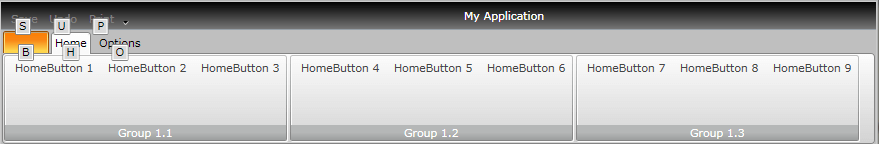

# Keyboard Support

__RadRibbonView__ implements keyboard navigation through Key Tips. You can start using it out-of the box as soon as you set the __KeyTipSerive.IsKeyTipsEnabled__ attached property to __True__.	  

#### __XAML__
{{region radribbonview-keyboard-support_0}}
    <telerik:RadRibbonView x:Name="radRibbonView" 
                           ApplicationName="RibbonViewApplication"
                           telerik:KeyTipService.IsKeyTipsEnabled="True" />
{{endregion}}

You can attach a *key tip* text to every component in the __RadRibbonView__ using the __KeyTipSerive.AccessText__ attached property:	  

#### __XAML__
{{region radribbonview-keyboard-support_1}}
    <telerik:RadRibbonView x:Name="radRibbonView" 
                           ApplicationName="RibbonViewApplication"
                           telerik:KeyTipService.IsKeyTipsEnabled="True">
        <telerik:RadRibbonView.Backstage>
            <telerik:RadRibbonBackstage telerik:KeyTipService.AccessText="B" />
        </telerik:RadRibbonView.Backstage>
    </telerik:RadRibbonView>
{{endregion}}

## KeyTipService class properties

The __KeyTipsService__ class allows you to enable/disable key tips for the __RadRibbonView__ control. It exposes the following properties that allow you to customize the key tips:

* __AccessText__ - gets/sets the key tip activation text			

* __AltAccessText__ - gets/sets alternative key tip activation text			

* __AccessKey__ - gets/sets the combination of keys to be used for displaying the key tips. By default the key tips are displayed by pressing CTRL+QALT. This property should be defined in the __RadRibbonView__ definition:			

	#### __XAML__
	{{region radribbonview-keyboard-support_2}}
		<telerik:RadRibbonView x:Name="radRibbonView" 
							   ApplicationName="RibbonViewApplication"
							   telerik:KeyTipService.AccessKey="Ctrl+Alt+Z"
							   telerik:KeyTipService.IsKeyTipsEnabled="True">
			...
		</telerik:RadRibbonView>
	{{endregion}}



* __AccessKeys__ - is a property of type __IEnumebable<KeyGesture>__ and it gets/sets a collection of __KeyGestures__ that can be used to trigger the KeyTips display. Please note that the __AccessKeys__ property can only be set in code either in code-behind or in a __ViewModel__. This is due to the fact that a __KeyGesture__ cannot be defined in XAML.

>If both __AcessKey__ and __AccessKeys__ properties are set, the value of the __AcessKey__ property will be ignored.You can download a runnable project demonstrating how to take advantage of the __KeyTipService.AccessKeys__ property from our online SDK repository. Please open [this link](https://github.com/telerik/xaml-sdk) and navigate to RibbonView/MultipleAccessKeys-KeyTips.

* __Activation__ - you can use the __KeyTipsService.Activation__ property to define additional logic that can be implemented when using a key tip:

	#### __XAML__
	{{region radribbonview-keyboard-support_3}}
		<telerik:RadRibbonTab Header="Home" telerik:KeyTipService.AccessText="H">
			<telerik:RadRibbonGroup Header="Group 1.1" telerik:KeyTipService.AccessText="A">
				<telerik:RadRibbonButton x:Name="HomeButton1" 
										 Click="HomeButton1_Click"
										 telerik:KeyTipService.AccessText="Z"
										 Text="HomeButton 1">
					<telerik:KeyTipService.Activation>
						<telerik:KeyTipActivation Activated="KeyTipActivation_Activated" />
					</telerik:KeyTipService.Activation>
				</telerik:RadRibbonButton>
				...
			</telerik:RadRibbonGroup>
			...
		</telerik:RadRibbonTab>
	{{endregion}}

	#### __C#__
	{{region radribbonview-keyboard-support_4}}
		private void KeyTipActivation_Activated(object sender, Telerik.Windows.RadRoutedEventArgs e)
		{
			MessageBox.Show("The key tip of the "+(e.OriginalSource as RadRibbonButton).Text.ToString() + "was activated.");
		}
		private void HomeButton1_Click(object sender, RoutedEventArgs e)
		{
			MessageBox.Show((sender as RadRibbonButton).Text.ToString() + "was clicked.");
		}
	{{endregion}}

	#### __VB.NET__
	{{region radribbonview-keyboard-support_5}}
		Private Sub KeyTipActivation_Activated(sender As Object, e As Telerik.Windows.RadRoutedEventArgs)
			MessageBox.Show("The key tip of the " & TryCast(e.OriginalSource, RadRibbonButton).Text.ToString() & "was activated.")
		End Sub
		
		Private Sub HomeButton1_Click(sender As Object, e As RoutedEventArgs)
			MessageBox.Show(TryCast(sender, RadRibbonButton).Text.ToString() & "was clicked.")
		End Sub
	{{endregion}}

	In the above example the __KeyTipActivation.Activated()__ event handler will fire as soon as the __HomeButton1__ key tip is activated. This means that you can implement custom logic that will be executed before the button's __Click()__ event is fired.

## Activating key tips

#### __XAML__
{{region radribbonview-keyboard-support_6}}
    <telerik:RadRibbonView x:Name="radRibbonView" telerik:KeyTipService.IsKeyTipsEnabled="True">
        <telerik:RadRibbonView.Backstage>
            <telerik:RadRibbonBackstage telerik:KeyTipService.AccessText="B" />
        </telerik:RadRibbonView.Backstage>
        <telerik:RadRibbonView.QuickAccessToolBar>
            <telerik:QuickAccessToolBar>
                <telerik:RadRibbonButton Foreground="Gray" 
                                         telerik:KeyTipService.AccessText="S"
                                         Text="Save" />
                <telerik:RadRibbonButton Foreground="Gray" 
                                         telerik:KeyTipService.AccessText="U"
                                         Text="Undo" />
                <telerik:RadRibbonButton Foreground="Gray" 
                                         telerik:KeyTipService.AccessText="P"
                                         Text="Print" />
            </telerik:QuickAccessToolBar>
        </telerik:RadRibbonView.QuickAccessToolBar>
        <telerik:RadRibbonTab Header="Home" telerik:KeyTipService.AccessText="H">
            <telerik:RadRibbonGroup Header="Group 1.1" telerik:KeyTipService.AccessText="A">
                <telerik:RadRibbonButton telerik:KeyTipService.AccessText="Z" Text="HomeButton 1" />
                <telerik:RadRibbonButton telerik:KeyTipService.AccessText="X" Text="HomeButton 2" />
                <telerik:RadRibbonButton telerik:KeyTipService.AccessText="C" Text="HomeButton 3" />
            </telerik:RadRibbonGroup>
            <telerik:RadRibbonGroup Header="Group 1.2" telerik:KeyTipService.AccessText="S">
                <telerik:RadRibbonButton telerik:KeyTipService.AccessText="W" Text="HomeButton 4" />
                <telerik:RadRibbonButton telerik:KeyTipService.AccessText="E" Text="HomeButton 5" />
                <telerik:RadRibbonButton telerik:KeyTipService.AccessText="R" Text="HomeButton 6" />
            </telerik:RadRibbonGroup>
            <telerik:RadRibbonGroup Header="Group 1.3" telerik:KeyTipService.AccessText="D">
                <telerik:RadRibbonButton telerik:KeyTipService.AccessText="G" Text="HomeButton 7" />
                <telerik:RadRibbonButton telerik:KeyTipService.AccessText="M" Text="HomeButton 8" />
                <telerik:RadRibbonButton telerik:KeyTipService.AccessText="N" Text="HomeButton 9" />
            </telerik:RadRibbonGroup>
        </telerik:RadRibbonTab>
        <telerik:RadRibbonTab Header="Options" telerik:KeyTipService.AccessText="O">...</telerik:RadRibbonTab>
    </telerik:RadRibbonView>
{{endregion}}

When a control's key tip is activated, the action associated with the control will be executed:

* Using a key tip of a __RibbonTab__ will select the tab

* Using a key tip of a __RibbonSplitButton/RibbonDropDownButton__ will open the __DropDown__ content of the button

* Using a key tip of a __RibbonGallery__ control will open the gallery

* Using a key tip on a __RibbonButton/RibbonRadioButton/RibbonToggleButton__ will execute the button's command or __Click()__ event

* Using a key tip on a collapsed __RibbonGroup__ will expand the group

* Using a key tip on a __RibbonComboBox__ will open the __ComboBox's__ __DropDown__ content

>You can navigate back thought the layers of the key tips using __Esc__ key.

## Styles and Templates

The key tips are themeable and any built-in Telerik theme can be applied to them. However, if you need to further customize their appearance, you can edit the __KeyTipControl ControlTemplate__:

#### __XAML__

{{region radribbonview-keyboard-support_7}}
    <SolidColorBrush x:Key="RibbonBarKeyTips_OuterBorderBrush" Color="#FF848484" />
    <SolidColorBrush x:Key="RibbonBarKeyTips_Background" Color="#FFD9D9D9" />
    <SolidColorBrush x:Key="RibbonBarKeyTips_InnerBorderBrush" Color="#FFFFFFFF" />
    
{{endregion}}

>The __Telerik_Windows_Controls_RibbonView_KeyTips__ namespace definition is: 
>`xmlns:Telerik_Windows_Controls_RibbonView_KeyTips="clr-namespace:Telerik.Windows.Controls.RibbonView.KeyTips;assembly=Telerik.Windows.Controls.RibbonView"`

# See Also
 * [Ribbon Tab]()
 * [Ribbon Group]()
 * [Ribbon ComboBox]()
 * [Overview]()