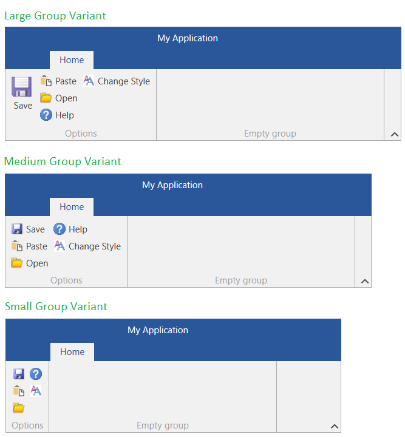
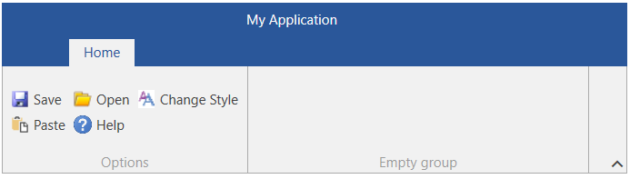
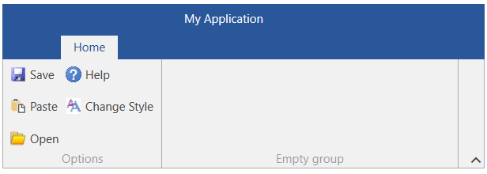

# Collapsible Panel

RadRibbonView's dynamic layout resizing allows you to optimize the layout depending on the available space. 

This feature is enabled with the __RadCollapsiblePanel__ (described in this article) and the [RadOrderedWrapPanel]().

>tip Read the [Resizing]() topic, which is tightly connected with the RadCollapsiblePanel behavior.

RadCollapsiblePanel behaves similarly to the UniformGrid panel. You can define the number of buttons per column (3 by default) and also the vertical spacing between them. The child buttons are ordered in columns when in **Small** and **Medium** size. Each button with **Large** size will be positioned alone in a separate column. 

If there is not enough height to draw the buttons in the corresponding number of rows (buttons per column), the panel will try to order to buttons in less rows. For example, if you define the rows to be 3, but there is only space for 2 rows, then 2 rows will be used. The minimum number of rows that can be reached is 1, after this the buttons will start clipping.

>tip The height of the panel can be changed by changing the height of the RadRibbonView's content. To do this, set the __ContentHeight__ property of RadRibbonView.

__Example 1: Setting up RadRibbonView with RadCollapsiblePanel__
```XAML
	<telerik:RadRibbonView>
		<telerik:RadRibbonTab Header="Home">
			<telerik:RadRibbonGroup Header="Options">
				<telerik:RadCollapsiblePanel>
					<telerik:RadRibbonButton Text="Save"
											 Size="Large"
											 SmallImage="Images/save16.png" 
											 LargeImage="Images/save32.png" 
											 CollapseToSmall="WhenGroupIsSmall" 
											 CollapseToMedium="WhenGroupIsMedium" />
					<telerik:RadRibbonButton Text="Paste"
											 SmallImage="Images/paste16.png" 
											 LargeImage="Images/paste16.png"
											 CollapseToSmall="WhenGroupIsSmall" 
											 CollapseToMedium="WhenGroupIsMedium"/>
					<telerik:RadRibbonButton Text="Open" 
											 SmallImage="Images/open16.png" 
											 LargeImage="Images/open16.png"
											 CollapseToSmall="WhenGroupIsSmall" 
											 CollapseToMedium="WhenGroupIsMedium"/>
					<telerik:RadRibbonButton Text="Help" 
											 SmallImage="Images/help16.png" 
											 LargeImage="Images/help16.png"
											 CollapseToSmall="WhenGroupIsSmall" 
											 CollapseToMedium="WhenGroupIsMedium"/>
					<telerik:RadRibbonButton Text="Change Style" 
											 SmallImage="Images/change-style16.png" 
											 LargeImage="Images/change-style16.png"
											 CollapseToSmall="WhenGroupIsSmall" 
											 CollapseToMedium="WhenGroupIsMedium"/>
				</telerik:RadCollapsiblePanel>
			</telerik:RadRibbonGroup>
			<!-- add other groups here -->
		</telerik:RadRibbonTab>
	</telerik:RadRibbonView>
```

#### Figure 1: Comparison between the different group sizes (variants)


## Defining Number of Rows

By default the RadCollapsiblePanel is using __3 rows__. To change this behavior, set the __RadCollapsiblePanel.SmallButtonsPerColumn__ attached property on the RadRibbonView element.

__Example 2: Setting the number of rows__
```XAML
	<telerik:RadRibbonView telerik:RadCollapsiblePanel.SmallButtonsPerColumn="2"/>
```

#### Figure 2: Collapsible panel with 2 rows


> This setting affects all RadCollapsiblePanel instances within the RadRibbonView instance.

## Defining Items Vertical Spacing

By default the RadCollapsiblePanel does not apply additional vertical spacing between the buttons. To change this and increase the distance between the rows, set the __RadCollapsiblePanel.ItemSpacing__ attached property on the RadRibbonView element.

__Example 3: Setting the vertical spacing__
```XAML
	<telerik:RadRibbonView ContentHeight="110" Margin="10" telerik:RadCollapsiblePanel.ItemSpacing="10" />
```

#### Figure 3: Collapsible panel with a vertical spacing of 10 between the buttons


> This setting affects all RadCollapsiblePanel instances within the RadRibbonView instance.

## See Also
 * [Application Menu]()
 * [Backstage Menu]()
 * [Ribbon Gallery]()
 * [Ribbon Group]()
 * [Quick Access ToolBar]()
 * [Ribbon ComboBox]()
 * [Ribbon Tab]()
 * [Ribbon Buttons - Overview]()
