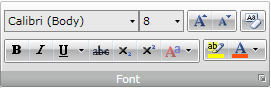
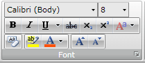
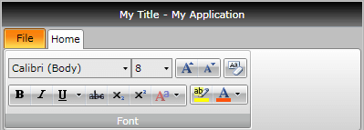
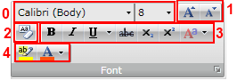
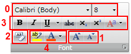

# Ordered Wrap Panel

RadRibbonView's dynamic layout resizing allows you to optimize the layout depending on the available space. 

This feature is enabled with the __RadOrderedWrapPanel__ (described in this article) and the [RadCollapsiblePanel]().

>tip Read the [Resizing]() topic, which is tightly connected with the RadOrderedWrapPanel behavior.

## RadOrderedWrapPanel - Fundamentals

__RadOrderedWrapPanel__ is used together with __RadButtonGroup__ to create a layout known from the Microsoft Office applications. It has two states:

* __Normal__ state.

	
	The __RadOrderedWrapPanel__ displays its children along __two__ horizontal lines in the __normal__ state.							

	>tip When there is enough space, the __RadOrderedWrapPanel__ always tries to layout its children in __Normal__ state.						

* __Compressed__ state

	
	In the __compressed__ state the __RadOrderedWrapPanel__ displays its children along __three__ horizontal lines, thus achieving a more compact and tightly packed structure.						

>tip If you refer to the Microsoft Office Word product, you will note that a similar layout behavior is used by the "Font" and "Paragraph" groups.

You have the ability to specify when the Panel should go into the __Compressed__ state by using the __RadOrderedWrapPanel__'s __CompressedThreshold__ property. Its values are predefined in the __CollapseThreshold__ enumeration, which exposes the following fields:				

* __Never__ - the panel never goes in __Compressed__ state.
* __WhenGroupIsSmall__ - the panel goes in __Compressed__ state when the group is in __Small__ variant.
* __WhenGroupIsMedium__ - the panel goes in __Compressed__ state when the group is in __Medium__ valiant.

At this point, if you fill your panel with RadControls, you will have a functioning layout that splits itself into two or three lines, depending on the available space. There is another important property - __CompressedItemsOrder__. It allows you to change the order of the panel's children upon being compressed. This is very useful because when your child controls are split into three lines, you may want to alter their order because some are being used more frequently than others. The __CompressedItemsOrder__ property is a simple __Int32__ collection, that you are able to set with a comma-delimited list of integers in XAML.

## Using RadOrderedWrapPanel

The next example demonstrates how to build a "Font" like __RadRibbonGroup__ using the __RadOrderedWrapPanel__.				

<snippet id='radribbonview-features-layout-controls-ordered-wrap-panel-block_1-xaml' />

## Setting RadOrderedWrapPanel's CompressedThreshold Property

The __CompressedThreshold__  property allows you to specify when the panel goes into __Compressed__ mode. For example, you may set this property to __CollapseThreshold.Never__.				

<snippet id='radribbonview-features-layout-controls-ordered-wrap-panel-block_2-xaml' />

In this case the panel never goes into __Compressed__ state, even though there isn't enough space to display all of its children.				

## Setting RadOrderedWrapPanel's CompressedItemsOrder Property

The __RadOrderedWrapPanel__'s __CompressedItemsOrder__ property allows you to change the order of the panel's children upon being compressed. This is very useful because when your child controls are split into three lines, you may want to alter their order because some are being used more frequently than others.				

The next snapshot shows you the wrap panel from the first example in __compressed__ state. The __CompressedItemsOrder__ property is not set. The different RadButton groups are marked with indexes from 0 to 4 (there are 5 button groups).

For example, you may wish to change the groups order. In this case you should set the __RadOrderedWrapPanel__'s __CompressedItemsOrder__ property. You can do it in XAML by specifying a comma-delimited list of integers like in the example below.				

<snippet id='radribbonview-features-layout-controls-ordered-wrap-panel-block_3-xaml' />

And the result is shown on the next snapshot. Note how the order of the groups is altered.
