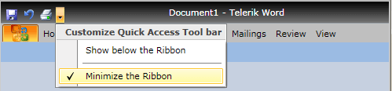
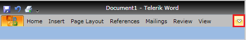

# Minimization

__RadRibbonView__ supports minimization, which means that the ribbon may be hidden so that only its tab headers remain visible. In this state, more screen real estate is available to the client area of the window.


By clicking a tab header, the ribbon appears in a popup over the window client area and all of its controls are accessible.


There are a few ways for the end user to toggle the minimization state of the __RadRibbonView__:			

* Double click on any of the tab headers.				

* Choose 'Minimize the Ribbon' under the Quick Access Tool bar menu.
	

* Display the MinimizeButton by setting the RibbonView.MinimizeButtonVisibility to Visible and toggling the button state
	

## Properties

The following properties are related to the minimize feature:

* __IsMinimizable__ - use this property to enable/disable the minimization functionality of the __RibbonView__. The default value is __True__.					

* __IsMinimized__ - use this property to set or get the current minimize state of the __RibbonView__.					

* __IsMinimizedPopupOpen__ - use this property to get whether the minimized popup menu of the __RibbonView__ is opened or not.					

## Disable the Minimization Functionality

To disable the minimization functionality of the __RadRibbonView__ just set the __IsMinimizable__ property to __False__. This feature is enabled by default.				


```XAML
	<telerik:RadRibbonView x:Name="radRibbonView" IsMinimizable="False" />
```


```C#
	radRibbonView.IsMinimizable = false;
```


```VB.NET
	radRibbonView.IsMinimizable = False
```

## Events

* The __MinimizedChanged__ event is raised when the the ribbon is changing its minimized state. The __MinimizedChanged__ event handler receives two arguments:
	* The __sender__ argument contains the __RadRibbonView__. This argument is of type __object__, but can be cast to the __RadRibbonView__ type.
	* A __Telerik.Windows.RadRoutedEventArgs__ object containing all the additional information about the event.							

* The __MinimizedPopupOpenStateChanged__ event is raised when the minimized popup changes its open state. The __MinimizedPopupOpenStateChanged__ event handler receives two arguments:
	* The __sender__ argument contains the __RadRibbonView__. This argument is of type __object__, but can be cast to the __RadRibbonView__ type.
	* A __Telerik.Windows.RadRoutedEventArgs__ object containing all the additional information about the event.

* The __PreviewPopupOpened__ event is raised when the minimized popup is about to be opened. The __PreviewPopupOpened__ event handler receives two arguments:
	* The __sender__ argument contains the __RadRibbonView__. This argument is of type object, but can be cast to the __RadRibbonView__ type.
	* A __Telerik.Windows.RadRoutedEventArgs__ object containing all the additional information about the event.

	>tip You can cancel the opening of the minimized popup by setting the __RadRoutedEventArgs__'s __Handled__ property to __True__.						

* The __PopupOpened__ event is raised when the minimized popup changes its open state. The __PopupOpened__ event handler receives two arguments:
	* The __sender__ argument contains the __RadRibbonView__. This argument is of type __object__, but can be cast to the __RadRibbonView__ type.
	* A __Telerik.Windows.RadRoutedEventArgs__ object containing all the additional information about the event.