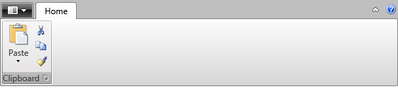
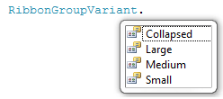
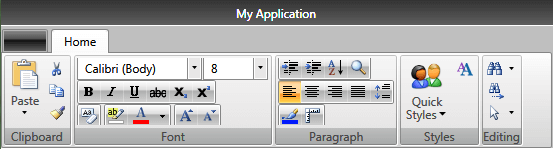

# Resizing

One of the most important features of the __RadRibbonView__ control is the dynamic layout resizing. It refers to the __RadRibbonView__'s ability to optimize its layout depending on how much space is available. This process can't be automated, however, the __RadRibbonView__'s API gives you the ability to specify how you would like the resizing to occur.

The resizing of the elements is defined per __RadRibbonTab__. The resizing behavior of one tab is __independent__ from the resizing behavior of the rest of the tabs. A __RadRibbonTab__ control can contains many __RadRibbonGroups__. Each group in your tabs can have four distinct sizes:

* __Large__- this is the default size.
	

* __Medium__
	

* __Small__
	

* __Collapsed__
	

## DefaultVariant

The __RadRibbonGroups__ assume the size of their __DefaultVariant__ whenever they can. By default the value of this property is __Large__, but you can easily change it:	


```XAML
	<telerik:RadRibbonTab Header="Home">
	    <telerik:RadRibbonGroup DefaultVariant="Small"
								DialogLauncherVisibility="Visible"
								Header="Clipboard"
								Icon="/Images/RibbonView/FirstLook/paste.png">
			<telerik:RadRibbonSplitButton LargeImage="/Images/RibbonView/FirstLook/paste.png"
										  Size="Large"
										  SmallImage="/Images/RibbonView/FirstLook/paste.png"
										  Text="Paste">
			</telerik:RadRibbonSplitButton>
			<telerik:RadCollapsiblePanel>
				<telerik:RadRibbonButton CollapseToSmall="WhenGroupIsSmall"
										 CollapseToMedium="WhenGroupIsMedium"
										 SmallImage="/Images/RibbonView/FirstLook/cut.png"
										 Text="Cut"/>
				<telerik:RadRibbonButton CollapseToSmall="WhenGroupIsSmall"
										 CollapseToMedium="WhenGroupIsMedium"
										 SmallImage="/Images/RibbonView/FirstLook/copy.png"
										 Text="Copy"/>
				<telerik:RadRibbonButton CollapseToSmall="WhenGroupIsSmall"
										 CollapseToMedium="WhenGroupIsMedium"
										 SmallImage="/Images/RibbonView/FirstLook/formatpainter.png"
										 Text="Format Painter"/>
			</telerik:RadCollapsiblePanel>
		</telerik:RadRibbonGroup>
	</telerik:RadRibbonTab>			
```



The __DefaultVariant__ is always available and is always with highest priority. For example, if you set __DefaultVariant__ to __Small__ as demonstrated above, the group will be initially in __Small__ state and its state can only change to __Collapsed__ when the width of the __RibbonView__ control gets smaller. Moreover, this __RibbonGroup__ will never enter its __Medium__ or __Large__ states as the __DefaultVariant__ is __Small__.		

## Variants

The resizing behavior of __RadRibbonGroup__ is specified through the RadRibbonGroup's __Variants__ collection. The collection is populated with __GroupVariant__ objects, which objects have two important properties:		

* __Variant__ - defines the variant in which the group can be. The values for this property are predefined in the __RibbonGroupVariant__ enumeration, which exposes the following fields:
	

* __Priority__- the priority for the specified __Variant__.			

Although the __Variants__ collection is defined on __RadRibbonGroup__ level, the __Priority__ properties for each __GroupVariant__ are applied throughout __RadRibbonTab__ as a whole - for all of the groups. And it is important to remember that the __Variants__ are applied based on the value of their __Priority__ following the rule - the highest number is with the highest priority.		

By default if no priorities are set for the __RadRibbonGroups Variants__ they will be resized from right to left going through all 4 variants  - e.g. when the size of the __RadRibbonView__ is smaller the right-most __RibbonGroup__ will be first set to a smaller size. However, the groups will only go through each of their 4 Variants, if every smaller variant actually takes less space. Otherwise, if for example the groups are empty, they will skip variants and will be resized from __Large__ to __Collapsed__ state directly.		

If you want to customize the resizing order, you should specify a __Priority__ for each of the __RibbonGroup__ __Variants__. Once you do so, the priorities are applied from the top-priority Variant to the least - meaning that when the __RibbonView__ tries to resize, it will try to fit the top-priority variant among all groups. However, a top-priority variant will be applied on a __RibbonGroup__ only if the size of the group in that variant is smaller than the size of the group in the current variant. Usually the variant and the size of a single __RadRibbonGroup__ can be described like so: __Collapsed < Small < Medium < Large__

>tip If there are multiple __Variants__ with equal priorities among the __RibbonGroups__ of a __RibbonTab__, the variants are applied from right to left.		  

You can create a __RibbonView__ definition where only a few __RibbonGroups__ have a predefined __Variants__ collection. In this case those groups that don't have any Variants settings are considered with lowest priority. Therefore the __RibbonView__ will first apply the __Variants__ of the __RadRibbonGroups__ that define a custom variants collection and only then it will change the state of the other __RibbonGroups__ applying each of the 4 variants (from the largest to the smallest) from right to left.		

>tip You have the ability to customize the layout of the __RibbonGroups__ when they are in large, medium or small state. In collapsed state, they look the same - only image and text are shown. For more information about the groups' customization, take a look at the [Ribbon Group]() topic.		  

## Example

The next example demonstrates how to set the __RadRibbonGroup__'s __Variants__ collection.		

>A size variant can only be specified once per group.


```XAML
    <telerik:RadRibbonView>
        <telerik:RadRibbonTab Header="Home">
            <telerik:RadRibbonGroup Header="Clipboard" Icon="/Images/RibbonView/FirstLook/paste.png">
                <telerik:RadRibbonGroup.Variants>
                    <telerik:GroupVariant Priority="11" Variant="Medium" />
                    <telerik:GroupVariant Priority="6" Variant="Small" />
                    <telerik:GroupVariant Priority="1" Variant="Collapsed" />
                </telerik:RadRibbonGroup.Variants>
                <telerik:RadRibbonSplitButton LargeImage="/Images/RibbonView/FirstLook/paste.png"
                                              Size="Large"
                                              SmallImage="/Images/RibbonView/FirstLook/paste.png"
                                              Text="Paste">
                </telerik:RadRibbonSplitButton>
                <telerik:RadCollapsiblePanel>
                    <telerik:RadRibbonButton CollapseToMedium="WhenGroupIsMedium"
                                             CollapseToSmall="WhenGroupIsSmall"
                                             SmallImage="/Images/RibbonView/FirstLook/cut.png"
                                             Text="Cut" />
                    <telerik:RadRibbonButton CollapseToMedium="WhenGroupIsMedium"
                                             CollapseToSmall="WhenGroupIsSmall"
                                             SmallImage="/Images/RibbonView/FirstLook/copy.png"
                                             Text="Copy" />
                    <telerik:RadRibbonButton CollapseToMedium="WhenGroupIsMedium"
                                             CollapseToSmall="WhenGroupIsSmall"
                                             SmallImage="/Images/RibbonView/FirstLook/formatpainter.png"
                                             Text="Format Painter" />
                </telerik:RadCollapsiblePanel>
            </telerik:RadRibbonGroup>
            <telerik:RadRibbonGroup Header="Font">
                <telerik:RadRibbonGroup.Variants>
                    <telerik:GroupVariant Priority="13" Variant="Medium" />
                    <telerik:GroupVariant Priority="8" Variant="Small" />
                    <telerik:GroupVariant Priority="3" Variant="Collapsed" />
                </telerik:RadRibbonGroup.Variants>
                <telerik:RadOrderedWrapPanel CompressedItemsOrder="0,3,2,4,1">
                    <StackPanel Orientation="Horizontal">
                        <telerik:RadRibbonComboBox Width="125"
                                                   SelectedIndex="1"
                                                   telerik:KeyTipService.AccessText="FF"
                                                   telerik:ScreenTip.Description="Change the font face."
                                                   telerik:ScreenTip.Title="Font">
                            <telerik:RadRibbonComboBoxItem Content="Arial" />
                            <telerik:RadRibbonComboBoxItem Content="Calibri (Body)" />
                            <telerik:RadRibbonComboBoxItem Content="Tahoma" />
                            <telerik:RadRibbonComboBoxItem Content="Verdana" />
                            <telerik:RadRibbonComboBoxItem Content="Times New Roman" />
                            <telerik:RadRibbonComboBoxItem Content="Cambria" />
                        </telerik:RadRibbonComboBox>
                        <telerik:RadRibbonComboBox Name="comboFontSize"
                                                   Width="65"
                                                   SelectedIndex="0"
                                                   telerik:KeyTipService.AccessText="FS"
                                                   telerik:ScreenTip.Description="Change the font size."
                                                   telerik:ScreenTip.Title="Font Size">
                            <telerik:RadRibbonComboBoxItem Content="8" />
                            <telerik:RadRibbonComboBoxItem Content="9" />
                            <telerik:RadRibbonComboBoxItem Content="10" />
                            <telerik:RadRibbonComboBoxItem Content="11" />
                            <telerik:RadRibbonComboBoxItem Content="12" />
                            <telerik:RadRibbonComboBoxItem Content="14" />
                            <telerik:RadRibbonComboBoxItem Content="16" />
                            <telerik:RadRibbonComboBoxItem Content="18" />
                        </telerik:RadRibbonComboBox>
                    </StackPanel>
                    <telerik:RadButtonGroup>
                        <telerik:RadRibbonButton SmallImage="/Images/RibbonView/FirstLook/font-increasesize.png" />
                        <telerik:RadRibbonButton SmallImage="/Images/RibbonView/FirstLook/font-decreasesize.png" />
                    </telerik:RadButtonGroup>
                    <telerik:RadButtonGroup>
                        <telerik:RadRibbonButton SmallImage="/Images/RibbonView/FirstLook/ClearFormatting16.png" Text="Clear Formatting" />
                    </telerik:RadButtonGroup>
                    <telerik:RadButtonGroup>
                        <telerik:RadRibbonToggleButton SmallImage="/Images/RibbonView/FirstLook/bold.png" />
                        <telerik:RadRibbonToggleButton SmallImage="/Images/RibbonView/FirstLook/italic.png" />
                        <telerik:RadRibbonToggleButton SmallImage="/Images/RibbonView/FirstLook/Underline/underline.png" />
                        <telerik:RadRibbonToggleButton SmallImage="/Images/RibbonView/FirstLook/Strikethrough16.png" />
                        <telerik:RadRibbonToggleButton SmallImage="/Images/RibbonView/FirstLook/subscript.png" />
                        <telerik:RadRibbonToggleButton SmallImage="/Images/RibbonView/FirstLook/superscript.png" />
                    </telerik:RadButtonGroup>
                    <telerik:RadButtonGroup>
                        <telerik:RadRibbonButton SmallImage="/Images/RibbonView/FirstLook/highlight.png" Text="Highlight Color" />
                        <telerik:RadColorPicker Margin="-1,0,0,0"
                                                BorderThickness="0"
                                                SelectedColor="Red" />
                    </telerik:RadButtonGroup>
                </telerik:RadOrderedWrapPanel>
            </telerik:RadRibbonGroup>
            <telerik:RadRibbonGroup Header="Paragraph">
                <telerik:RadRibbonGroup.Variants>
                    <telerik:GroupVariant Priority="12" Variant="Medium" />
                    <telerik:GroupVariant Priority="7" Variant="Small" />
                    <telerik:GroupVariant Priority="2" Variant="Collapsed" />
                </telerik:RadRibbonGroup.Variants>
                <telerik:RadOrderedWrapPanel CompressedItemsOrder="0,2,1">
                    <telerik:RadButtonGroup>
                        <telerik:RadRibbonButton SmallImage="/Images/RibbonView/FirstLook/outdent.png" />
                        <telerik:RadRibbonButton SmallImage="/Images/RibbonView/FirstLook/indent.png" />
                        <telerik:RadRibbonButton SmallImage="/Images/RibbonView/FirstLook/sortasc.png" Text="Sort" />
                        <telerik:RadRibbonButton SmallImage="/Images/RibbonView/FirstLook/zoom.png" Text="Zoom" />
                    </telerik:RadButtonGroup>
                    <telerik:RadButtonGroup>
                        <telerik:RadRibbonButton SmallImage="/Images/RibbonView/FirstLook/linecolor.png" Text="Shading" />
                        <telerik:RadRibbonButton SmallImage="/Images/RibbonView/FirstLook/Ruler.png" Text="Borders" />
                    </telerik:RadButtonGroup>
                    <telerik:RadButtonGroup>
                        <telerik:RadRibbonRadioButton IsChecked="True" SmallImage="/Images/RibbonView/FirstLook/alignleft.png" />
                        <telerik:RadRibbonRadioButton SmallImage="/Images/RibbonView/FirstLook/aligncenter.png" />
                        <telerik:RadRibbonRadioButton SmallImage="/Images/RibbonView/FirstLook/alignright.png" />
                        <telerik:RadRibbonRadioButton SmallImage="/Images/RibbonView/FirstLook/alignjustify.png" />
                        <telerik:RadRibbonButton SmallImage="/Images/RibbonView/FirstLook/lineSpacing_more.png" Text="Line Spacing" />
                    </telerik:RadButtonGroup>
                </telerik:RadOrderedWrapPanel>
            </telerik:RadRibbonGroup>
            <telerik:RadRibbonGroup Header="Styles">
                <telerik:RadRibbonGroup.Variants>
                    <telerik:GroupVariant Priority="15" Variant="Medium" />
                    <telerik:GroupVariant Priority="10" Variant="Small" />
                    <telerik:GroupVariant Priority="5" Variant="Collapsed" />
                </telerik:RadRibbonGroup.Variants>
                <telerik:RadRibbonGallery x:Name="QuickStyles"
                                          Title="Quick Styles"
                                          Icon="/Images/RibbonView/FirstLook/users.png">
                    <telerik:RadGalleryItem Name="Normal"
                                            Image="/Images/RibbonView/FirstLook/Paragraph/paragraph.png"
                                            IsSelected="True" />
                    <telerik:RadGalleryItem Name="No_Spacing" Image="/Images/RibbonView/FirstLook/Paragraph/paragraph9.png" />
                    <telerik:RadGalleryItem Name="Heading1" Image="/Images/RibbonView/FirstLook/Paragraph/paragraph8.png" />
                    <telerik:RadGalleryItem Name="Heading2" Image="/Images/RibbonView/FirstLook/Paragraph/paragraph7.png" />
                    <telerik:RadGalleryItem Name="Title" Image="/Images/RibbonView/FirstLook/Paragraph/paragraph6.png" />
                    <telerik:RadGalleryItem Name="Subtitle" Image="/Images/RibbonView/FirstLook/Paragraph/paragraph5.png" />
                    <telerik:RadGalleryItem Name="Subtitle_Emphasis" Image="/Images/RibbonView/FirstLook/Paragraph/paragraph4.png" />
                    <telerik:RadGalleryItem Name="Emphasis" Image="/Images/RibbonView/FirstLook/Paragraph/paragraph3.png" />
                    <telerik:RadGalleryItem Name="Intense_Emphasis" Image="/Images/RibbonView/FirstLook/Paragraph/paragraph2.png" />
                    <telerik:RadGalleryItem Name="Strong" Image="/Images/RibbonView/FirstLook/Paragraph/paragraph1.png" />
                </telerik:RadRibbonGallery>
                <telerik:RadRibbonButton CollapseToSmall="WhenGroupIsMedium"
                                         LargeImage="/Images/RibbonView/FirstLook/ChangeStyles32.png"
                                         Size="Large"
                                         Text="Change Styles" />
            </telerik:RadRibbonGroup>
            <telerik:RadRibbonGroup Header="Editing">
                <telerik:RadRibbonGroup.Variants>
                    <telerik:GroupVariant Priority="14" Variant="Medium" />
                    <telerik:GroupVariant Priority="9" Variant="Small" />
                    <telerik:GroupVariant Priority="4" Variant="Collapsed" />
                </telerik:RadRibbonGroup.Variants>
                <telerik:RadCollapsiblePanel>
                    <telerik:RadRibbonSplitButton CollapseToMedium="WhenGroupIsMedium"
                                                  CollapseToSmall="WhenGroupIsSmall"
                                                  Size="Large"
                                                  SmallImage="/Images/RibbonView/FirstLook/find.png"
                                                  Text="Find" />
                    <telerik:RadRibbonButton CollapseToMedium="WhenGroupIsMedium"
                                             CollapseToSmall="WhenGroupIsSmall"
                                             Size="Large"
                                             SmallImage="/Images/RibbonView/FirstLook/findnext.png"
                                             Text="Replace" />
                    <telerik:RadRibbonSplitButton CollapseToMedium="WhenGroupIsMedium"
                                                  CollapseToSmall="WhenGroupIsSmall"
                                                  IsTextInMiddleButton="False"
                                                  Size="Large"
                                                  SmallImage="/Images/RibbonView/FirstLook/pointer.png"
                                                  Text="Select" />
                </telerik:RadCollapsiblePanel>
            </telerik:RadRibbonGroup>
        </telerik:RadRibbonTab>
    </telerik:RadRibbonView>
```


In the previous example the demo would change the size of the groups following the order defined by the Variants collection and the priority of each variant. In our case when the __RibbonView Width__ is decreased the Groups will be resized going through each variant following this order:

1. Styles
2. Editing
3. Font
4. Paragraph
5. Clipboard



Please keep in mind that when the group changes its __Size__, the elements inside are automatically resized. And in order to customize the resizing behavior of the elements you can wrap them in the panels that Telerik supports. For more information, take a look at the [Ordered Wrap Panel]() and [Collapsible Panel]() topics. Developers can also choose to create a custom logic for the resizing by using the __RadRibbonButtons__ and by defining how they will behave when the group changes its size. For more information, please take a look at the [Ribbon Buttons]() topic.

## See Also
 * [Ribbon Group]()
 * [RibbonButtons Overview]()
 * [Collapsing]()
