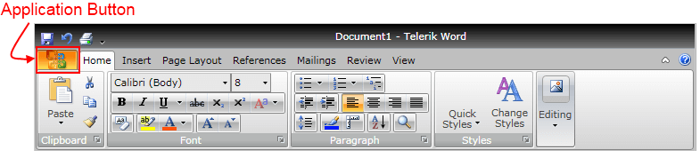
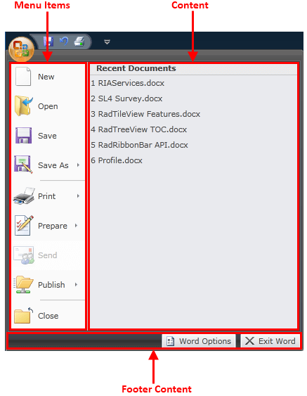
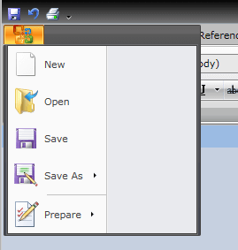
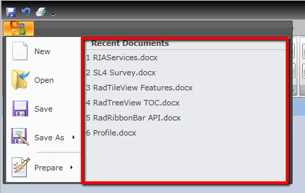
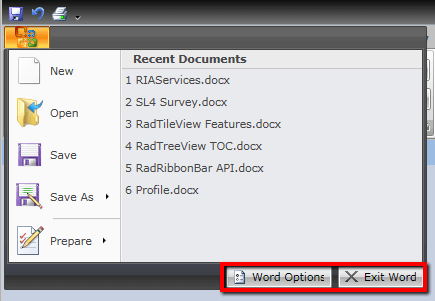

# Application Menu

Telerik __RadRibbonView__ provides a simple and consistent way for building interfaces similar to the RibbonView used in Microsoft Office. The __RadRibbonView__ consists of various elements, one of which is the __Application Menu__. This topic discusses concepts fundamental to the __Application Menu__ at first and then goes into the usage of the __ApplicationMenu__ class and its features.			

>tip Before proceeding with this tutorial, it is recommended to get familiar with the [Visual Structure]() of the __RadRibbonView__ control.			

## Application Menu - Fundamentals

The __Application Menu__ is equivalent to the __File__ menu of the traditional menu UIs. By default it is represented by the rectangular button (named __Application Button__) on the upper-left corner of the __RadRibbonView__ control.

The __Application Menu__ appears when a user __clicks__ the __Application Button__. This menu displays controls used to perform actions on the entire document, like Save, Print and Send. The __Application Menu__ also provides a list of recent documents, access to application options for changing user settings and preferences, and application exit. 

>The class that represents the application menu is __Telerik.Windows.Controls.ApplicationMenu__.					

The __ApplicationMenu__ is an [ItemsControl](http://msdn.microsoft.com/en-us/library/system.windows.controls.itemscontrol.aspx) (it derives from __ItemsControl__), which consists of three parts:				

* __Menu Items__ - they are populated by using the __ApplicationMenu__'s __Items__ property. For items it is handy to use the __RadRibbonButton__, __RadRibbonSplitButton__ and __RadRibbonDropDownButton__ controls. They will be styled automatically to fit into the __ApplicationMenu__ styles.					

* __Content__ - this is the right pane of the application menu. To populate it you should use the __ApplicationMenu__'s __Content__ property and set the content you like.					

* __Footer Content__ - this is the bottom pane of the application menu. Here are usually placed application options and exit buttons. In order to populate this area you need to use the __ApplicationMenu__'s __FooterContent__ property and set the content you like.					

Note that the __ApplicationMenu__ can be used as a stand-alone control, independed from RadRibbonView.

## Adding Application Menu to a RadRibbonView Control

In order to add an application menu to your __RadRibbonView__ control you need to set the __RadRibbonView__'s __ApplicationMenu__ property. The next several code-snippets show you how to do that in XAML, as well as in the code-behind.				

<snippet id='radribbonview-features-ribbon-controls-applicationmenu-block_1-xaml' />

<snippet id='radribbonview-features-ribbon-controls-applicationmenu-block_2-cs' />
<snippet id='radribbonview-features-ribbon-controls-applicationmenu-block_3-vb' />

## Adding Menu Items

When you want to add menu items to your __RadRibbonView__'s application menu, you need to populate the __ApplicationMenu__'s __Items__ collection. It is handy to use the __RadRibbonButton__, __RadRibbonSplitButton__, __RadRibbonDropDownButton__ and __Separator__ controls.				

>tip For more information about the different types of __RadRibbonButtons__ and their properties, take a look at the [RibbonButtons]()topic.				

The next example demonstrates how to add several buttons as menu items to your application menu.

<snippet id='radribbonview-features-ribbon-controls-applicationmenu-block_4-xaml' />

Three ordinary __RadRibbonButtons__, one __RadRibbonSplitButton__ and one __RadRibbonDropDownButton__ are added. Also note the way for adding a separator element - __<telerik:Separator />__. The result can be seen on the snapshot below.

## Adding Content

The second element you may want to initialize when building an application menu is the __Content__. This is the right pane of the application menu. To populate it you should use the __ApplicationMenu__'s __Content__ property and set the content you like.				

The next example shows you how to set the __ApplicationMenu__'s __Content__ property. Note that in this example the [initialization](#adding-menu-items) of the menu items is skipped.				

<snippet id='radribbonview-features-ribbon-controls-applicationmenu-block_5-xaml' />

## Adding Footer Content

The last element of the application menu is the __Footer Content__. This is the bottom pane of the application menu. Here are usually placed application options and exit buttons. In order to initialize it you need to set the __ApplicationMenu__'s __FooterContent__ property like in the example below.				

<snippet id='radribbonview-features-ribbon-controls-applicationmenu-block_6-xaml' />

In this example, it is assumed that you are familiar with initializing the menu items and content of the application menu. If not, check out the previous two sections where the process of adding [menu items](#adding-menu-items) and [content](#adding-content) is described. The result of the last example is shown on the snapshot below. 

## Customizing the Application Menu Button

In order to learn how to customize the application menu button, disable it or hide it, read the [Customize the Application Menu Button]() article.

## Events

The __RadRibbonView__ class exposes the __ApplicationButtonDoubleClick__ event, which is fired when the __RibbonView__'s __ApplicationButton__ is __double-clicked__.				

<snippet id='radribbonview-features-ribbon-controls-applicationmenu-block_7-xaml' />

The __ApplicationButtonDoubleClick__ event handler receives two arguments:
	* The sender argument contains the __RadRibbonView__. This argument is of type __object__, but can be cast to the __RadRibbonView__ type.
	* The second argument is a __RadRoutedEventArgs__ object.

<snippet id='radribbonview-features-ribbon-controls-applicationmenu-block_8-cs' />
<snippet id='radribbonview-features-ribbon-controls-applicationmenu-block_9-vb' />

One common scenario is to close the application when the user makes a double-click on the application button.

For a full list of the exposed by the __RadRibbonView__ events, take a look at the [Events - Overview]() topic.				

The __RadRibbonView__ is a complex control and the __application menu__ is only a small part of it. The __RadRibbonView__ consists of various elements such as:				
* [Backstage Menu]()
* [Quick Access ToolBar]()
* [Ribbon Tab]()
* [Ribbon Group]()
* [Ribbon Gallery]()
* [RibbonButtons Overview]()
* [Ribbon ComboBox]()
* [Screen Tips]()

Additional features that you may find interesting are:
* [Selection]()
* [Resizing]()
* [Minimization]()
* [Localization]()