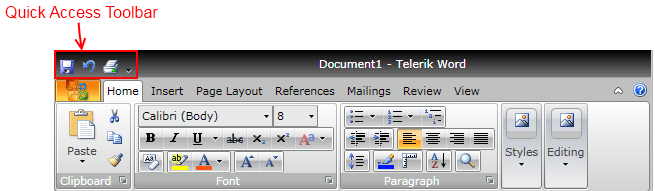
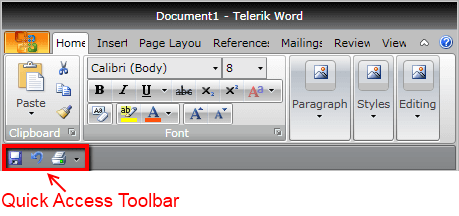
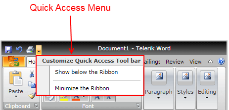
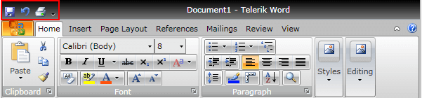
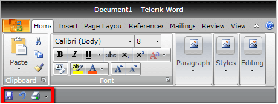
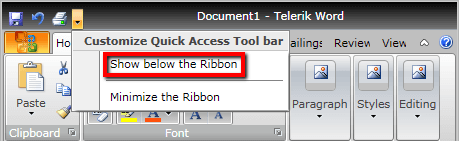

# Quick Access Toolbar

Telerik __RadRibbonView__ provides a simple and consistent way for building interfaces similar to the RibbonView used in Microsoft Office. The __RadRibbonView__ consists of various elements, one of which is the __Quick Access Toolbar__. This topic discusses concepts fundamental to the __Quick Access Toolbar__ at first and then goes into the usage of the __QuickAccessToolbar__ class and its features.      

>tip Before proceeding with this tutorial, it is recommended to get familiar with the [Visual Structure]() of the __RadRibbonView__ control.        

## Quick Access ToolBar - Fundamentals

The __Quick Access Toolbar__ is used to render a set of __RadRibbonView__ controls that are most commonly used in the application. It is rendered above  the __ApplicationButton__ to make it easily accessible to end-users.



This is the __default__ position of the __Quick Access Toolbar__. However, it is also possible to position the Quick Access Toolbar __below__ the Ribbon control.



An integral part of the Quick Access Toolbar is the __Quick Access Menu__, which is rendered right next to the Quick Access Toolbar.



The Quick Access Menu can be used by the end-user to choose the place of the Quick Access Toolbar - __above__ or __below__ the ribbon, or to __hide__ the entire ribbon control.        

>The class that represents the Quick Access Toolbar is __Telerik.Windows.Controls.QuickAccessToolbar__.          

The __QuickAccessToolbar__ control is an [ItemsControl](http://msdn.microsoft.com/en-us/library/system.windows.controls.itemscontrol.aspx) ( it __indirectly__ derives from __ItemsControl__). That fact allows you to easily customize it by adding/removing commands.        

Check out the rest of this topic, which is entirely dedicated to the __QuickAccessToolbar__.        

## Adding QuickAccessToolbar to a RadRibbonView Control

In order to add a quick access toolbar to your __RadRibbonView__ control you need to set the __RadRibbonView__'s __QuickAccessToolbar__ property. The next several code-snippets show you how to do that in XAML, as well as in the code-behind.        


```XAML
	<telerik:RadRibbonView x:Name="radRibbonView" Title="My Title" ApplicationName="My Application">
	    <telerik:RadRibbonView.QuickAccessToolBar>
	        <telerik:QuickAccessToolBar />
	    </telerik:RadRibbonView.QuickAccessToolBar>
	</telerik:RadRibbonView>
```


```C#
	this.radRibbonView.QuickAccessToolBar = new QuickAccessToolBar();
```
```VB.NET
	Me.radRibbonView.QuickAccessToolBar = New QuickAccessToolBar()
```

## Adding QuickAccessToolbar Items

When you want to add toolbar items to your __RadRibbonView__'s Quick Access Toolbar, you need to populate the __QuickAccessToolbar__'s __Items__ collection. It is handy to use the __RadRibbonButton__, __RadRibbonSplitButton__, __RadRibbonDropDownButton__ and __RadToolBarSeparator__ controls.

>tip For more information about the different types of __RadRibbonButtons__ and their properties, take a look at the [Ribbon Buttons]() topic.          

The next example demonstrates how to add several buttons as toolbar items to your Quick Access Toolbar.


```XAML
	<telerik:RadRibbonView x:Name="radRibbonView">
	    <telerik:RadRibbonView.QuickAccessToolBar>
	        <telerik:QuickAccessToolBar>
	            <telerik:RadRibbonButton Text="Save" SmallImage="Images/IconMSOffice/16/save.png"
	                                        Size="Small"
	                                        telerik:KeyTipService.AccessText="1" />
	            <telerik:RadRibbonButton Text="Undo" SmallImage="Images/IconMSOffice/16/undo.png"
	                                        Size="Small"
	                                        telerik:KeyTipService.AccessText="2" />
	            <telerik:RadRibbonButton Text="Print" SmallImage="Images/IconMSOffice/16/print.png"
	                                        Size="Small"
	                                        telerik:KeyTipService.AccessText="3" />
	        </telerik:QuickAccessToolBar>
	    </telerik:RadRibbonView.QuickAccessToolBar>
	</telerik:RadRibbonView>
```

The result can be seen on the snapshot below.


## Changing the QuickAccessToolbar Position 

The default position of the __QuickAccessToolbar__ is right next to the [Application Menu]() button. However, you can change its position either design-time or run-time. In order to change the __QuickAccessToolbar__ position design-time, you need to set the __RadRibbonView__'s __QuickAccessToolBarPosition__ property. Its values are predefined in the __QuickAccessToolBarPosition__ enumeration, which exposes the following fields:        

* __AboveRibbon__ - position the __QuickAccessToolbar above__ the ribbon.            

* __BelowRibbon__ - position the __QuickAccessToolbar below__ the ribbon.            

* __NotHosted__ - the __QuickAccessToolbar__ is __not hosted__. Use this value, when you want to hide the __QuickAccessToolbar__.            

The next example demonstrates how to set the __QuickAccessToolBarPosition__ property.        


```XAML
	<telerik:RadRibbonView x:Name="radRibbonView" QuickAccessToolBarPosition="BelowRibbon">
```


```C#
	radRibbonView.QuickAccessToolBarPosition = QuickAccessToolBarPosition.BelowRibbon;
```
```VB.NET
	radRibbonView.QuickAccessToolBarPosition = QuickAccessToolBarPosition.BelowRibbon
```

The result from the previous example is that when you run your application, the __QuickAccessToolbar__ will be positioned below the ribbon.



>tip The default value of the __RadRibbonView__'s __QuickAccessToolBarPosition__ property is __QuickAccessToolBarPosition.AboveRibbon__.          

__RadRibbonView__ has a built-in feature, which allows you to change the __QuickAccessToolbar__ position run-time. Suffice it to execute the QuickAccessMenu's "Show below/above the Ribbon" command.



## Hiding the QuickAccessToolbar

When you want to hide the __QuickAccessToolbar__, you should set the __RadRibbonView__'s __QuickAccessToolBarPosition__ property to __QuickAccessToolBarPosition.NotHosted__.        


```XAML
	<telerik:RadRibbonView x:Name="radRibbonView" QuickAccessToolBarPosition="NotHosted">
```


```C#
	radRibbonView.QuickAccessToolBarPosition = QuickAccessToolBarPosition.NotHosted;
```
```VB.NET
	radRibbonView.QuickAccessToolBarPosition = QuickAccessToolBarPosition.NotHosted
```

## Events

The __RadRibbonView__ class exposes the __ToolBarPositionChanged__ event, which is fired when the __QuickAccessToolbar__ position is changed.        


```XAML
	<telerik:RadRibbonView x:Name="radRibbonView" ToolBarPositionChanged="radRibbonView_ToolBarPositionChanged">
```

The __ToolBarPositionChanged__ event handler receives two arguments:        

* The sender argument contains the __RadRibbonView__. This argument is of type __object__, but can be cast to the __RadRibbonView__ type.            
* The second argument is a __RadRoutedEventArgs__ object.            


```C#
	private void radRibbonView_ToolBarPositionChanged( object sender, RadRoutedEventArgs e )
	{
	RadRibbonView ribbonView = sender as RadRibbonView ;
	QuickAccessToolBarPosition newPosition = ribbonView.QuickAccessToolBarPosition;
	// Do some logic here.
	}
```
```VB.NET
	Private Sub radRibbonView_ToolBarPositionChanged(ByVal sender As Object, ByVal e As RadRoutedEventArgs)
	Dim ribbonView As RadRibbonView = TryCast(sender, RadRibbonView)
	' Do some logic here.'
	Dim newPosition As QuickAccessToolBarPosition = ribbonView.QuickAccessToolBarPosition
	End Sub
```

>tip You can handle the __ToolBarPositionChanged__ event to get notified when the user changes the ToolBar position.          

For a full list of the exposed by the __RadRibbonView__ events, take a look at the [Events - Overview]() topic.        

The __RadRibbonView__ is a complex control and the __Quick Access Toolbar__ is only a small part of it. The __RadRibbonView__ consists of various elements such as:
* [Application Menu]()
* [Backstage Menu]()
* [Ribbon Tab]()
* [Ribbon Group]()
* [Ribbon Gallery]()
* [RibbonButtons Overview]()
* [Ribbon ComboBox]()
* [Screen Tips]()

Additional features that you may find interesting are:
* [Selection]()
* [Resizing]()
* [Minimization]()
* [Localization]()

## See Also
 * [Styling the QuickAccessToolbar]()
