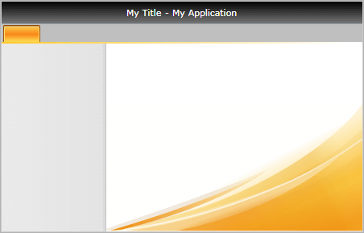
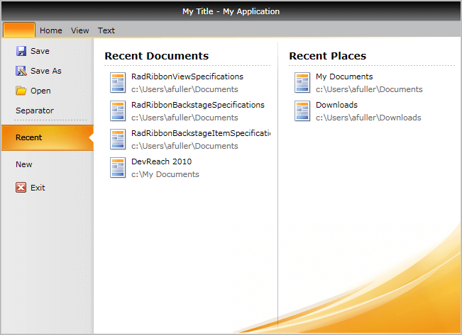
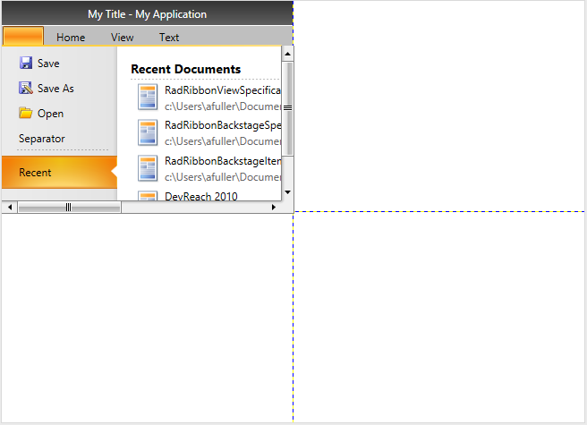

# Ribbon Backstage

Telerik __RadRibbonView__ provides a simple and consistent way for building interfaces similar to the ribbon control used in Microsoft Office. The __Ribbon Backstage__ control allows you to achieve a more native MS Office look and feel of your application.

## RibbonBackstage Fundamentals

The __RibbonBackstage__ appears when a user __clicks__ the __Application Button__. It can be used to display controls, used to perform actions on the entire document, like __Save__, __Print__ and __Send__. The __RibbonBackstage__ can also provide a list of recent documents, access to application options for changing user settings and preferences, and application exit.

By default the __Backstage__ isn't opened. In order to control its state you can set the __RadRibbonView__'s __IsBackstageOpen__ property.

__Example 1: Set the IsBackstageOpen property__
```XAML
	<telerik:RadRibbonView x:Name="radRibbonView" Title="My Title" ApplicationName="My Application" IsBackstageOpen="True">
	 ...
	</telerik:RadRibbonView>
```

## Adding Backstage to the RadRibbonView

In order to add a backstage to your __RadRibbonView__ control you need to set the __RadRibbonView__'s __Backstage__ property. The next several code-snippets show you how to do that in XAML, as well as in the code-behind.

__Example 2: Declaring RadRibbonBackstage in XAML__
```XAML
	<telerik:RadRibbonView x:Name="radRibbonView" Title="My Title" ApplicationName="My Application">
	    <telerik:RadRibbonView.Backstage>
	        <telerik:RadRibbonBackstage />
	    </telerik:RadRibbonView.Backstage>
	</telerik:RadRibbonView>
```

__Example 3: Declaring RadRibbonBackstage in code-behind__
```C#
	this.radRibbonView.Backstage = new RadRibbonBackstage();
```
```VB.NET
	Me.radRibbonView.Backstage = New RadRibbonBackstage()
```

#### __Figure 1: RadRibbonBackstage default appearance__


## Adding Backstage Items

The __Backstage__ control derives from the __RadTabControl__. That fact allows you to easily customize it by adding/removing __BackstageItems__ (the __BackstageItem__ derives from a __RadTabItem__).

__Example 4: Adding RadRibbonBackstageItem in XAML__
```XAML
	<telerik:RadRibbonView x:Name="radRibbonView" 
	                        Title="My Title"
	                        ApplicationButtonContent="File"
	                        ApplicationName="My Application">
	    <telerik:RadRibbonView.Backstage>
	        <telerik:RadRibbonBackstage>
	            <telerik:RadRibbonBackstageItem Header="Save" />
	            <telerik:RadRibbonBackstageItem Header="Save As" />
	            <telerik:RadRibbonBackstageItem Header="Open" />
	            <telerik:RadRibbonBackstageItem Header="Recent" />
	            <telerik:RadRibbonBackstageItem Header="New" />
	            <telerik:RadRibbonBackstageItem Header="Options" />
	            <telerik:RadRibbonBackstageItem Header="Exit" />
	        </telerik:RadRibbonBackstage>
	    </telerik:RadRibbonView.Backstage>
	</telerik:RadRibbonView>
```

## Backstage Properties

* __WindowMinHeight__: Specifies the minimum __Height__ of the window when the backstage is open.

* __WindowMinWidth__: Specifies the minimum __Width__ of the window when the backstage is open.

* __CloseButtonVisibility__: Specifies the visibility of the backstage's close button. The default value is `Visible`.

* __BackstagePosition__: Specifies where the backstage will be positioned when opened. The backstage position is an enumeration of type Telerik.Windows.Controls.RibbonView.BackstagePosition and it accepts the following values:
	* __Office2010__: The backstage will be positioned under the tab strip area
	
		#### __Figure 2: BackstagePosition property set to Office2010__
		

	* __Office2013__: The backstage will be positioned on top of the tab strip area
	
		#### __Figure 3: BackstagePosition property set to Office2013__
	

	>The recommended __BackstagePosition__ for the themes from OfficeBlack to Windows8Touch including from the [Available Themes]() list is the __Office2010__.  If the property is set to __Office2013__ for any of the themes before Office2013, the close button of the backstage will __not__ be displayed.
 
## BackstageItem Properties

The __BackstageItem__ exposes the following properties that allow you to further customize it:

* __IsSelectable__: Specifies whether an item can be selected. If you set this property to __False__, the item will behave like a __Button__. 

	>If the __BackstageItem__ __IsSelectable__ property is set to __False__, you will be able to take advantage of the __Click()__ event of the item, as well as its __Command__ property.

* __IsDefault__: Specifies whether the item should be selected when the __Backstage__ is opened. 

	>Please note that if you set the __IsDefault__ property of multiple __BackstageItems__ to __True__, the last one marked as default will be selected.

* __IsGroupSeparator__: Specifies whether an item is a group separator. Such items are used as a heading in order to differentiate a logical group of __BackstageItems__.

* __Icon__  gets or sets __BackstageItem__ icon 
	
* __CloseOnClick__: Specifies whether the __Backstage__ will be closed when the item is clicked. 

	>If the __BackstageItem__ is not selectable the __CloseOnClick__ property is set to __True__ by default. However, if the item is selectable, then the __CloseOnClick__ property won't affect its behavior.

__Example 5: RadRibbonView with RadRibbonBackstage code example__
```XAML
	<telerik:RadRibbonView x:Name="radRibbonView" 
	                        Title="My Title"
	                        ApplicationName="My Application">
	    <telerik:RadRibbonView.Backstage>
	        <telerik:RadRibbonBackstage>
	            <telerik:RadRibbonBackstageItem CloseOnClick="False" 
	                                            Header="Save"
	                                            Icon="Images/Save.png"
	                                            IsSelectable="False" />
	            <telerik:RadRibbonBackstageItem Header="Save As" 
	                                            Icon="Images/SaveAs.png"
	                                            IsSelectable="False" />
	            <telerik:RadRibbonBackstageItem Header="Open" 
	                                            Icon="Images/Open.png"
	                                            IsSelectable="False" />
	            <telerik:RadRibbonBackstageItem Header="Separator" IsGroupSeparator="True" />
	            <telerik:RadRibbonBackstageItem Header="Recent" IsDefault="True">
	                <Grid>
	                    <Grid.ColumnDefinitions>
	                        <ColumnDefinition Width="*" />
	                        <ColumnDefinition Width="Auto" />
	                        <ColumnDefinition Width="*" />
	                    </Grid.ColumnDefinitions>
	                    <StackPanel Margin="15 15 0 0">
	                        <TextBlock Margin="0 0 0 2" 
	                                    FontSize="14"
	                                    FontWeight="Bold"
	                                    Text="Recent Documents" />
	                        <Rectangle Height="1">
	                            <Rectangle.Fill>
	                                <LinearGradientBrush MappingMode="Absolute" SpreadMethod="Repeat" StartPoint="0,0.5" EndPoint="4,0.5">
	                                    <GradientStop Offset="0" Color="#40000000" />
	                                    <GradientStop Offset="0.5" Color="#40000000" />
	                                    <GradientStop Offset="0.501" Color="Transparent" />
	                                </LinearGradientBrush>
	                            </Rectangle.Fill>
	                        </Rectangle>
	                        <ItemsControl Margin="0 4 0 0">
	                            <telerik:RadRibbonButton Width="285" HorizontalContentAlignment="Left">
	                                <StackPanel Orientation="Horizontal">
	                                    <Image Source="Images/Document.png" />
	                                    <StackPanel Margin="3 0 0 0" HorizontalAlignment="Left">
	                                        <TextBlock Margin="0 0 0 2" Text="RadRibbonViewSpecifications" />
	                                        <TextBlock Foreground="DimGray" Text="c:\Users\afuller\Documents" />
	                                    </StackPanel>
	                                </StackPanel>
	                            </telerik:RadRibbonButton>
	                            <telerik:RadRibbonButton Width="285" HorizontalContentAlignment="Left">
	                                <StackPanel Orientation="Horizontal">
	                                    <Image Source="Images/Document.png" />
	                                    <StackPanel Margin="3 0 0 0" HorizontalAlignment="Left">
	                                        <TextBlock Margin="0 0 0 2" Text="RadRibbonBackstageSpecifications" />
	                                        <TextBlock Foreground="DimGray" Text="c:\Users\afuller\Documents" />
	                                    </StackPanel>
	                                </StackPanel>
	                            </telerik:RadRibbonButton>
	                            <telerik:RadRibbonButton Width="285" HorizontalContentAlignment="Left">
	                                <StackPanel Orientation="Horizontal">
	                                    <Image Source="Images/Document.png" />
	                                    <StackPanel Margin="3 0 0 0" HorizontalAlignment="Left">
	                                        <TextBlock Margin="0 0 0 2" Text="RadRibbonBackstageItemSpecifications" />
	                                        <TextBlock Foreground="DimGray" Text="c:\Users\afuller\Documents" />
	                                    </StackPanel>
	                                </StackPanel>
	                            </telerik:RadRibbonButton>
	                            <telerik:RadRibbonButton Width="285" HorizontalContentAlignment="Left">
	                                <StackPanel Orientation="Horizontal">
	                                    <Image Source="Images/Document.png" />
	                                    <StackPanel Margin="3 0 0 0" HorizontalAlignment="Left">
	                                        <TextBlock Margin="0 0 0 2" Text="DevReach 2010" />
	                                        <TextBlock Foreground="DimGray" Text="c:\My Documents" />
	                                    </StackPanel>
	                                </StackPanel>
	                            </telerik:RadRibbonButton>
	                        </ItemsControl>
	                    </StackPanel>
	                    <Rectangle Grid.Column="1" 
	                                Width="1"
	                                Margin="10, 5">
	                        <Rectangle.Fill>
	                            <LinearGradientBrush StartPoint="0.5,0" EndPoint="0.5,1">
	                                <GradientStop Offset="0" Color="#10000000" />
	                                <GradientStop Offset="0.15" Color="#40000000" />
	                                <GradientStop Offset="0.95" Color="#40000000" />
	                                <GradientStop Offset="1" Color="#10000000" />
	                            </LinearGradientBrush>
	                        </Rectangle.Fill>
	                    </Rectangle>
	                    <StackPanel Grid.Column="2" Margin="5 15 7 0">
	                        <TextBlock Margin="0 0 0 2" 
	                                    FontSize="14"
	                                    FontWeight="Bold"
	                                    Text="Recent Places" />
	                        <Rectangle Height="1">
	                            <Rectangle.Fill>
	                                <LinearGradientBrush MappingMode="Absolute" SpreadMethod="Repeat" StartPoint="0,0.5" EndPoint="4,0.5">
	                                    <GradientStop Offset="0" Color="#40000000" />
	                                    <GradientStop Offset="0.5" Color="#40000000" />
	                                    <GradientStop Offset="0.501" Color="Transparent" />
	                                </LinearGradientBrush>
	                            </Rectangle.Fill>
	                        </Rectangle>
	                        <ItemsControl Margin="0 4 0 0">
	                            <telerik:RadRibbonButton Width="285" HorizontalContentAlignment="Left">
	                                <StackPanel Orientation="Horizontal">
	                                    <Image Source="Images/Document.png" />
	                                    <StackPanel Margin="3 0 0 0" HorizontalAlignment="Left">
	                                        <TextBlock Margin="0 0 0 2" Text="My Documents" />
	                                        <TextBlock Foreground="DimGray" Text="c:\Users\afuller\Documents" />
	                                    </StackPanel>
	                                </StackPanel>
	                            </telerik:RadRibbonButton>
	                            <telerik:RadRibbonButton Width="285" HorizontalContentAlignment="Left">
	                                <StackPanel Orientation="Horizontal">
	                                    <Image Source="Images/Document.png" />
	                                    <StackPanel Margin="3 0 0 0" HorizontalAlignment="Left">
	                                        <TextBlock Margin="0 0 0 2" Text="Downloads" />
	                                        <TextBlock Foreground="DimGray" Text="c:\Users\afuller\Downloads" />
	                                    </StackPanel>
	                                </StackPanel>
	                            </telerik:RadRibbonButton>
	                        </ItemsControl>
	                    </StackPanel>
	                </Grid>
	            </telerik:RadRibbonBackstageItem>
	            <telerik:RadRibbonBackstageItem Header="New" IsSelected="True">
	                <StackPanel Margin="15 15 0 0">
	                    <TextBlock Margin="0 0 0 2" 
	                                FontSize="14"
	                                FontWeight="Bold"
	                                Text="Available Templates" />
	                    <Rectangle Height="1">
	                        <Rectangle.Fill>
	                            <LinearGradientBrush MappingMode="Absolute" SpreadMethod="Repeat" StartPoint="0,0.5" EndPoint="4,0.5">
	                                <GradientStop Offset="0" Color="#40000000" />
	                                <GradientStop Offset="0.5" Color="#40000000" />
	                                <GradientStop Offset="0.501" Color="Transparent" />
	                            </LinearGradientBrush>
	                        </Rectangle.Fill>
	                    </Rectangle>
	                    <ItemsControl>
	                        <ItemsControl.ItemsPanel>
	                            <ItemsPanelTemplate>
	                                <telerik:RadWrapPanel />
	                            </ItemsPanelTemplate>
	                        </ItemsControl.ItemsPanel>
	                        <telerik:RadRibbonButton>
	                            <Grid Width="80">
	                                <Grid.RowDefinitions>
	                                    <RowDefinition Height="Auto" />
	                                    <RowDefinition />
	                                </Grid.RowDefinitions>
	                                <Image Source="Images/DocTemplateNew.png" Stretch="None" />
	                                <TextBlock Grid.Row="1" 
	                                            Margin="2"
	                                            HorizontalAlignment="Center"
	                                            Text="Blank Document"
	                                            TextWrapping="Wrap" />
	                            </Grid>
	                        </telerik:RadRibbonButton>
	                        <telerik:RadRibbonButton>
	                            <Grid Width="80">
	                                <Grid.RowDefinitions>
	                                    <RowDefinition Height="Auto" />
	                                    <RowDefinition />
	                                </Grid.RowDefinitions>
	                                <Image Source="Images/DocTemplateBlogPost.png" Stretch="None" />
	                                <TextBlock Grid.Row="1" 
	                                            Margin="2"
	                                            HorizontalAlignment="Center"
	                                            Text="Blog Post"
	                                            TextWrapping="Wrap" />
	                            </Grid>
	                        </telerik:RadRibbonButton>
	                        <telerik:RadRibbonButton>
	                            <Grid Width="80">
	                                <Grid.RowDefinitions>
	                                    <RowDefinition Height="Auto" />
	                                    <RowDefinition />
	                                </Grid.RowDefinitions>
	                                <Image Source="Images/DocTemplateRecent.png" Stretch="None" />
	                                <TextBlock Grid.Row="1" 
	                                            Margin="2"
	                                            HorizontalAlignment="Center"
	                                            Text="Recent Templates"
	                                            TextWrapping="Wrap" />
	                            </Grid>
	                        </telerik:RadRibbonButton>
	                        <telerik:RadRibbonButton>
	                            <Grid Width="80">
	                                <Grid.RowDefinitions>
	                                    <RowDefinition Height="Auto" />
	                                    <RowDefinition />
	                                </Grid.RowDefinitions>
	                                <Image Source="Images/DocTemplateSamples.png" Stretch="None" />
	                                <TextBlock Grid.Row="1" 
	                                            Margin="2"
	                                            HorizontalAlignment="Center"
	                                            Text="Sample Templates"
	                                            TextWrapping="Wrap" />
	                            </Grid>
	                        </telerik:RadRibbonButton>
	                        <telerik:RadRibbonButton>
	                            <Grid Width="80">
	                                <Grid.RowDefinitions>
	                                    <RowDefinition Height="Auto" />
	                                    <RowDefinition />
	                                </Grid.RowDefinitions>
	                                <Image Source="Images/DocTemplateMy.png" Stretch="None" />
	                                <TextBlock Grid.Row="1" 
	                                            Margin="2"
	                                            HorizontalAlignment="Center"
	                                            Text="My Templates"
	                                            TextWrapping="Wrap" />
	                            </Grid>
	                        </telerik:RadRibbonButton>
	                        <telerik:RadRibbonButton>
	                            <Grid Width="80">
	                                <Grid.RowDefinitions>
	                                    <RowDefinition Height="Auto" />
	                                    <RowDefinition />
	                                </Grid.RowDefinitions>
	                                <Image Source="Images/DocTemplateNewBasedOn.png" Stretch="None" />
	                                <TextBlock Grid.Row="1" 
	                                            Margin="2"
	                                            HorizontalAlignment="Center"
	                                            Text="New from Existing"
	                                            TextWrapping="Wrap" />
	                            </Grid>
	                        </telerik:RadRibbonButton>
	                    </ItemsControl>
	                </StackPanel>
	            </telerik:RadRibbonBackstageItem>
	            <telerik:RadRibbonBackstageItem Header="Exit" 
	                                            Icon="Images/Exit.png"
	                                            IsSelectable="False" />
	        </telerik:RadRibbonBackstage>
	    </telerik:RadRibbonView.Backstage>
	    <telerik:RadRibbonTab Header="Home" />
	    <telerik:RadRibbonTab Header="View" />
	    <telerik:RadRibbonTab Header="Text" />
	</telerik:RadRibbonView>
```

#### __Figure 4: Customized RadRibbonBackstage__


The __RadRibbonView__ exposes the __BackstageClippingElement__ property, that allows you to define the area over which the __Backstage__ will be displayed:

__Example 6: Specify BackstageClippingElement property__
```XAML
     <Grid x:Name="LayoutRoot" Background="White" ShowGridLines="True">
        <Grid.RowDefinitions>
            <RowDefinition Height="*" />
            <RowDefinition Height="*" />
        </Grid.RowDefinitions>
        <Grid.ColumnDefinitions>
            <ColumnDefinition Width="*" />
            <ColumnDefinition Width="*" />
        </Grid.ColumnDefinitions>
        <Grid x:Name="ribbonContainer">
            <Grid.RowDefinitions>
                <RowDefinition Height="*" />
                <RowDefinition Height="*" />
            </Grid.RowDefinitions>
            <telerik:RadRibbonView x:Name="radRibbonView" 
                                   Title="My Title"
                                   ApplicationName="My Application"
                                   BackstageClippingElement="{Binding ElementName=ribbonContainer}">

                <telerik:RadRibbonView.Backstage>
                    <telerik:RadRibbonBackstage>...</telerik:RadRibbonBackstage>
                </telerik:RadRibbonView.Backstage>
                ...
            </telerik:RadRibbonView>
        </Grid>
    </Grid>
```

#### __Figure 5: RadRibbonView with BackstageClippingElement property set__

	
## Hide Backstage Close Button

The close button of the ribbon backstage control is displayed in the themes after Windows8Touch. See the [Available Themes]() article.

To hide the close button, set the __CloseButtonVisibility__ property of __RadRibbonBackstage__ to `Collapsed` or `Hidden`.

__Example 7: Setting CloseButtonVisibility__
```XAML
	<telerik:RadRibbonView>		
		<telerik:RadRibbonView.Backstage>
			<telerik:RadRibbonBackstage BackstagePosition="Office2013" CloseButtonVisibility="Visible" />
		</telerik:RadRibbonView.Backstage>
	</telerik:RadRibbonView>
```

#### __Figure 5: Hidden backstage close button in Fluent theme__

	
The __RadRibbonView__ is a complex control and the __backstage menu__ is only a small part of it. The __RadRibbonView__ consists of various elements such as:
* [Application Menu]()
* [Quick Access ToolBar]()
* [Ribbon Tab]()
* [Ribbon Group]()
* [Ribbon Gallery]()
* [RibbonButtons Overview]()
* [Ribbon ComboBox]()
* [Screen Tips]()

## See Also
* [Selection]()
* [Resizing]()
* [Minimization]()
* [Localization]()
