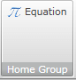
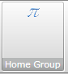
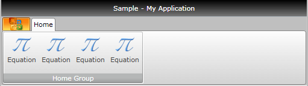
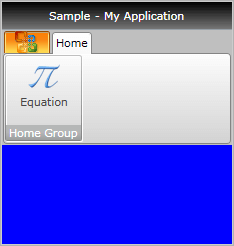
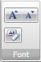

# Overview

There is a specific set of buttons introduced with the __RadRibbonView__ control. They all inherit and extend the functionality of the standard button controls i.e. __RadRibbonToggleButton__ derives from __RadToggleButton, RadRibbonSplitButton__ derives from __RadSplitButton__, etc. The additional functionality which they provide allows you to easily implement MS-Office-Ribbon-like behavior in your application. This topic covers the common functionality for all ribbon buttons.	  

>The __RadRibbonButtons__ can be used outside the __RadRibbonView__ control as well.		

The following Ribbon buttons are available:
* [Ribbon Button]()
* [Ribbon ToggleButton]()
* [Ribbon RadioButton]()
* [Ribbon DropDownButton]()
* [Ribbon SplitButton]()

## Button States

There are three button states:

* __Large__ - displays the large image and the text label defined for the button.


* __Medium__ - displays the small image and the text label defined for the button.


* __Small__ - displays the small image defined for the button.


The state of the button depends on the state of the __RadRibbonGroup__ and can be controlled via the __CollapseToSmall__, __CollapseToMedium__ and the __IsAutoSize__ properties of the ribbon buttons. To learn more about that take a look at the [Common Functionality](#Common-Functionality) section of this topic.		

To learn more about the states of the __RadRibbonGroup__ take a look at [this]() topic.		

## Common Functionality

As it was mentioned above all __RadRibbonButtons__ derive from the base button controls. Each of them inherits the specifics of the respective button and implements additional functionality. Although they are different controls, there is a common set of properties explained below.		

* __Text__ - gets or sets the text label that is shown in __Medium__ and __Large__ button state.			

* __SmallImage__ - gets or sets the image that is shown in __Medium__ and __Small__ button state.			

* __LargeImage__ - gets or sets the image that is shown in __Large__ button state.

* __Size__ - gets or sets the button initial size. This will be the maximum size of the button as well.			

* __SplitText__ - enables or disables the text wrapping for the large-sized button. This property is available only for the __RadRibbonSplitButton, RadRibbonDropDownButton, RadRibbonButton__.			

* __CollapseToSmall__ - specifies when the button will be collapsed to its __Small__ state, depending on the state of the __RadRibbonGroup__ it belongs to.			

* __CollapseToMedium__ - specifies when the button will be collapsed to its __Medium__ state, depending on the state of the __RadRibbonGroup__ to which it belongs.			

	>The __CollapseToSmall__ and __CollapseToMedium__ properties use the __CollapseThreshold__ enumeration. It has the following values:			  
	>	- __Never__ - indicates that the button will never collapse to __Small__/__Medium__ state. This is the default value of the properties.				  
	>	- __WhenGroupIsMedium__ - indicates that the button will go to the __Small__/__Medium__ state when its __RadRibbonGroup__ is in __Medium__ state.
	>	- __WhenGroupIsSmall__ - indicates that the button will go to the __Small__/__Medium__ state when its __RadRibbonGroup__ is in __Small__ state.				  

* __IsAutoSize__ -  specifies whether the button __Image__ will be sized accordingly to the __RibbonView__ guidance specification. If set to __False__, the button will display its images (both Small and Large) in its original size. Otherwise the __SmallImage__ will be displayed with size of 16x16px and the __LargeImage__ will be displayed with size of 32x32px.			

* __TextRow1__ -  gets the text that is shown in __Medium__ and __Large__ button state.			

* __TextRow2__ -  gets the text that is shown in the __Large__ button state.			

## Example

Here is an example of a __RadRibbonButton__ with the following properties set.		

```XAML
	<telerik:RadRibbonButton CollapseToMedium="Never" 
	                         CollapseToSmall="WhenGroupIsMedium"
	                         IsAutoSize="True"
	                         LargeImage="Icons/32/Equation.png"
	                         Size="Large"
	                         SmallImage="Icons/16/Equation.png"
	                         Text="Equation" />
```

This button has its initial size set to __Large__ and its text label set to __"Equation"__. As the __IsAutoSize__ property is set to __True__, the button will change its size depending on the __RadRibbonGroup's__ size. The button will also never collapse to its __Medium__ size and will collapse to its Small size when the __RadRibbonGroup__ collapses to __Medium__. 


and


## Handling the Button Clicks

There are two ways to implement a custom logic upon a button click - via event handler and via commands.

The first one is the standard way. You have to attach an event handler to the __Click__ event of the button.		

```XAML
	<telerik:RadRibbonButton CollapseToMedium="Never" 
	                         ...
	                         Text="Equation" 
	                         Click="RadRibbonButton_Click"/>
```

```C#
	private void RadRibbonButton_Click(object sender, RoutedEventArgs e)
	{
	 //place your custom logic here.
	}
```
```VB.NET
	Private Sub RadRibbonButton_Click(sender As Object, e As RoutedEventArgs)
		'place your custom logic here.'
	End Sub
```

The other way is to set the __Command__ property to a certain command. Here is an example of the command defined in the code-behind file of your UserControl. In order to create a command you have to create a static read-only instance of __Telerik.Windows.Controls.RoutedUICommand____System.Windows.Controls.RoutedUICommand__ and then add execute and you can execute event handlers to the __Telerik.Windows.Controls.CommandManager____System.Windows.Controls.CommandManager__ class.		

```C#
	public partial class RibbonButtonsSample : UserControl
	{
	   public static readonly RoutedUICommand EquationCommand = new RoutedUICommand(
	       "Equation",
	       "EquationCommand",
	       typeof( RibbonButtonsSample ) );
	   public RibbonButtonsSample()
	   {
	       InitializeComponent();
	       CommandManager.AddExecutedHandler( this, this.OnExecuted );
	       CommandManager.AddCanExecuteHandler( this, this.OnCanExecute );
	   }
	   private void OnExecuted( object sender, ExecutedRoutedEventArgs e )
	   {
	       this.LayoutRoot.Background = new SolidColorBrush( Colors.Blue );
	   }
	   private void OnCanExecute( object sender, CanExecuteRoutedEventArgs e )
	   {
	       e.CanExecute = true;
	   }
	}
```
```VB.NET
	Public Partial Class RibbonButtonsSample
		Inherits UserControl
			Public Shared ReadOnly EquationCommand As New RoutedUICommand("Equation", "EquationCommand", GetType(RibbonButtonsSample))
	
			Public Sub New()
				InitializeComponent()
				CommandManager.AddExecutedHandler(Me, AddressOf Me.OnExecuted)
				CommandManager.AddCanExecuteHandler(Me, AddressOf Me.OnCanExecute)
			End Sub
			Private Sub OnExecuted(sender As Object, e As ExecutedRoutedEventArgs)
				Me.LayoutRoot.Background = New SolidColorBrush(Colors.Blue)
			End Sub
			Private Sub OnCanExecute(sender As Object, e As CanExecuteRoutedEventArgs)
				e.CanExecute = True
			End Sub
	
	End Class
```

After that set the __Command__ property of the __RadRibbonButton__ to the full qualified path to the command. static command defined in code behind. 

```XAML	
	<telerik:RadRibbonButton Text="Equation"
			Command="{x:Static local:RibbonButtonsSample.EquationCommand}" />
```

And now if you run your application and hit the 'Equation' button, the background of the user control will be changed to Blue as it is shown on the snapshot below.


## ButtonGroup

__RadRibbonView__ allows you to additionally organize your buttons with common functionality (i.e. wrap Increase, Decrease Font buttons) in one panel. For this purpose you should use the __RadButtonGroup__ class. It will automatically apply a  __Small Size__ on all buttons wrapped in it. Furthermore, the __RadButtonGroup__ is designed to create a separator between every two buttons in it.		

> Because the RadRibbonGroup sets the Size of all child RadRibbonButtons to Small, the CollapseToSmall and CollapseToMedium properties of the button won't be respected.

The next example shows you how to use __RadButtonGroup__.		

```XAML
	<telerik:RadRibbonView x:Name="radRibbonView" Title="My Title" ApplicationName="My Application">
	    <telerik:RadRibbonTab Header="Home">
	        <telerik:RadRibbonGroup Header="Font">
	            <telerik:RadOrderedWrapPanel>
	                <telerik:RadButtonGroup>
	                    <telerik:RadRibbonButton
	                            SmallImage="Images/IconMSOffice/16/font-increasesize.png" />
	                    <telerik:RadRibbonButton
	                            SmallImage="Images/IconMSOffice/16/font-decreasesize.png" />
	                </telerik:RadButtonGroup>
	                <telerik:RadButtonGroup>
	                    <telerik:RadRibbonButton
	                            SmallImage="Images/IconMSOffice/16/ClearFormatting16.png"
	                            Text="Clear Formatting" />
	                </telerik:RadButtonGroup>
	            </telerik:RadOrderedWrapPanel>
	        </telerik:RadRibbonGroup>
	    </telerik:RadRibbonTab>
	</telerik:RadRibbonView>
```



## See Also
 * [Ribbon Group]()
 * [Resizing]()
 * [Ordered Wrap Panel]()
 * [Collapsible Panel]()
