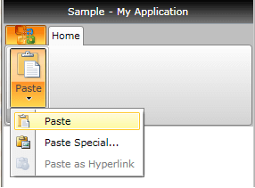

# Ribbon DropDownButton

The __RadRibbonDropDownButton__ represents an extension of the __RadDropDownButton__. It provides an easier interaction with the __RadRibbonView__ control. What is special about the __RadRibbonDropDownButton__ is that upon activation it can display a popup area. Any content of any kind can be nested inside the popup area.			

>To learn more about the __RadDropDownButton__ control read its documentation.				

Here is a sample definition of a __RadRibbonDropDownButton__ without having any drop down content defined:			

#### __XAML__
```XAML
	<telerik:RadRibbonDropDownButton LargeImage="Icons/32/paste.png" 
	                                 Size="Large"
	                                 SmallImage="Icons/16/paste.png"
	                                 Text="Paste" />
```

>tip As all buttons in the RadRibbonView's set slightly expose the same functionality, take a look at the [Overview]() topic.			

This button has its initial size set to __Large__ and its text label set to __"Paste"__.


## Setting the Drop Down Content

To set the popup content you have to simply set the __DropDownContent__ property of the button. Here is an example of a __RadRibbonDropDownButton__ with three menu items inside its drop down.				

#### __XAML__
```XAML
	<telerik:RadRibbonDropDownButton LargeImage="Icons/32/paste.png" 
	                                 Size="Large"
	                                 SmallImage="Icons/16/paste.png"
	                                 Text="Paste">
	    <telerik:RadRibbonDropDownButton.DropDownContent>
	        <telerik:RadContextMenu BorderThickness="0">
	            <telerik:RadMenuItem Header="Paste">
	                <telerik:RadMenuItem.Icon>
	                    <Image Source="Icons/16/paste.png" />
	                </telerik:RadMenuItem.Icon>
	            </telerik:RadMenuItem>
	            <telerik:RadMenuItem Header="Paste Special...">
	                <telerik:RadMenuItem.Icon>
	                    <Image Source="Icons/16/pastespecial.png" />
	                </telerik:RadMenuItem.Icon>
	            </telerik:RadMenuItem>
	            <telerik:RadMenuItem Header="Paste as Hyperlink" IsEnabled="False">
	                <telerik:RadMenuItem.Icon>
	                    <Image Source="Icons/16/pastehyperlink.png" />
	                </telerik:RadMenuItem.Icon>
	            </telerik:RadMenuItem>
	        </telerik:RadContextMenu>
	    </telerik:RadRibbonDropDownButton.DropDownContent>
	</telerik:RadRibbonDropDownButton>
```



## Handling the Drop Down Events

Besides the __Click__ event, the __RadRibbonDropDownButton__ exposes several drop down related events:				

* __DropDownClosed__ - fires after the popup area has been closed.					

* __DropDownOpening__ - fires before the popup area gets opened.					

* __DropDownOpened__ - fires after the popup area has been opened.					

#### __XAML__
```XAML
	<telerik:RadRibbonDropDownButton LargeImage="Icons/32/paste.png" 
	                                 ...
	                                 DropDownClosed="RadRibbonDropDownButton_DropDownClosed"
	                                 DropDownOpened="RadRibbonDropDownButton_DropDownOpened"
	                                 DropDownOpening="RadRibbonDropDownButton_DropDownOpening">
	 ...
	</telerik:RadRibbonDropDownButton>
```

#### __C#__
```C#
	private void RadRibbonDropDownButton_DropDownClosed(object sender, RoutedEventArgs e)
	{
	}
	private void RadRibbonDropDownButton_DropDownOpened(object sender, RoutedEventArgs e)
	{
	}
	private void RadRibbonDropDownButton_DropDownOpening(object sender, RoutedEventArgs e)
	{
	}
```

#### __VB.NET__
```VB.NET
	Private Sub RadRibbonDropDownButton_DropDownClosed(sender As Object, e As RoutedEventArgs)
	End Sub
	
	Private Sub RadRibbonDropDownButton_DropDownOpened(sender As Object, e As RoutedEventArgs)
	End Sub
	
	Private Sub RadRibbonDropDownButton_DropDownOpening(sender As Object, e As RoutedEventArgs)
	End Sub
```

## See Also
 * [Styling the RadRibbonDropDownButton]()
