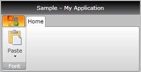
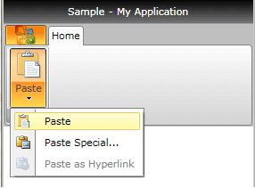

# Ribbon DropDownButton

The __RadRibbonDropDownButton__ represents an extension of the __RadDropDownButton__. It provides an easier interaction with the __RadRibbonView__ control. What is special about the __RadRibbonDropDownButton__ is that upon activation it can display a popup area. Any content of any kind can be nested inside the popup area.			

>To learn more about the __RadDropDownButton__ control read its documentation.				

Here is a sample definition of a __RadRibbonDropDownButton__ without having any drop down content defined:			

<snippet id='radribbonview-features-ribbon-controls-ribbon-buttons-dropdown-button-block_1-xaml' />

>tip As all buttons in the RadRibbonView's set slightly expose the same functionality, take a look at the [Overview]() topic.			

This button has its initial size set to __Large__ and its text label set to __"Paste"__.

## Setting the Drop Down Content

To set the popup content you have to simply set the __DropDownContent__ property of the button. Here is an example of a __RadRibbonDropDownButton__ with three menu items inside its drop down.				

<snippet id='radribbonview-features-ribbon-controls-ribbon-buttons-dropdown-button-block_2-xaml' />

## Handling the Drop Down Events

Besides the __Click__ event, the __RadRibbonDropDownButton__ exposes several drop down related events:				

* __DropDownClosed__ - fires after the popup area has been closed.					

* __DropDownOpening__ - fires before the popup area gets opened.					

* __DropDownOpened__ - fires after the popup area has been opened.					

<snippet id='radribbonview-features-ribbon-controls-ribbon-buttons-dropdown-button-block_3-xaml' />

<snippet id='radribbonview-features-ribbon-controls-ribbon-buttons-dropdown-button-block_4-cs' />
<snippet id='radribbonview-features-ribbon-controls-ribbon-buttons-dropdown-button-block_5-vb' />

## See Also
 * [Styling the RadRibbonDropDownButton]()