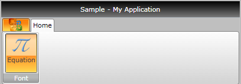
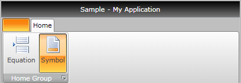

# Ribbon RadioButton

The __RadRibbonRadioButton__ represents an extension of the __RadRadioButton__. It provides an easier interaction with the __RadRibbonView__ control. What is special about the __RadRibbonRadioButton__ is that it has two states - checked and unchecked. To switch between these states just click on it. Adding several __RadRibbonRadioButtons__ to a __RadRibbonGroup__ allows you to have only one checked at a time.			

>Note that ones the button has been checked, it stays in the checked state unless another radio button in the same __RadRibbonGroup__ is clicked. If the button is used alone, it can be unchecked after it has been selected once.				

>tip To learn more about the __RadRibbonRadioButton__ control read its documentation.			

Here is a sample definition of a __RadRibbonRadioButton__:			

#### __XAML__
```XAML
	<telerik:RadRibbonRadioButton CollapseToMedium="Never" 
	                              CollapseToSmall="WhenGroupIsMedium"
	                              IsAutoSize="True"
	                              LargeImage="Icons/32/Equation.png"
	                              Size="Large"
	                              SmallImage="Icons/16/Equation.png"
	                              Text="Equation" />
```

>tip As all buttons in the RadRibbonView's set slightly expose the same functionality, take a look at the [Overview]() topic.

This button has its initial size set to __Large__ and its text label set to __"Equation"__. As the __IsAutoSize__ property is set to __True__, the button will change its size depending on the __RadRibbonGroup's__ size. The button will also never collapse to its __Medium__ size and will collapse to its __Small__ size when the __RadRibbonGroup__ collapses to __Medium__.


Here is an example of a __RadRibbonGroup__ that contains two __RadRibbonRadioButtons__.			

#### __XAML__
```XAML
	<telerik:RadRibbonGroup DialogLauncherVisibility="Visible" Header="Home Group">
	    <telerik:RadRibbonRadioButton CollapseToMedium="Never" 
	                                  CollapseToSmall="WhenGroupIsMedium"
	                                  IsAutoSize="True"
	                                  LargeImage="Icons/32/PageBreak.png"
	                                  Size="Large"
	                                  SmallImage="Icons/16/PageBreak.png"
	                                  Text="Equation" />
	    <telerik:RadRibbonRadioButton CollapseToMedium="Never" 
	                                  CollapseToSmall="WhenGroupIsMedium"
	                                  IsAutoSize="True"
	                                  LargeImage="Icons/32/Footer.png"
	                                  Size="Large"
	                                  SmallImage="Icons/16/Footer.png"
	                                  Text="Symbol" />
	</telerik:RadRibbonGroup>
```



## Handling Changes in the Button's Checked State

Besides the __Click__ event, the __RadRibbonRadioButton__ control exposes two additional events - __Checked__ and __Unchecked.__ They are meant to notify for changes in the checked state of the radio button.				

#### __XAML__
```XAML
	<telerik:RadRibbonToggleButton Checked="RadRibbonToggleButton_Checked"
	                               CollapseToMedium="Never"
	                               CollapseToSmall="WhenGroupIsMedium"
	                               IsAutoSize="True"
	                               LargeImage="Icons/32/Equation.png"
	                               Size="Large"
	                               SmallImage="Icons/16/Equation.png"
	                               Text="Symbol"
	                               Unchecked="RadRibbonToggleButton_Unchecked" />
```

#### __C#__
```C#
	private void RadRibbonToggleButton_Checked(object sender, RoutedEventArgs e)
	{
	}
	private void RadRibbonToggleButton_Unchecked(object sender, RoutedEventArgs e)
	{
	}
```

#### __VB.NET__
```VB.NET
	Private Sub RadRibbonToggleButton_Checked(sender As Object, e As RoutedEventArgs)
	End Sub
	
	Private Sub RadRibbonToggleButton_Unchecked(sender As Object, e As RoutedEventArgs)
	End Sub
```

## See Also
 * [Styling the RadRibbonRadioButton]()