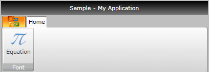

# Ribbon Button

The __RadRibbonButton__ represents the basic button in the set of the __RadRibbonView__ buttons. It inherits the __RadButton__ control and extends its functionality in order to provide a better interaction with the __RadRibbonView__ control.

>tip To learn more about the __RadButton__ control read its documentation.

Here is a sample definition of a __RadRibbonButton__:


```XAML
	<telerik:RadRibbonButton CollapseToMedium="Never" 
	                         CollapseToSmall="WhenGroupIsMedium"
	                         IsAutoSize="True"
	                         LargeImage="Icons/32/Equation.png"
	                         Size="Large"
	                         SmallImage="Icons/16/Equation.png"
	                         Text="Equation" />
```

This button has its initial size set to __Large__ and its text label set to __"Equation"__. As the __IsAutoSize__ property is set to __True__, the button will change its size depending on the __RadRibbonGroup__'s size. The button will also never collapse to its __Medium__ size and will collapse to its __Small__ size when the __RadRibbonGroup__ collapses to __Medium__.
          

## See Also
 * [Styling the RadRibbonButton]()