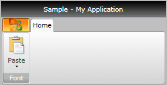
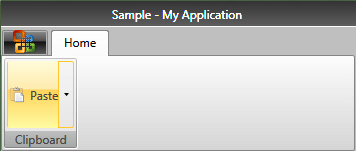
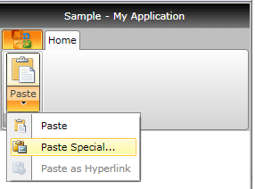

# Ribbon SplitButton

The __RadRibbonSplitButton__ represents an extension of the __RadSplitButton__. It provides an easier interaction with the __RadRibbonView__ control. What is special about the __RadRibbonSplitButton__ is that it is separated into two areas. The first one exposes a default action for the button while the second one pops up the drop down content like the __RadRibbonDropDownButton__ does. This means that the user does not need to open the popup area every time he needs to select an action, he can just select the one exposed directly by the button.	  

>tip To learn more about the __RadSplitButton__ control read its documentation.		

Here is a sample definition of a __RadRibbonSplitButton__ without having any drop down content defined:	  

<snippet id='radribbonview-features-ribbon-controls-ribbon-buttons-split-button-block_1-xaml' />

>tip As all buttons in the RadRibbonView's set slightly expose the same functionality, take a look at the [Overview]() topic.

This button has its initial size set to __Large__ and its text label set to __"Paste"__.

But if the size of the button is __Medium__, then it will look like this:

Please note that the __Text__ value of the button is displayed in its button part. If you want to modify that behavior and display the __Text__ in the DropDownPart of the button, then you can use the __IsTextInMiddleButton__ property. If set to __False__, this property will make sure the button displays its __Text__ in the DropDownPart of the __RibbonSplitButon__.		

## Setting the Drop Down Content

To set the popup content you have to simply set the __DropDownContent__ property of the button. Here is an example of a __RadRibbonSplitButton__ with three menu items inside its drop down.		

<snippet id='radribbonview-features-ribbon-controls-ribbon-buttons-split-button-block_2-xaml' />

## Handling the Drop Down Events

Besides the __Click__ event, the __RadRibbonSplitButton__ exposes several drop down related events:		

* __DropDownClosed__ - fires after the popup area has been closed.			

* __DropDownOpening__ - fires before the popup area gets opened.			

* __DropDownOpend__ - fires after the popup area has been opened.			

<snippet id='radribbonview-features-ribbon-controls-ribbon-buttons-split-button-block_3-xaml' />

<snippet id='radribbonview-features-ribbon-controls-ribbon-buttons-split-button-block_4-cs' />
<snippet id='radribbonview-features-ribbon-controls-ribbon-buttons-split-button-block_5-vb' />

## See Also
 * [Styling the RadRibbonSplitButton]()