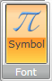

# Ribbon ToggleButton

The __RadRibbonToggleButton__ represents an extension of the __RadToggleButton__. It provides an easier interaction with the __RadRibbonView__ control. What is special about the __RadRibbonToggleButton__ is that it has two states - checked and unchecked. To switch between these states just click on it.

>tip To learn more about the __RadToggleButtonButton__ control read its documentation. __RadRibbonToggleButton__

#### __XAML__
```XAML
	<telerik:RadRibbonToggleButton CollapseToMedium="Never"
	                               CollapseToSmall="WhenGroupIsMedium"
	                               IsAutoSize="True"
	                               LargeImage="Icons/32/Equation.png"
	                               Size="Large"
	                               SmallImage="Icons/16/Equation.png"
	                               Text="Symbol" />
```

This button has its initial size set to __Large__ and its text label set to __"Symbol"__. As the __IsAutoSize__ property is set to __True__ the button will change its size depending on the __RadRibbonGroup's__ size. The button will also never collapse to its __Medium__ size and will collapse to its __Small__ size when the __RadRibbonGroup__ collapses to __Medium__.


## Handling Changes in the the Button's Checked State

Besides the __Click__ event, the __RadRibbonToggleButton__ control exposes two additional events - __Checked__ and __Unchecked.__ They are meant to notify for changes in the checked state of the toggle button.

#### __XAML__
```XAML
	<telerik:RadRibbonToggleButton Checked="RadRibbonToggleButton_Checked"
	                               CollapseToMedium="Never"
	                               CollapseToSmall="WhenGroupIsMedium"
	                               IsAutoSize="True"
	                               LargeImage="Icons/32/Equation.png"
	                               Size="Large"
	                               SmallImage="Icons/16/Equation.png"
	                               Text="Symbol"
	                               Unchecked="RadRibbonToggleButton_Unchecked" />
```

#### __C#__
```C#
	private void RadRibbonToggleButton_Checked(object sender, RoutedEventArgs e)
	{
	}
	private void RadRibbonToggleButton_Unchecked(object sender, RoutedEventArgs e)
	{
	}
```


#### __VB.NET__
```VB.NET
	Private Sub RadRibbonToggleButton_Checked(sender As Object, e As RoutedEventArgs)
	
	End Sub
	
	Private Sub RadRibbonToggleButton_Unchecked(sender As Object, e As RoutedEventArgs)
	
	End Sub
```

## See Also
 * [Styling the RadRibbonToggleButton]()